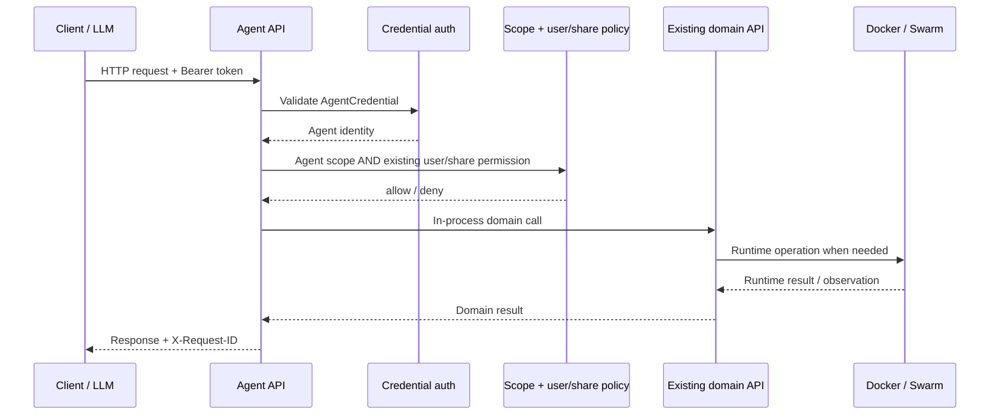
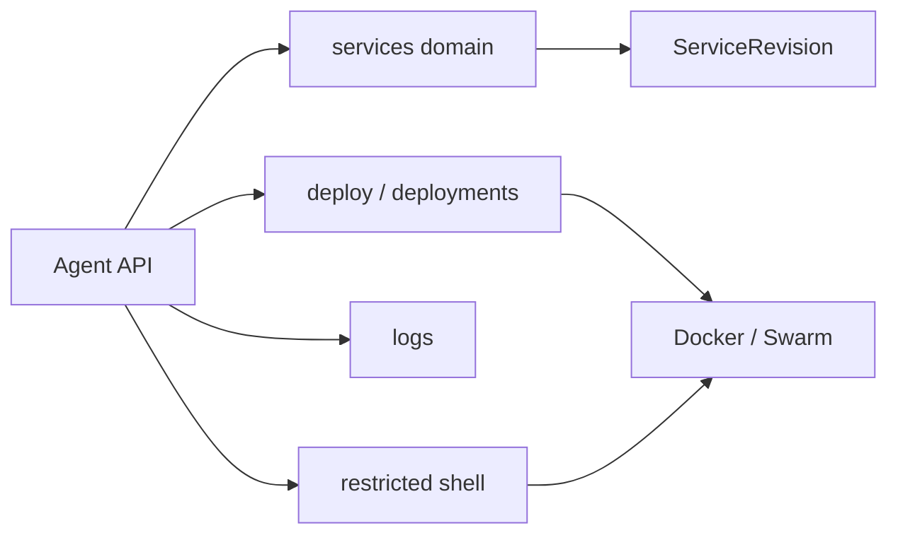

# Agent API reference

The Agent endpoint contract is defined by src/agent/contracts.py. This page documents the complete route matrix plus request parameter conventions. The machine-readable schema remains /agent/v1/openapi.json.

## Request flow



## Common parameters and headers

| Parameter/header | Required | Contract |
|---|---|---|
| `Authorization: Bearer <token>` | Yes except `/auth/exchange` | Persistent Agent access credential. Never log or expose it. |
| `X-Request-ID` | Optional | Request correlation id; server creates one if absent/invalid and returns it. |
| `Idempotency-Key` | Optional by HTTP syntax; used by idempotent mutations | Durable 24-hour replay identity for endpoints marked idempotent. |
| `X-Shell-Token` | Required for shell command/close unless body `token` is supplied | Short-lived credential for one shell session. |

## Pagination

AgentPage collection endpoints accept page and page_size. Default page size is 25; maximum is 100.

## Complete endpoint matrix

Every row below is copied from the centralized endpoint contract. `scopes` are all required. `any_scopes`, when present, adds an OR requirement on top of the required scopes. Therefore the two shell file/tool contracts that list both file scopes in `scopes` still require both scopes; their `any_scopes` entry is currently redundant and documented as such rather than silently changing runtime behavior.

| Method | Endpoint | Path parameters | Required scopes | Any-of scopes | Mutating | Idempotent | Throttle |
|---|---|---|---|---|---|---|---|
| `GET` | `/agent/v1/` | — | — | — | no | no | `read` |
| `GET` | `/agent/v1/skills` | — | — | — | no | no | `read` |
| `GET` | `/agent/v1/skills/{skill_name}` | {skill_name} | — | — | no | no | `read` |
| `POST` | `/agent/v1/auth/exchange` | — | — | — | no | no | `exchange` |
| `GET` | `/agent/v1/auth/me` | — | — | — | no | no | `read` |
| `GET` | `/agent/v1/capabilities` | — | — | — | no | no | `read` |
| `GET` | `/agent/v1/openapi.json` | — | — | — | no | no | `read` |
| `GET` | `/agent/v1/agent.md` | — | `agent.manifest.generate` | — | no | no | `mutation` |
| `GET` | `/agent/v1/services` | — | `services.read` | — | no | no | `read` |
| `POST` | `/agent/v1/services` | — | `services.create` | — | yes | yes | `mutation` |
| `POST` | `/agent/v1/services/from-plan` | — | `services.create`, `plans.apply` | — | yes | yes | `mutation` |
| `GET` | `/agent/v1/services/{service_id}` | {service_id} | `services.read` | — | no | no | `read` |
| `PATCH` | `/agent/v1/services/{service_id}` | {service_id} | `services.update` | — | yes | yes | `mutation` |
| `DELETE` | `/agent/v1/services/{service_id}` | {service_id} | `services.delete` | — | yes | yes | `mutation` |
| `POST` | `/agent/v1/services/{service_id}/start` | {service_id} | `services.start` | — | yes | yes | `deployment` |
| `POST` | `/agent/v1/services/{service_id}/stop` | {service_id} | `services.stop` | — | yes | yes | `deployment` |
| `POST` | `/agent/v1/services/{service_id}/restart` | {service_id} | `services.restart` | — | yes | yes | `deployment` |
| `POST` | `/agent/v1/services/{service_id}/rebuild` | {service_id} | `deployments.rebuild` | — | yes | yes | `deployment` |
| `POST` | `/agent/v1/services/{service_id}/purge-runtime` | {service_id} | `services.purge` | — | yes | yes | `deployment` |
| `GET` | `/agent/v1/services/{service_id}/status` | {service_id} | `services.read` | — | no | no | `read` |
| `GET` | `/agent/v1/services/{service_id}/metrics` | {service_id} | `services.read` | — | no | no | `read` |
| `GET` | `/agent/v1/services/{service_id}/logs` | {service_id} | `service_logs.read` | — | no | no | `read` |
| `GET` | `/agent/v1/services/{service_id}/logs/export` | {service_id} | `service_logs.export` | — | no | no | `read` |
| `GET` | `/agent/v1/services/{service_id}/configuration` | {service_id} | `service_config.read` | — | no | no | `read` |
| `PATCH` | `/agent/v1/services/{service_id}/configuration` | {service_id} | `service_config.write` | — | yes | yes | `mutation` |
| `GET` | `/agent/v1/services/{service_id}/environment` | {service_id} | `service_environment.read` | — | no | no | `read` |
| `POST` | `/agent/v1/services/{service_id}/environment` | {service_id} | `service_environment.write` | — | yes | yes | `mutation` |
| `DELETE` | `/agent/v1/services/{service_id}/environment` | {service_id} | `service_environment.write` | — | yes | yes | `mutation` |
| `GET` | `/agent/v1/services/{service_id}/secrets` | {service_id} | `service_secrets.read` | — | no | no | `read` |
| `POST` | `/agent/v1/services/{service_id}/secrets` | {service_id} | `service_secrets.write` | — | yes | yes | `mutation` |
| `DELETE` | `/agent/v1/services/{service_id}/secrets` | {service_id} | `service_secrets.write` | — | yes | yes | `mutation` |
| `GET` | `/agent/v1/services/{service_id}/endpoints` | {service_id} | `service_endpoints.read` | — | no | no | `read` |
| `POST` | `/agent/v1/services/{service_id}/endpoints` | {service_id} | `service_endpoints.write` | — | yes | yes | `mutation` |
| `DELETE` | `/agent/v1/services/{service_id}/endpoints` | {service_id} | `service_endpoints.write` | — | yes | yes | `mutation` |
| `GET` | `/agent/v1/services/{service_id}/networks` | {service_id} | `service_networks.read` | — | no | no | `read` |
| `POST` | `/agent/v1/services/{service_id}/networks` | {service_id} | `service_networks.write` | — | yes | yes | `mutation` |
| `DELETE` | `/agent/v1/services/{service_id}/networks` | {service_id} | `service_networks.write` | — | yes | yes | `mutation` |
| `GET` | `/agent/v1/services/{service_id}/databases` | {service_id} | `service_config.read` | — | no | no | `read` |
| `POST` | `/agent/v1/services/{service_id}/databases` | {service_id} | `service_config.write` | — | yes | yes | `mutation` |
| `DELETE` | `/agent/v1/services/{service_id}/databases` | {service_id} | `service_config.write` | — | yes | yes | `mutation` |
| `GET` | `/agent/v1/services/{service_id}/database-credentials` | {service_id} | `service_database_credentials.read` | — | no | no | `read` |
| `GET` | `/agent/v1/services/{service_id}/revisions` | {service_id} | `services.read` | — | no | no | `read` |
| `GET` | `/agent/v1/services/{service_id}/revisions/{revision_id}` | {service_id}, {revision_id} | `services.read` | — | no | no | `read` |
| `POST` | `/agent/v1/services/{service_id}/revisions/{revision_id}/rollback` | {service_id}, {revision_id} | `deployments.rollback` | — | yes | yes | `deployment` |
| `GET` | `/agent/v1/services/{service_id}/shell` | {service_id} | `shell.read` | — | no | no | `shell` |
| `POST` | `/agent/v1/services/{service_id}/shell/sessions` | {service_id} | `shell.read`, `shell.execute` | — | yes | no | `shell` |
| `POST` | `/agent/v1/services/{service_id}/shell/sessions/{session_id}/commands` | {service_id}, {session_id} | `shell.execute` | — | yes | no | `shell` |
| `POST` | `/agent/v1/services/{service_id}/shell/sessions/{session_id}/close` | {service_id}, {session_id} | `shell.execute` | — | yes | no | `shell` |
| `POST` | `/agent/v1/services/{service_id}/shell/replace` | {service_id} | `shell.replace` | — | yes | no | `shell` |
| `POST` | `/agent/v1/services/{service_id}/shell/files` | {service_id} | `shell.files.read`, `shell.files.write` | `shell.files.read`, `shell.files.write` | yes | no | `shell` |
| `GET` | `/agent/v1/services/{service_id}/tools` | {service_id} | `shell.read`, `shell.execute` | `shell.read`, `shell.execute` | no | no | `shell` |
| `POST` | `/agent/v1/services/{service_id}/tools/{tool_name}` | {service_id}, {tool_name} | `shell.read`, `shell.execute` | `shell.read`, `shell.execute` | yes | yes | `shell` |
| `GET` | `/agent/v1/plans` | — | `plans.read` | — | no | no | `read` |
| `GET` | `/agent/v1/plans/{plan_id}` | {plan_id} | `plans.read` | — | no | no | `read` |
| `POST` | `/agent/v1/plans/{plan_id}/apply` | {plan_id} | `plans.apply`, `services.create` | — | yes | yes | `mutation` |
| `POST` | `/agent/v1/plans/manage` | — | `plans.manage` | — | yes | yes | `mutation` |
| `PATCH` | `/agent/v1/plans/manage/{plan_id}` | {plan_id} | `plans.manage` | — | yes | yes | `mutation` |
| `DELETE` | `/agent/v1/plans/manage/{plan_id}` | {plan_id} | `plans.manage` | — | yes | yes | `mutation` |
| `GET` | `/agent/v1/networks` | — | `service_networks.read` | — | no | no | `read` |
| `POST` | `/agent/v1/networks` | — | `service_networks.write` | — | yes | yes | `mutation` |
| `GET` | `/agent/v1/networks/{network_id}` | {network_id} | `service_networks.read` | — | no | no | `read` |
| `PATCH` | `/agent/v1/networks/{network_id}` | {network_id} | `service_networks.write` | — | yes | yes | `mutation` |
| `DELETE` | `/agent/v1/networks/{network_id}` | {network_id} | `service_networks.write` | — | yes | yes | `mutation` |
| `GET` | `/agent/v1/volumes` | — | `service_volumes.read` | — | no | no | `read` |
| `POST` | `/agent/v1/volumes` | — | `service_volumes.write` | — | yes | yes | `mutation` |
| `GET` | `/agent/v1/volumes/{volume_id}` | {volume_id} | `service_volumes.read` | — | no | no | `read` |
| `PATCH` | `/agent/v1/volumes/{volume_id}` | {volume_id} | `service_volumes.write` | — | yes | yes | `mutation` |
| `DELETE` | `/agent/v1/volumes/{volume_id}` | {volume_id} | `service_volumes.write` | — | yes | yes | `mutation` |
| `GET` | `/agent/v1/deployments` | — | `deployments.read` | — | no | no | `read` |
| `POST` | `/agent/v1/deployments` | — | `deployments.create` | — | yes | yes | `mutation` |
| `GET` | `/agent/v1/deployments/help` | — | `deployments.read` | — | no | no | `read` |
| `POST` | `/agent/v1/deployments/inspect` | — | `deployments.upload` | — | no | no | `upload` |
| `GET` | `/agent/v1/deployments/{deployment_id}` | {deployment_id} | `deployments.read` | — | no | no | `read` |
| `DELETE` | `/agent/v1/deployments/{deployment_id}` | {deployment_id} | `deployments.delete` | — | yes | yes | `mutation` |
| `POST` | `/agent/v1/deployments/{deployment_id}/upload` | {deployment_id} | `deployments.upload` | — | yes | yes | `upload` |
| `POST` | `/agent/v1/deployments/{deployment_id}/start` | {deployment_id} | `deployments.start` | — | yes | yes | `deployment` |
| `POST` | `/agent/v1/deployments/{deployment_id}/cancel` | {deployment_id} | `deployments.cancel` | — | yes | yes | `deployment` |
| `POST` | `/agent/v1/deployments/{deployment_id}/redeploy` | {deployment_id} | `deployments.redeploy` | — | yes | yes | `deployment` |
| `POST` | `/agent/v1/deployments/{deployment_id}/rebuild` | {deployment_id} | `deployments.rebuild` | — | yes | yes | `deployment` |
| `POST` | `/agent/v1/deployments/{deployment_id}/rollback` | {deployment_id} | `deployments.rollback` | — | yes | yes | `deployment` |
| `GET` | `/agent/v1/deployments/{deployment_id}/logs` | {deployment_id} | `deployments.logs.read` | — | no | no | `read` |
| `GET` | `/agent/v1/deployments/{deployment_id}/logs/export` | {deployment_id} | `deployments.logs.export` | — | no | no | `read` |

## Request body schemas

The runtime OpenAPI builder derives several request schemas from the existing Services/Plans/Deploy serializers. These are the authoritative field contracts for the Agent-facing JSON bodies.

| Schema | Required fields | Optional/defaulted fields | Notes |
|---|---|---|---|
| `ServiceCreateRequest` | `name`, `plan`, `network` | Remaining writable ServiceSerializer fields | User is assigned from Agent identity; network is required for this Agent boundary. |
| `ServiceUpdateRequest` | none | Writable ServiceSerializer fields | Partial update; read-only fields remain blocked. |
| `ServiceFromPlanRequest` | `name`, `plan` | Service-create fields except `network`; `create_network=false`, `network_name` optional | `create_network=true` allows automatic network creation; `network_name` is used only then. |
| `PlanApplyRequest` | serializer-specific target fields | Service-create fields, `create_network=false`, `network_name` | Plan is identified by the URL; apply is service-targeted. |
| `NetworkCreateRequest` | serializer-defined | serializer-defined | Uses existing PrivateNetwork serializer. |
| `VolumeCreateRequest` | existing `service` UUID plus serializer-required fields | serializer-defined | Create the Service first; volume creation without a Service is rejected so the backend can enforce plan quota. |
| `DeploymentCreateRequest` | `service` plus DeploySerializer requirements | `source` defaults to `archive` | Supported source enum: `archive`, `zip`, `database`, `database_native`. |
| `ConfigurationPatchRequest` | none | `source_kind`, `source_config`, `build_config`, `runtime_config`, `desired_state` | Unknown fields are rejected; secret-like values must use secret resources. |
| `EnvironmentMutationRequest` | `key` | `scope=runtime`, `is_secret=false`, `value` | `key` matches `[A-Za-z_][A-Za-z0-9_]{0,127}`; `value` is required by the mutation handler even though the OpenAPI schema marks it writable. |
| `SecretMutationRequest` | `key`, `value` | `note`, `description` | `value` is write-only and stored through the encrypted/versioned secret system. |
| `EndpointMutationRequest` | `name`, `target_port` | `process`, `published_port`, `protocol=http`, `exposure=public`, `hostname`, `path`, `tls=false`, `enabled=true`, `metadata` | Ports are bounded to 1–65535. |
| `NetworkAttachmentRequest` | `network` | `alias`, `internal=false`, `metadata` | `network` is a UUID. |
| `DatabaseBindingRequest` | `database` | `alias=default`, `env_prefix=DB`, `access_mode=rw`, `metadata` | Database id is a UUID. |
| `ShellSessionCreateRequest` | none | `mode=restricted`, `workdir` | Developer mode requires extra scope/permission. |
| `ShellCommandRequest` | `command` | `confirm=false`, `dry_run=false`, `token` | Token is a write-only body fallback for `X-Shell-Token`. |
| `ShellFileRequest` | `action`, `path` | `token`, `new_name`, `content`, upload fields | Rename/create-folder/upload have operation-specific requirements. |

## High-risk endpoints

**Database credentials:** `GET /agent/v1/services/{service_id}/database-credentials` requires `service_database_credentials.read` and existing service permission. `reveal=true` may return decrypted credentials, so the client must treat the response as secret material and avoid caching/logging it.

**Shell:** shell sessions return a separate `Shell` token. Developer shell additionally requires `shell.developer` plus the existing advanced-shell service permission. Destructive commands and session replacement use explicit confirmation.

## Authorization

```text
Agent scope
  AND existing PassDeployer user authorization
  AND ServiceShare action permission when the service is shared
```

Superuser status does not manufacture missing Agent scopes.

## Errors

Error responses use a normalized envelope with `result=error`, `code`, `detail`, `request_id`, `retryable`, `failure_domain`, `visibility`, `resource_effect` and `certainty`. Sensitive input values are scrubbed from protected error payloads.

## Discovery

- `GET /agent/v1/capabilities`: scope-filtered capabilities and operations.
- `GET /agent/v1/openapi.json`: machine-readable endpoint and schema contract.
- `GET /agent/v1/agent.md`: LLM/tool manifest; response is non-cacheable and sensitive.
- `GET /agent/v1/skills` and `GET /agent/v1/skills/{skill_name}`: scope-filtered operating playbooks.

## Deployment input policy

The current Agent contract advertises ZIP/archive deployment inspection/upload and database-native deployment. Git input, existing-image deployment, host shell and raw Docker API are intentionally unsupported.

## Relationship to the rest of the platform


