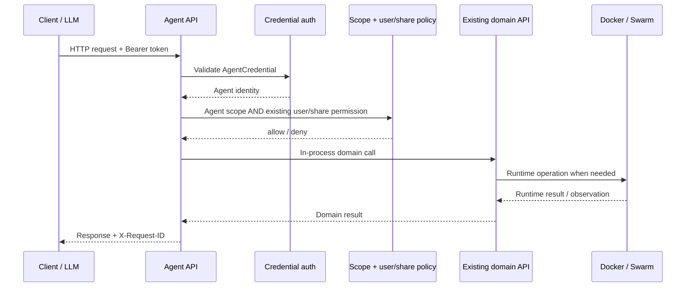
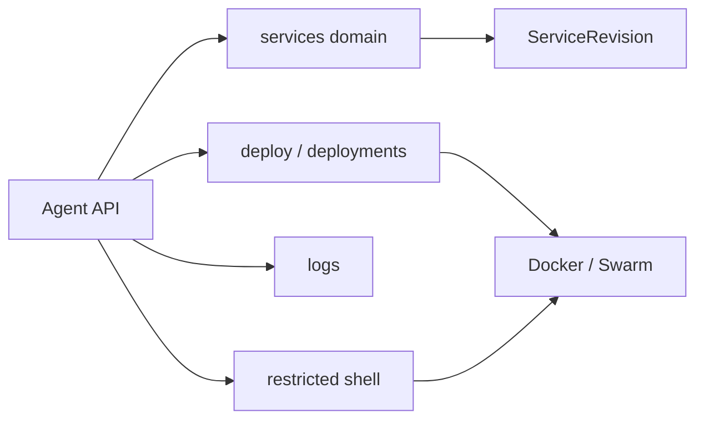

# Agent API reference

The Agent endpoint contract is defined by src/agent/contracts.py. This page documents the complete route matrix plus request parameter conventions. The machine-readable schema remains /agent/v1/openapi.json.

## Request flow



## Common parameters and headers

| Parameter/header | Required | Contract |
|---|---|---|
| `Authorization: Bearer <token>` | Yes except `/auth/exchange` | Persistent Agent access credential. Never log or expose it. |
| `X-Request-ID` | Optional | Request correlation id; server creates one if absent/invalid and returns it. |
| `Idempotency-Key` | Optional by HTTP syntax; used by idempotent mutations | Durable 24-hour replay identity for endpoints marked idempotent. |
| `X-Shell-Token` | Required for shell command/close unless body `token` is supplied | Short-lived credential for one shell session. |

## Pagination

AgentPage collection endpoints accept page and page_size. Default page size is 25; maximum is 100.

## Complete endpoint matrix

| Method | Endpoint | Path parameters | Required scopes | Any-of scopes | Mutating | Idempotent | Throttle | Request parameters |
|---|---|---|---|---|---|---|---|---|
| `GET` | `/agent/v1/` | — | — | — | no | no | `read` | Optional pagination on collection endpoints: page/page_size (default 25, max 100). |
| `GET` | `/agent/v1/skills` | — | — | — | no | no | `read` | Optional pagination on collection endpoints: page/page_size (default 25, max 100). |
| `GET` | `/agent/v1/skills/{skill_name}` | `skill_name` | — | — | no | no | `read` | Optional pagination on collection endpoints: page/page_size (default 25, max 100). |
| `POST` | `/agent/v1/auth/exchange` | — | — | — | no | no | `exchange` | JSON: enrollment_token required; client optional. |
| `GET` | `/agent/v1/auth/me` | — | — | — | no | no | `read` | Optional pagination on collection endpoints: page/page_size (default 25, max 100). |
| `GET` | `/agent/v1/capabilities` | — | — | — | no | no | `read` | Optional pagination on collection endpoints: page/page_size (default 25, max 100). |
| `GET` | `/agent/v1/openapi.json` | — | — | — | no | no | `read` | Optional pagination on collection endpoints: page/page_size (default 25, max 100). |
| `GET` | `/agent/v1/agent.md` | — | — | — | no | no | `read` | Optional pagination on collection endpoints: page/page_size (default 25, max 100). |
| `GET` | `/agent/v1/services` | — | `services.read` | — | no | no | `read` | Query: page/page_size optional. |
| `POST` | `/agent/v1/services` | — | — | — | no | no | `read` | JSON: name, plan and network are required by the underlying Service creation API; other accepted fields follow that API. |
| `POST` | `/agent/v1/services/from-plan` | — | — | — | no | no | `read` | JSON: plan required; name required; network normally required. create_network=true enables automatic network creation; network_name optional. |
| `GET` | `/agent/v1/services/{service_id}` | `service_id` | `services.read` | — | no | no | `read` | Optional pagination on collection endpoints: page/page_size (default 25, max 100). |
| `PATCH` | `/agent/v1/services/{service_id}` | `service_id` | — | — | no | no | `read` | JSON body; fields are endpoint/resource specific and validated by the delegated domain boundary. |
| `DELETE` | `/agent/v1/services/{service_id}` | `service_id` | — | — | no | no | `read` | No body required. |
| `POST` | `/agent/v1/services/{service_id}/start` | `service_id` | — | — | no | no | `read` | JSON body; fields are endpoint/resource specific and validated by the delegated domain boundary. |
| `POST` | `/agent/v1/services/{service_id}/stop` | `service_id` | — | — | no | no | `read` | JSON body; fields are endpoint/resource specific and validated by the delegated domain boundary. |
| `POST` | `/agent/v1/services/{service_id}/restart` | `service_id` | — | — | no | no | `read` | JSON body; fields are endpoint/resource specific and validated by the delegated domain boundary. |
| `POST` | `/agent/v1/services/{service_id}/rebuild` | `service_id` | — | — | no | no | `read` | JSON body; fields are endpoint/resource specific and validated by the delegated domain boundary. |
| `POST` | `/agent/v1/services/{service_id}/purge-runtime` | `service_id` | — | — | no | no | `read` | JSON body; fields are endpoint/resource specific and validated by the delegated domain boundary. |
| `GET` | `/agent/v1/services/{service_id}/status` | `service_id` | `services.read` | — | no | no | `read` | Optional pagination on collection endpoints: page/page_size (default 25, max 100). |
| `GET` | `/agent/v1/services/{service_id}/metrics` | `service_id` | — | — | no | no | `read` | Optional pagination on collection endpoints: page/page_size (default 25, max 100). |
| `GET` | `/agent/v1/services/{service_id}/logs` | `service_id` | `service_logs.read` | — | no | no | `read` | Optional pagination on collection endpoints: page/page_size (default 25, max 100). |
| `GET` | `/agent/v1/services/{service_id}/logs/export` | `service_id` | `service_logs.export` | — | no | no | `read` | Query: from, to, level, stream, q, limit (default 5000; max 10000), format (txt/jsonl); all optional. |
| `GET` | `/agent/v1/services/{service_id}/configuration` | `service_id` | `service_config.read` | — | no | no | `read` | No body; authorization and resource id come from the URL/context. |
| `PATCH` | `/agent/v1/services/{service_id}/configuration` | `service_id` | — | — | no | no | `read` | JSON payload delegated to the existing Service configuration API; secret reads never return plaintext. |
| `GET` | `/agent/v1/services/{service_id}/environment` | `service_id` | `service_environment.read` | — | no | no | `read` | No body; authorization and resource id come from the URL/context. |
| `POST` | `/agent/v1/services/{service_id}/environment` | `service_id` | — | — | no | no | `read` | JSON payload delegated to the existing Service configuration API; secret reads never return plaintext. |
| `DELETE` | `/agent/v1/services/{service_id}/environment` | `service_id` | — | — | no | no | `read` | JSON payload delegated to the existing Service configuration API; secret reads never return plaintext. |
| `GET` | `/agent/v1/services/{service_id}/secrets` | `service_id` | `service_secrets.read` | — | no | no | `read` | No body; authorization and resource id come from the URL/context. |
| `POST` | `/agent/v1/services/{service_id}/secrets` | `service_id` | — | — | no | no | `read` | JSON payload delegated to the existing Service configuration API; secret reads never return plaintext. |
| `DELETE` | `/agent/v1/services/{service_id}/secrets` | `service_id` | — | — | no | no | `read` | JSON payload delegated to the existing Service configuration API; secret reads never return plaintext. |
| `GET` | `/agent/v1/services/{service_id}/endpoints` | `service_id` | `service_endpoints.read` | — | no | no | `read` | No body; authorization and resource id come from the URL/context. |
| `POST` | `/agent/v1/services/{service_id}/endpoints` | `service_id` | — | — | no | no | `read` | JSON payload delegated to the existing Service configuration API; secret reads never return plaintext. |
| `DELETE` | `/agent/v1/services/{service_id}/endpoints` | `service_id` | — | — | no | no | `read` | JSON payload delegated to the existing Service configuration API; secret reads never return plaintext. |
| `GET` | `/agent/v1/services/{service_id}/networks` | `service_id` | `service_networks.read` | — | no | no | `read` | No body; authorization and resource id come from the URL/context. |
| `POST` | `/agent/v1/services/{service_id}/networks` | `service_id` | — | — | no | no | `read` | JSON payload delegated to the existing Service configuration API; secret reads never return plaintext. |
| `DELETE` | `/agent/v1/services/{service_id}/networks` | `service_id` | — | — | no | no | `read` | JSON payload delegated to the existing Service configuration API; secret reads never return plaintext. |
| `GET` | `/agent/v1/services/{service_id}/databases` | `service_id` | `service_config.read` | — | no | no | `read` | No body; authorization and resource id come from the URL/context. |
| `POST` | `/agent/v1/services/{service_id}/databases` | `service_id` | — | — | no | no | `read` | JSON payload delegated to the existing Service configuration API; secret reads never return plaintext. |
| `DELETE` | `/agent/v1/services/{service_id}/databases` | `service_id` | — | — | no | no | `read` | JSON payload delegated to the existing Service configuration API; secret reads never return plaintext. |
| `GET` | `/agent/v1/services/{service_id}/database-credentials` | `service_id` | `service_database_credentials.read` | — | no | no | `read` | Query: reveal optional (default false); true may expose decrypted credentials. |
| `GET` | `/agent/v1/services/{service_id}/revisions` | `service_id` | `services.read` | — | no | no | `read` | Optional pagination on collection endpoints: page/page_size (default 25, max 100). |
| `GET` | `/agent/v1/services/{service_id}/revisions/{revision_id}` | `service_id`, `revision_id` | `services.read` | — | no | no | `read` | Optional pagination on collection endpoints: page/page_size (default 25, max 100). |
| `POST` | `/agent/v1/services/{service_id}/revisions/{revision_id}/rollback` | `service_id`, `revision_id` | — | — | no | no | `read` | JSON body; fields are endpoint/resource specific and validated by the delegated domain boundary. |
| `GET` | `/agent/v1/services/{service_id}/shell` | `service_id` | — | — | no | no | `read` | Optional pagination on collection endpoints: page/page_size (default 25, max 100). |
| `POST` | `/agent/v1/services/{service_id}/shell/sessions` | `service_id` | — | — | no | no | `read` | JSON: mode optional (restricted default; developer needs extra permission), workdir optional. |
| `POST` | `/agent/v1/services/{service_id}/shell/sessions/{session_id}/commands` | `service_id`, `session_id` | — | — | no | no | `read` | JSON: command required; confirm and dry_run optional. X-Shell-Token header or body token authenticates the shell session. |
| `POST` | `/agent/v1/services/{service_id}/shell/sessions/{session_id}/close` | `service_id`, `session_id` | — | — | no | no | `read` | JSON body; fields are endpoint/resource specific and validated by the delegated domain boundary. |
| `POST` | `/agent/v1/services/{service_id}/shell/replace` | `service_id` | — | — | no | no | `read` | JSON: confirm=true required; mode and workdir optional. |
| `POST` | `/agent/v1/services/{service_id}/shell/files` | `service_id` | — | — | no | no | `read` | JSON: action is required by the delegated file API; remaining fields depend on action. |
| `GET` | `/agent/v1/services/{service_id}/tools` | `service_id` | — | — | no | no | `read` | Optional pagination on collection endpoints: page/page_size (default 25, max 100). |
| `POST` | `/agent/v1/services/{service_id}/tools/{tool_name}` | `service_id`, `tool_name` | — | — | no | no | `read` | JSON body; fields are endpoint/resource specific and validated by the delegated domain boundary. |
| `GET` | `/agent/v1/plans` | — | `plans.read` | — | no | no | `read` | Optional pagination on collection endpoints: page/page_size (default 25, max 100). |
| `GET` | `/agent/v1/plans/{plan_id}` | `plan_id` | `plans.read` | — | no | no | `read` | Optional pagination on collection endpoints: page/page_size (default 25, max 100). |
| `POST` | `/agent/v1/plans/{plan_id}/apply` | `plan_id` | — | — | no | no | `read` | JSON body; fields are endpoint/resource specific and validated by the delegated domain boundary. |
| `POST` | `/agent/v1/plans/manage` | — | — | — | no | no | `read` | JSON POST forwarded to existing plan-management validation. |
| `PATCH` | `/agent/v1/plans/manage/{plan_id}` | `plan_id` | — | — | no | no | `read` | JSON partial plan update. |
| `DELETE` | `/agent/v1/plans/manage/{plan_id}` | `plan_id` | — | — | no | no | `read` | No body required. |
| `GET` | `/agent/v1/networks` | — | `service_networks.read` | — | no | no | `read` | Optional pagination on collection endpoints: page/page_size (default 25, max 100). |
| `POST` | `/agent/v1/networks` | — | — | — | no | no | `read` | JSON body; fields are endpoint/resource specific and validated by the delegated domain boundary. |
| `GET` | `/agent/v1/networks/{network_id}` | `network_id` | `service_networks.read` | — | no | no | `read` | Optional pagination on collection endpoints: page/page_size (default 25, max 100). |
| `PATCH` | `/agent/v1/networks/{network_id}` | `network_id` | — | — | no | no | `read` | JSON body; fields are endpoint/resource specific and validated by the delegated domain boundary. |
| `DELETE` | `/agent/v1/networks/{network_id}` | `network_id` | — | — | no | no | `read` | No body required. |
| `GET` | `/agent/v1/volumes` | — | `service_volumes.read` | — | no | no | `read` | Optional pagination on collection endpoints: page/page_size (default 25, max 100). |
| `POST` | `/agent/v1/volumes` | — | — | — | no | no | `read` | JSON body; fields are endpoint/resource specific and validated by the delegated domain boundary. |
| `GET` | `/agent/v1/volumes/{volume_id}` | `volume_id` | `service_volumes.read` | — | no | no | `read` | Optional pagination on collection endpoints: page/page_size (default 25, max 100). |
| `PATCH` | `/agent/v1/volumes/{volume_id}` | `volume_id` | — | — | no | no | `read` | JSON body; fields are endpoint/resource specific and validated by the delegated domain boundary. |
| `DELETE` | `/agent/v1/volumes/{volume_id}` | `volume_id` | — | — | no | no | `read` | No body required. |
| `GET` | `/agent/v1/deployments` | — | `deployments.read` | — | no | no | `read` | Query: page/page_size optional. |
| `POST` | `/agent/v1/deployments` | — | — | — | no | no | `read` | JSON: deployment creation payload follows the existing Deploy API boundary. |
| `GET` | `/agent/v1/deployments/help` | — | `deployments.read` | — | no | no | `read` | Optional pagination on collection endpoints: page/page_size (default 25, max 100). |
| `POST` | `/agent/v1/deployments/inspect` | — | — | — | no | no | `read` | Multipart/form-data: file required; zip_file is accepted as a compatibility alias. |
| `GET` | `/agent/v1/deployments/{deployment_id}` | `deployment_id` | `deployments.read` | — | no | no | `read` | Optional pagination on collection endpoints: page/page_size (default 25, max 100). |
| `DELETE` | `/agent/v1/deployments/{deployment_id}` | `deployment_id` | — | — | no | no | `read` | No body required. |
| `POST` | `/agent/v1/deployments/{deployment_id}/upload` | `deployment_id` | — | — | no | no | `read` | Multipart/form-data ZIP upload; file is required. |
| `POST` | `/agent/v1/deployments/{deployment_id}/start` | `deployment_id` | — | — | no | no | `read` | JSON body; fields are endpoint/resource specific and validated by the delegated domain boundary. |
| `POST` | `/agent/v1/deployments/{deployment_id}/cancel` | `deployment_id` | — | — | no | no | `read` | JSON body; fields are endpoint/resource specific and validated by the delegated domain boundary. |
| `POST` | `/agent/v1/deployments/{deployment_id}/redeploy` | `deployment_id` | — | — | no | no | `read` | JSON body; fields are endpoint/resource specific and validated by the delegated domain boundary. |
| `POST` | `/agent/v1/deployments/{deployment_id}/rebuild` | `deployment_id` | — | — | no | no | `read` | JSON body; fields are endpoint/resource specific and validated by the delegated domain boundary. |
| `POST` | `/agent/v1/deployments/{deployment_id}/rollback` | `deployment_id` | — | — | no | no | `read` | JSON body; fields are endpoint/resource specific and validated by the delegated domain boundary. |
| `GET` | `/agent/v1/deployments/{deployment_id}/logs` | `deployment_id` | `deployments.logs.read` | — | no | no | `read` | Optional pagination on collection endpoints: page/page_size (default 25, max 100). |
| `GET` | `/agent/v1/deployments/{deployment_id}/logs/export` | `deployment_id` | `deployments.logs.export` | — | no | no | `read` | Query: from, to, level, stream, q, limit (default 5000; max 10000), format (txt/jsonl); all optional. |

## High-risk endpoints

**Database credentials:** `GET /agent/v1/services/{service_id}/database-credentials` requires `service_database_credentials.read` and existing service permission. `reveal=true` may return decrypted credentials, so the client must treat the response as secret material and avoid caching/logging it.

**Shell:** shell sessions return a separate `Shell` token. Developer shell additionally requires `shell.developer` plus the existing advanced-shell service permission. Destructive commands and session replacement use explicit confirmation.

## Authorization

```text
Agent scope
  AND existing PassDeployer user authorization
  AND ServiceShare action permission when the service is shared
```

Superuser status does not manufacture missing Agent scopes.

## Errors

Error responses use a normalized envelope with `result=error`, `code`, `detail`, `request_id`, `retryable`, `failure_domain`, `visibility`, `resource_effect` and `certainty`. Sensitive input values are scrubbed from protected error payloads.

## Discovery

- `GET /agent/v1/capabilities`: scope-filtered capabilities and operations.
- `GET /agent/v1/openapi.json`: machine-readable endpoint and schema contract.
- `GET /agent/v1/agent.md`: LLM/tool manifest; response is non-cacheable and sensitive.
- `GET /agent/v1/skills` and `GET /agent/v1/skills/{skill_name}`: scope-filtered operating playbooks.

## Deployment input policy

The current Agent contract advertises ZIP/archive deployment inspection/upload and database-native deployment. Git input, existing-image deployment, host shell and raw Docker API are intentionally unsupported.

## Relationship to the rest of the platform


