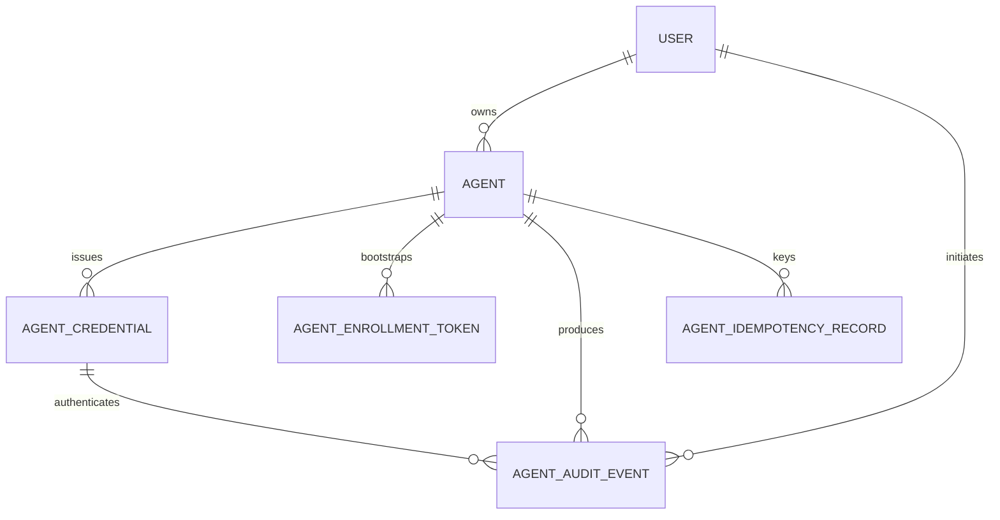
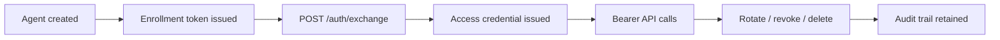
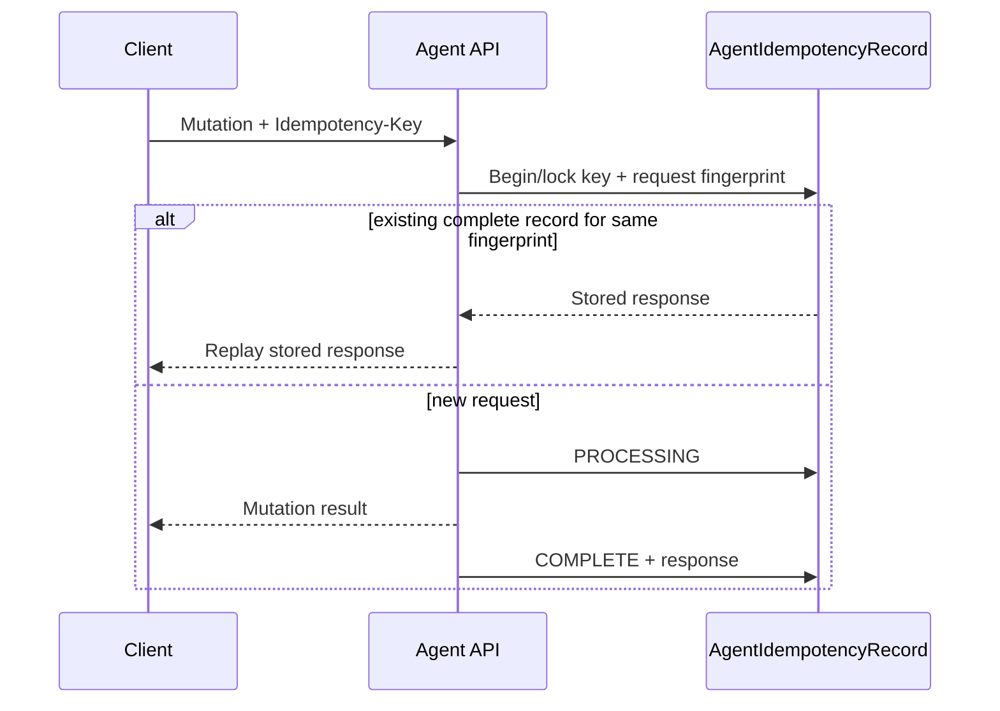

# agent models

The Agent app persists machine-control-plane identity, credentials, enrollment state, audit records and idempotency state. Full field-by-field details are in [field-reference.md](field-reference.md).

## Model relationship diagram

## Models

| Model | Purpose | Important lifecycle/constraints |
|---|---|---|
| `Agent` | Represents one machine/LLM control-plane identity owned by a PassDeployer user. | Unique per owner + name; scopes are normalized/validated on save; status can be active, disabled or revoked. |
| `AgentCredential` | Stores persistent Bearer access credentials without storing the raw token. | Token hash is SHA-256 of the high-entropy access token; credentials can expire/revoke independently. |
| `AgentEnrollmentToken` | Short-lived one-time bootstrap credential used to exchange for a normal Agent access token. | Must be unused, unexpired, and attached to an active Agent/user. |
| `AgentAuditEvent` | Durable sanitized audit trail for Agent operations. | Credential/Agent/User use SET_NULL where appropriate so audit history can survive resource deletion. |
| `AgentIdempotencyRecord` | Deduplicates retried mutating requests and stores replayable responses when configured. | Unique on (Agent, key); request fingerprint prevents the same key from silently representing a different request; records expire. |

## Credential lifecycle

Access credentials use deterministic SHA-256 storage for high-entropy raw tokens. The raw token is returned only at issuance/exchange time; ordinary reads expose prefix and lifecycle metadata, not plaintext credentials.

## Idempotency lifecycle

An idempotency key is scoped to one Agent. A missing key is permitted; the mutation then executes normally without replay storage. The decorator is fail-closed when it cannot establish a reliable request fingerprint.
