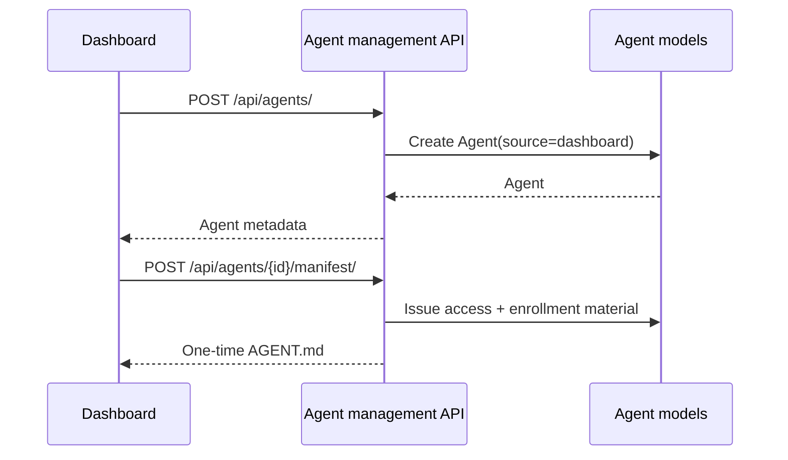

# Agent browser-management API

Root mount: `/api/agents/`. This is the authenticated browser/dashboard control plane for managing Agents owned by the current PassDeployer user. It is distinct from `/agent/v1/`, which is the machine-facing Agent API.

## Authentication

All endpoints use `SessionJWTAuthentication` and `IsAuthenticated`. The user can only address Agents belonging to that user.

## Lifecycle

## Endpoint matrix

| Method | Endpoint | Required input | Optional input | Behavior |
|---|---|---|---|---|
| GET | `/api/agents/scopes/` | none | none | Returns all known scopes with labels, category, high-risk/destructive/default flags. |
| GET | `/api/agents/` | none | `page`, `page_size` | Lists caller-owned Agents oldest-first. Page size is fixed to 5 maximum. |
| POST | `/api/agents/` | `name` | `description`, `scopes`, `metadata` | Creates a dashboard-provisioned Agent. Missing description/scopes/metadata default to empty/default scopes/empty object. Name max 100; duplicate owner+name => 409. |
| GET | `/api/agents/{agent_id}/` | path `agent_id` | none | Returns safe Agent summary and credential counts. |
| PATCH | `/api/agents/{agent_id}/` | path `agent_id` | `name`, `description`, `scopes`, `metadata` | Partial update; omitted fields remain unchanged. Scope names are validated. |
| DELETE | `/api/agents/{agent_id}/` | path `agent_id` | none | Deletes the Agent and its credentials through the application lifecycle. |
| GET | `/api/agents/{agent_id}/credentials/` | path `agent_id` | `page`, `page_size` | Lists credentials newest-first. Page size is fixed to 10 maximum. Raw token is never returned. |
| POST | `/api/agents/{agent_id}/credentials/` | path `agent_id` | `expires_at`, `expires_in_days` | Issues a new Bearer credential. Agent must be active. `expires_at` accepts ISO-8601 future datetime; `expires_in_days` is 1–3650 and overrides `expires_at` when both are supplied. |
| POST | `/api/agents/{agent_id}/credentials/rotate/` | path `agent_id` | none | Revokes previously active credentials and issues one new credential. Agent must be active. |
| DELETE | `/api/agents/{agent_id}/credentials/{credential_id}/` | `agent_id`, `credential_id` | none | Permanently deletes one credential belonging to the Agent. |
| POST | `/api/agents/{agent_id}/credentials/{credential_id}/revoke/` | `agent_id`, `credential_id` | none | Revokes the credential but retains its lifecycle/audit row. |
| GET | `/api/agents/{agent_id}/audit/` | path `agent_id` | `page`, `page_size` | Lists sanitized audit events newest-first. Page size is fixed to 10 maximum. |
| POST | `/api/agents/{agent_id}/manifest/` | path `agent_id` | none | Generates the one-time AGENT.md connection manifest. Agent must be active; response is no-store. |
| POST | `/api/agents/{agent_id}/{action}/` | `agent_id`, `action` | none | Supported actions are exactly `enable`, `disable`, `revoke`. |

## Agent body contract

| Field | Create required? | Update required? | Contract |
|---|---:|---:|---|
| `name` | Yes | No | Trimmed string, 1–100 characters. |
| `description` | No | No | String, maximum 10,000 characters; create defaults to empty. |
| `scopes` | No | No | List/tuple/set of valid scope names; create defaults to `DEFAULT_SCOPES`. |
| `metadata` | No | No | Must be an object; create defaults to `{}`. |

## Credential security

`token_hash` is persisted instead of plaintext. Ordinary credential reads return prefix/type/lifecycle metadata. Newly issued or rotated raw tokens are returned only in the creation response and must be stored securely.

Deleting a credential and revoking a credential are intentionally different operations: revoke keeps the credential record for lifecycle/audit visibility; delete removes the credential row.

## Audit

Successful Agent, credential, status and manifest mutations emit sanitized `AgentAuditEvent` records. Bearer, enrollment, shell and service-secret plaintext are excluded.

## Source

`src/agent/user_urls.py` and `src/agent/user_api.py`.
