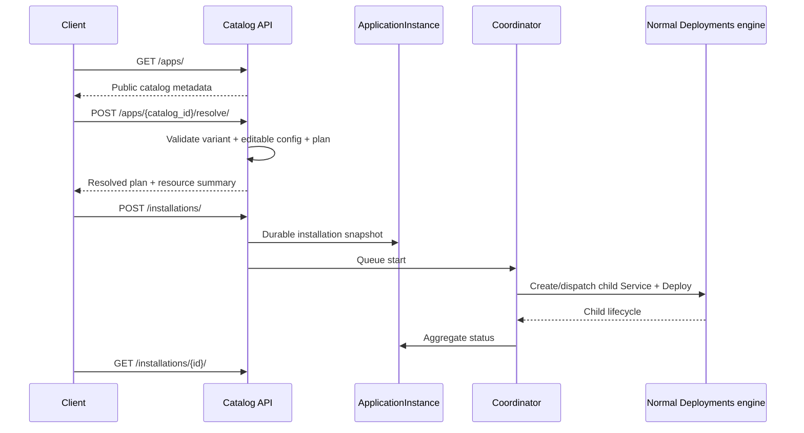
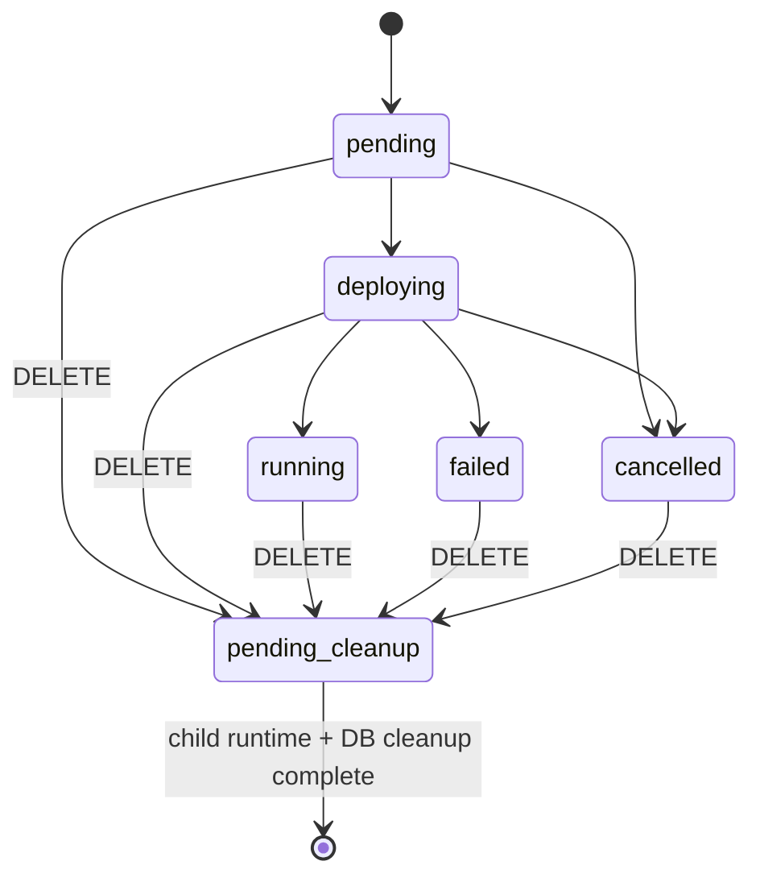
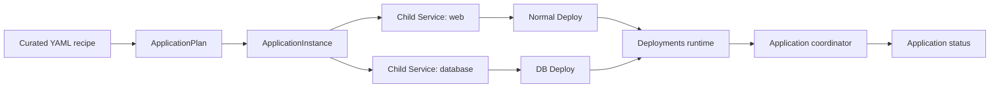

# app_catalog — detailed API reference

Root mount: `/api/application-catalog/`. Public Ready Apps only expose definitions that pass the publication policy. Installation records are always owner-scoped to the authenticated user.

## Ready App flow

## Endpoint matrix

| Method | Endpoint | Path parameters | Body/query | Requiredness | Side effect |
|---|---|---|---|---|---|
| GET | `/apps/` | none | none | — | None; lists public catalog entries. |
| GET | `/apps/{catalog_id}/` | `catalog_id` required | none | path required | None; hidden/internal definitions return 404. |
| POST | `/apps/{catalog_id}/resolve/` | `catalog_id` required | `name`, `plan_id`, `variant`, `config` | all four required; `config` must be object (may be empty) | Preview only; does not create DB/Service/Deploy state. |
| GET | `/installations/` | none | none | — | Reads caller-owned ApplicationInstances. |
| POST | `/installations/` | none | `catalog_id`, `variant`, `name`, `plan_id`, `config` | install contract requires all of these; sensitive values use declared secret slots | Creates ApplicationInstance and queues coordinator. |
| GET | `/installations/{id}/` | `id` UUID required | none | path required | None. Returns safe config and child summaries. |
| POST | `/installations/{id}/cancel/` | `id` UUID required | none | path required | Records durable cancellation intent and converges child work. |
| DELETE | `/installations/{id}/` | `id` UUID required | none | path required | Durable deletion intent; may return 202 while cleanup converges. |

## Resolve parameters

`POST /apps/{catalog_id}/resolve/` is the planning/validation boundary.

| Field | Required | Meaning |
|---|---:|---|
| `name` | Yes | User-facing application name; max length is enforced server-side and converted to a safe slug for internal identity. |
| `plan_id` | Yes | Selected Docker application/Ready plan. Non-Docker plans are rejected for public Ready Apps. |
| `variant` | Yes | Explicit catalog variant identifier. |
| `config` | Yes | Object containing only fields allowed by the selected variant. It may be empty when the recipe has defaults. |

For public Ready Apps, `domain` is not user-editable. The backend injects a platform-owned placeholder during resolution and later derives the final hostname from the created Service identity. The resolver forces HTTPS for public output.

The resource summary is backend-authoritative: CPU/RAM/price scale with declared replicas, and storage is counted from declared persistent volumes rather than browser-side calculations.

## Installation parameters

The installation body is the same logical input as resolve. The important difference is that installation crosses the trust boundary and persists an immutable definition/variant/config snapshot before creating child resources.

| Field | Required | Notes |
|---|---:|---|
| `catalog_id` | Yes | Must identify a currently public catalog definition. |
| `variant` | Yes | Must exist in the selected definition. |
| `name` | Yes | User-owned application name; `(user, slug)` is the installation identity boundary. |
| `plan_id` | Yes | Application/Ready Docker plan selected for app-role services. DB-role children use their configured DB plan. |
| `config` | Yes | Non-secret user configuration object. Secret slots are resolved into ServiceSecret/ServiceSecretVersion rather than exposed in the application serializer. |

## Installation state and cleanup

`cancel_requested` and the deletion stage are durable coordinator intent. Deletion may begin from any current application status; the parent commonly remains in its current status while `stage=deletion_pending` until child cleanup converges.

Reconciliation may requeue lost task delivery, but it never re-resolves the catalog or regenerates secrets. Child Services are removed before the application-owned network so Docker attachments can be released safely.
## Public response rules

The public catalog serializer exposes safe metadata and user-editable fields, not arbitrary Compose, raw secrets or privileged host configuration. Installation detail exposes the final `application_url` only after the application reaches `running`.

A child component includes its catalog key, concrete Service id/name, Deploy id/status/stage and safe resource/status information. Sensitive `secret_config` values are not returned.

## Errors

| Condition | HTTP | Code/behavior |
|---|---:|---|
| Unknown/internal catalog entry | 404 | Catalog application not found. |
| Invalid variant/config/plan | 400 | Catalog validation error. |
| Same owner + same application name | 409 | `application_name_conflict`; existing installation id may be returned. |
| Broker queue failure | 503 | `APPLICATION_TASK_QUEUE_FAILED`; installation stays durable/pending for reconciliation. |
| Cancel terminal installation | 409 | Current serialized installation is returned. |
| Delete with active cleanup/children | 202/409 depending boundary | Cleanup-pending response or active-child conflict. |

## Ready App → normal Service deployment boundary

The catalog coordinator does not own Docker/Swarm. Child services use the normal Service/Deploy/revision/deployment path, so Ready App runtime behavior stays consistent with ordinary services.
