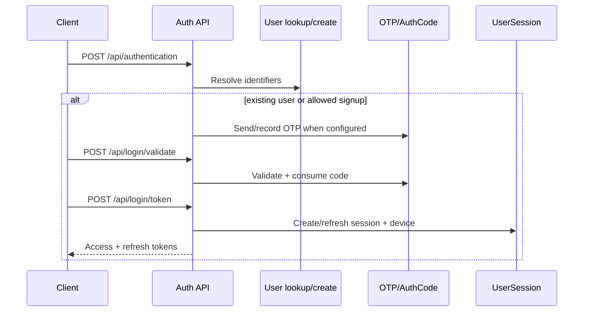

# auth_users — detailed API reference

Root mount: `/auth/`. Public authentication/recovery endpoints deliberately use the authentication-free boundary. Session/device/admin endpoints require the session JWT plus their specific permission policy.

## Authentication flow

## Public login settings

### GET `/api/settings/`

No body/query parameters.

Returns the active login policy used by frontend/auth flows, including enabled identifiers, OTP/password requirements, signup/invite policy, recovery policy, password rules and OTP timing.

## Start authentication

### POST `/api/authentication/`

At least one allowed identifier is required; accepted identifiers depend on LoginSettings.

| Field | Required | Notes |
|---|---:|---|
| `username` | Conditional | Accepted when username login is enabled. |
| `email` | Conditional | Accepted when email login is enabled. |
| `phone_number` | Conditional | Accepted when phone login is enabled. |
| `invite` | Conditional | May be required for new-user signup when invite policy requires it. |
| `invite_token` | Conditional | Compatibility alias for `invite`. |
| `password` | Conditional | May be accepted during account creation when password-on-signup is configured. |

The server resolves the user using enabled identifier rules. For a new user, signup is allowed only when current settings and invite policy permit it.

## Validate OTP

### POST `/api/login/validate/`

| Field | Required | Notes |
|---|---:|---|
| `code` | Yes | Login/signup OTP. |
| `username` | Conditional | One allowed identifier when required by the configured login policy. |
| `email` | Conditional | Alternative identifier. |
| `phone_number` | Conditional | Alternative identifier. |

The OTP is purpose-scoped and may be consumed after successful validation. Verification can also mark email/phone verified and activate the user according to LoginSettings.

## Complete authentication

### POST `/api/login/token/`

| Field | Required | Notes |
|---|---:|---|
| `code` | Conditional | Required when OTP is enabled. |
| `password` | Conditional | Required when the current user needs password authentication. |
| `username`, `email`, `phone_number` | Conditional | Identifier required according to policy. |

Successful authentication creates/updates Device + UserSession state before token issuance.

## Set password

### POST `/api/set-password/`

The request uses the account-setup/password serializer. Password confirmation is required when `require_confirm_password` is enabled; minimum length follows LoginSettings.

## Username recovery

### POST `/api/recovery/request/`

At least one of `email` or `phone_number` is required.

| Field | Required | Notes |
|---|---:|---|
| `email` | One-of | Used only when email recovery is enabled. |
| `phone_number` | One-of | Used only when phone recovery is enabled. |

Unknown accounts use the anti-enumeration success response.

### POST `/api/recovery/confirm/`

| Field | Required | Notes |
|---|---:|---|
| `code` | Yes | Recovery OTP. |
| `email` | One-of | Contact used for the request. |
| `phone_number` | One-of | Contact used for the request. |

## Password recovery

### POST `/api/password-recovery/request/`

One of `email` or `phone_number` is required. The chosen channel must be enabled by LoginSettings.

### POST `/api/password-recovery/confirm/`

| Field | Required | Notes |
|---|---:|---|
| `code` | Yes | Password-reset OTP. |
| `password` | Yes | New password; minimum length follows policy. |
| `password_confirm` | Conditional | Required when confirmation is enabled. |
| `confirm_password` | Alias | Accepted compatibility alias for `password_confirm`. |
| `email` | One-of | Contact identifier. |
| `phone_number` | One-of | Contact identifier. |

## Invite API

### GET `/api/invite/validate/`

Query:

| Parameter | Required |
|---|---:|
| `token` | Yes |

### POST `/api/invite/create/`

All fields are optional.

| Field | Required | Default/meaning |
|---|---|---|
| `label` | No | Empty string when omitted. |
| `max_uses` | No | Null means unlimited; otherwise integer >= 1. |
| `expires_at` | No | No expiry when omitted; ISO-8601 when supplied. |
| `base_url` | No | Optional URL prefix used only to construct the returned invite URL. |

Requires the existing invite-management permission.

### GET `/api/invite/list/`

No request body. Admin-only invite listing.

### POST `/api/invite/deactivate/`

Body: `token` required.

## Session APIs

### GET `/api/sessions/`

No body. Returns caller's active session list and server-side session-management metadata.

### POST `/api/sessions/activity/`

No body required. Records activity for the current session subject to server-side rate limiting.

### POST `/api/sessions/logout-all/`

No body. Revokes eligible sessions owned by the caller.

### DELETE `/api/sessions/{session_id}/`

Path `session_id` required. Caller ownership is verified.

### GET `/api/devices/`

No body. Lists caller-owned devices.

### POST `/api/devices/{device_id}/sessions/`

Path `device_id` required. Revokes sessions attached to the caller-owned device.

## Token compatibility endpoints

### POST `/api/login/token/refresh[/]`

Body:

| Field | Required |
|---|---:|
| `refresh` | Yes |

The refresh token must contain `sid` and `user_id`. The stored session credential hash is compared atomically, the refresh token is rotated, and the session cache is refreshed.

### POST `/api/login/token/verify[/]`

Body:

| Field | Required |
|---|---:|
| `token` | Yes |

The token must contain `sid` and `user_id`, and the referenced UserSession must still be active.

### GET/POST `/api/validateToken/`

Compatibility token-validation endpoint. Use the session-aware token semantics above; tokens without a valid session binding are rejected.

## Admin login policy

### GET/PATCH `/api/admin/login-settings/`

GET has no body. PATCH accepts any subset of the editable LoginSettings fields:

`allow_username`, `allow_email`, `allow_phone`, `require_password`, `require_otp`, `password_as_second_factor`, `allow_auto_signup`, `auto_activate_on_signup`, `require_password_on_signup`, `activate_after_successful_otp`, `require_invite_for_signup`, `allow_username_recovery`, `recovery_via_email`, `recovery_via_phone`, `allow_password_recovery`, `password_recovery_via_email`, `password_recovery_via_phone`, `require_confirm_password`, `min_password_length`, `allow_login`, `custom_login_closed_title`, `custom_login_closed_message`, `otp_length`, `otp_expire_minutes`, `otp_max_attempts`.

Boolean fields are coerced to boolean. Integer policy fields must be >= 1. Staff requires the existing `login_settings.manage` rule for mutation; superusers bypass it.

## WebSocket session rule

First-party browser WebSockets carry a session-bound access JWT in the `token` query parameter. The JWT `sid` must resolve to an active UserSession. A revoked live session is closed with application code `4401`.

## Legacy aliases

`/api/login/` and `/api/signup/` delegate into the same unified authentication flow rather than implementing a second credential model.

## Additional exact URL aliases

The URL module also declares these trailing-slash forms explicitly:

- `DELETE /api/sessions/{session_id}/` — `session_id` required.
- `GET /api/admin/auth-codes/{pk}/` — `pk` required and admin permission applies.

The project also retains both slash and no-slash token refresh/verify compatibility mounts where declared by `src/auth_users/urls.py`.
 
## Administrative AuthCode endpoints

### GET/POST `/api/admin/auth-codes/`

Administrative inspection/management of `AuthCode` records. Authentication-code plaintext is not exposed as a normal read field.

### POST `/api/admin/auth-codes/purge/`

Privileged cleanup operation for purgeable authentication codes. No tenant credential is returned.

### GET/DELETE `/api/admin/auth-codes/{pk}/`

`pk` is required and identifies one `AuthCode` row. Responses expose sanitized lifecycle metadata only.

