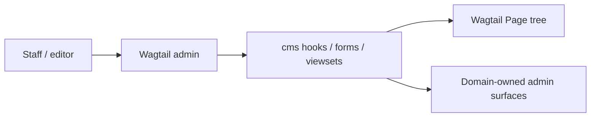

# cms API and administration boundary

The `cms` app does not expose an independent public REST API. Its main runtime surface is Wagtail page/admin integration.

## Administration surface

The concrete page model is `cms.HomePage`. Wagtail's inherited `Page` fields and behavior remain the authority; `HomePage` adds no fields in `src/cms/models.py`.

## HTTP contract

There is no `src/cms/urls.py` or app-owned REST route. Product documentation content is owned by the `docs` app, while Wagtail administration is mounted by the project's admin routing.

Source: `src/cms/models.py`, `forms.py`, `viewsets.py`, `wagtail_hooks.py`.
