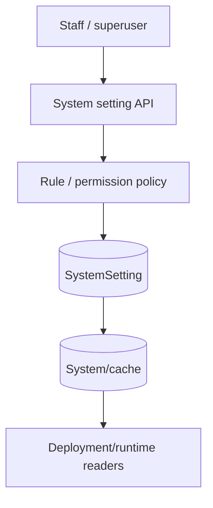
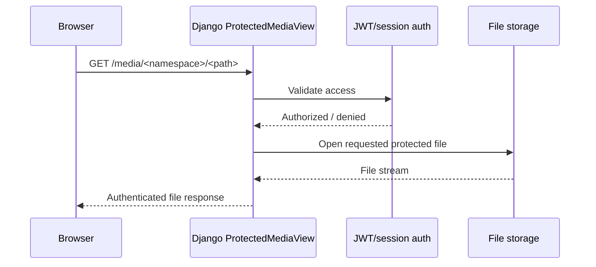

# core — detailed API and protected-media reference

The core app owns system-setting APIs and protected media/file-serving boundaries. It is infrastructure support, not the tenant deployment runtime.

## System settings flow

## Settings endpoints

The settings routes are mounted under the project system-settings prefix.

### GET `settings/`

Lists system settings according to the caller's permission policy. Query/filter behavior is defined by `SystemSettingListAPIView`; secret values are protected from non-staff callers.

### POST `settings/seed/`

Operator action that seeds known settings. No tenant request body is required. The action is privileged and should be treated as an administrative configuration mutation.

### GET `settings/{key}/`

Path `key` is required. Returns one setting subject to the secret/editability exposure policy.

### PATCH `settings/{key}/`

Path `key` is required. Only editable settings may be changed. Secret settings must preserve the non-disclosure rule; the API must not turn an encrypted/secret value into plaintext public output.

## Protected deployment download

### GET `<uuid:pk>/download/`

The path UUID identifies a stored deployment artifact. Authorization is enforced before file access.

## Protected media

The following paths are intentionally served through Django rather than nginx so JWT policy cannot be bypassed:

- `messenger/<path:path>` — Messenger avatars/attachments.
- `images/<path:path>` — user profile images.
- `tickets/<path:path>` — ticket attachments.

The `path` parameter is required and is treated as a path within the selected protected-media namespace.

Serving these paths directly through an nginx alias would bypass the application-level permission check and is therefore intentionally forbidden.

## Infrastructure settings model

`SystemSetting` stores stable machine keys with a text value plus a declared `value_type` (`string`, `integer`, `float`, `boolean`, `json`). Secret/editability are first-class flags. Saving or deleting a setting invalidates the per-key and global settings cache.
