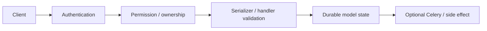

# custom_emails — detailed API route reference

This page is a source-derived route inventory. Path parameters are required by the URL shape. Request fields shown as observed are read by the implementation; endpoint-specific validation remains authoritative in the handler/serializer.

## Request flow

## Endpoint matrix

| Route declaration | Handler | Request fields observed in source | Requiredness / notes |
|---|---|---|---|
| `templates/` | `EmailTemplateListCreateAPIView` | `search`, `status` | no path parameter ; handler-module inputs include `search`, `status` |
| `templates/<int:pk>/` | `EmailTemplateDetailAPIView` | `search`, `status` | path `pk` required ; handler-module inputs include `search`, `status` |
| `templates/preview/` | `EmailTemplatePreviewAPIView` | `search`, `status` | no path parameter ; handler-module inputs include `search`, `status` |
| `send/` | `EmailSendAPIView` | `search`, `status` | no path parameter ; handler-module inputs include `search`, `status` |
| `logs/` | `EmailLogListAPIView` | `search`, `status` | no path parameter ; handler-module inputs include `search`, `status` |
| `logs/<int:pk>/` | `EmailLogDetailAPIView` | `search`, `status` | path `pk` required ; handler-module inputs include `search`, `status` |
| `logs/<int:pk>/retry/` | `EmailLogRetryAPIView` | `search`, `status` | path `pk` required ; handler-module inputs include `search`, `status` |
| `stats/` | `EmailStatsAPIView` | `search`, `status` | no path parameter ; handler-module inputs include `search`, `status` |
| `users/` | `AdminUserSearchAPIView` | `search`, `status` | no path parameter ; handler-module inputs include `search`, `status` |

## Observed request keys

| Key | Typical role | Optionality |
|---|---|---|
| `search` | Input consumed by at least one handler in this app API layer. | Conditional/operation-specific; use the handler or serializer as the final requiredness contract. |
| `status` | Input consumed by at least one handler in this app API layer. | Conditional/operation-specific; use the handler or serializer as the final requiredness contract. |

## Source of truth

The URL declaration, handler implementation and serializer validation are authoritative. This reference deliberately does not invent requiredness when the code makes it conditional on login settings, ownership, resource state or another field.
