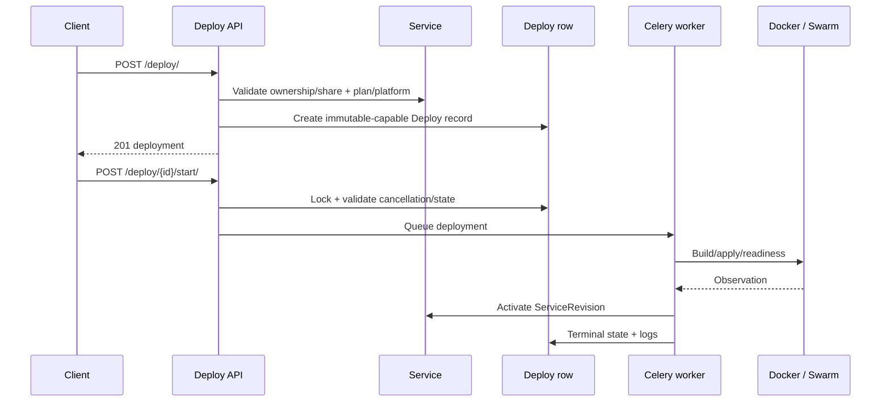
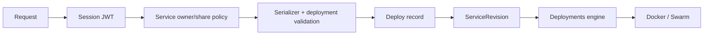

# deploy — detailed API reference

Root mount: `/deploy/`. Normal deployment APIs use session JWT authentication and then enforce Service ownership or the applicable ServiceShare action.

## Deployment request flow

## Collection endpoint

### GET `/deploy/`

Optional query parameters:

| Parameter | Required | Default | Behavior |
|---|---|---|---|
| `service_id` | No | all visible services | Restricts results to one Service. |
| `status` | No | all | Exact Deploy status filter. |
| `stage` | No | all | Exact lifecycle stage filter. |
| `q` | No | empty | Case-insensitive name search. |
| `created_by` | No | all | Filters by creator user id. |
| `from` | No | none | Inclusive `created_at` lower bound; ISO datetime accepted by Django parser. |
| `to` | No | none | Inclusive `created_at` upper bound. |
| `ordering` | No | `-created_at` | Only `created_at`, `-created_at`, `status`, `-status` are accepted; unknown values fall back to `-created_at`. |
| `page` | No | 1 | DRF page number. |
| `page_size` | No | 10 | Requested page size; server maximum is 50. |

### POST `/deploy/`

Required:

| Field | Type | Required | Notes |
|---|---|---:|---|
| `service` | UUID | Yes | Target Service. Must be owned by the caller or allow the `can_deploy_add` share action. |
| `name` | string | No | Normalized/allocated by the server when omitted or conflicting. |
| `version` | string | No | Deployment version/tag input when applicable. |
| `config` | object/JSON string | No | Tenant configuration; sanitized before persistence. |
| `zip_file` | ZIP upload | No | Required for archive-backed flows that do not already have an artifact. |

The selected Service Plan determines the execution platform family; tenant `config.platform` cannot switch an APP plan into another execution family. Database platforms receive additional credential/config validation.

## Detail endpoint

### GET `/deploy/{id}/`

Returns deployment provenance, revision/status fields, masked configuration, recent lifecycle logs and safe artifact metadata.

### PUT/PATCH `/deploy/{id}/`

Executable fields become immutable once `revision` is attached. The implementation rejects changes to `service`, `version`, `zip_file` or `config` when such a revision exists. PATCH is partial.

### DELETE `/deploy/{id}/`

Uses the existing deployment destroy/cleanup boundary. Authorization is Service-scoped.

## Lifecycle actions

### POST `/deploy/{id}/start/`

No request body is required.

Preconditions include Service not already being queued/deployed/stopped and, for database platforms, valid stored DB credentials. The API records a new execution owner and queues the appropriate application or DB worker.

### POST `/deploy/{id}/cancel/`

No body is required.

Cancellation is cooperative: the endpoint records durable cancellation intent and lets the current owner stop build/runtime work and clean up safely. It does not immediately terminate the worker process.

### POST `/deploy/{id}/redeploy/`

No body is required.

This is an alias of `start`; it reuses the existing Deploy row and execution path.

### POST `/deploy/{id}/rebuild/`

Optional query:

| Parameter | Required | Default | Valid values | Effect |
|---|---|---|---|---|
| `force_reinit` | No | false | `1`, `true`, `yes`, `on` | Database platforms only. Wipes DB data volumes so initialization runs from scratch. |

Sending `force_reinit` to a non-DB deployment returns HTTP 400. Normal rebuild preserves database volumes while rebuilding runtime; application platforms rebuild image/container as appropriate.

### POST `/deploy/{id}/rollback/`

No body is required.

The endpoint marks rollback requested. Actual rollback/activation is performed through the revision/runtime lifecycle.

## Database configuration

### PATCH `/deploy/{id}/update_db_config/`

Allowed top-level keys:

| Key | Required | Notes |
|---|---|---|
| `root_password` | Conditional | Required for MySQL/MariaDB unless a password alias can satisfy the platform validator. Empty values are treated as unchanged so masked forms do not erase the existing secret. |
| `password` | Conditional | DB user password or MySQL/MariaDB root-password alias. |
| `username` | Conditional | Database username. Required by some database platforms. |
| `database` | No | Database name when supported. |
| `port` | No | Custom port; otherwise platform default is used. |
| `env` | No | Additional DB environment mapping accepted by the validator. |

The endpoint does not restart the deployment. Call rebuild/start through the lifecycle boundary to apply the stored configuration.

### GET `/deploy/{id}/reveal_db_credentials/`

High-risk read. Service ownership or `can_view_db_credentials` is required. Credential values are not exposed to unauthorized callers.

## Logs and artifacts

### GET `/deploy/{id}/logs/`

Optional query:

| Parameter | Required | Default | Notes |
|---|---|---|---|
| `limit` | No | 10 | Integer, clamped to 1–200. |
| `before` | No | none | Opaque/date cursor for backward pagination. |
| `after` | No | none | Opaque/date cursor for forward pagination. |
| `q` | No | empty | Message search. |
| `level` | No | all | Exact level filter. |
| `stage` | No | all | Exact deployment stage. |
| `event_type` | No | all | Exact event type. |
| `from` | No | none | Lower creation-time bound. |
| `to` | No | none | Upper creation-time bound. |

If the dedicated deployment-log store is unavailable, the endpoint returns the Deploy with an empty log list and `log_store_available=false` rather than failing the primary API.

### GET `/deploy/{id}/logs/export/`

Exports deployment lifecycle events for an authorized caller. Query filters mirror the log query boundary.

### GET `/deploy/{id}/download/`

No body. Returns the stored ZIP only after deployment ownership/staff authorization.

## Utility endpoints

### GET `/deploy/name_is_available/`

| Query parameter | Required | Default | Meaning |
|---|---|---|---|
| `name` | Yes | — | Candidate name; names shorter than 4 characters return `result=false`. |
| `service_id` | No | global check | Limit uniqueness check to one Service. |
| `exclude_id` | No | none | Deployment id to exclude when editing; `exclude` is accepted as an alias. |

### POST `/deploy/set_deploy/`

Body:

| Field | Required |
|---|---:|
| `deploy_id` | Yes |
| `service_id` | Yes |

The operation validates service access and immutable revision availability, then activates the revision. `selected_deploy` is only a compatibility projection.

### POST `/deploy/unset_deploy/`

Body:

| Field | Required |
|---|---:|
| `deploy_id` | Yes |
| `service_id` | Yes |

The deployment must currently be authoritative for the Service. The operation clears `active_revision` and the compatibility selection under a lock.

### POST `/deploy/generate_db_credentials/`

Body:

| Field | Required | Notes |
|---|---|---|
| `platform` | Yes | Must be one of the configured DB platforms. |

Response contains generated `username`, `password`, `database`, `port`, and for MySQL/MariaDB `root_password`.

### POST `/deploy/inspect_zip/`

Multipart:

| Field | Required | Notes |
|---|---|---|
| `file` | Yes | Must be a `.zip`; size is bounded by the deployment upload limit. |

This endpoint is read-only: it extracts to a temporary location, detects platform/framework markers and returns a suggested configuration. It does not create a Deploy.

### GET/POST `/deploy/config_contract/`

GET returns the tenant configuration contract, blocked keys, supported platforms, mirrors and an example.

POST accepts a draft config object and returns warnings, unknown keys, stripped blocked fields and sanitized config. It is validation/preview only and does not create a Deploy.

## Authorization and source of truth

The API owns request validation and orchestration requests. Docker/Swarm mutation remains owned by the deployments runtime layer.
