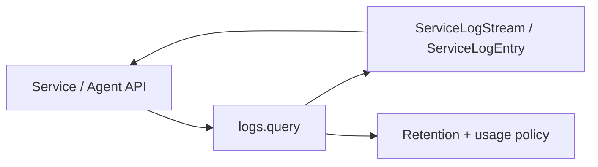

# logs API and service-log query boundary

The `logs` app does not own a separate public REST router. Runtime logs are exposed through the Services API and the Agent API, while the `logs.query` module is the internal query/export boundary.

## Public consumers

| Consumer | Endpoint | Purpose |
|---|---|---|
| Services | `/services/service/<uuid:pk>/logs/` | Read runtime service log events for an authorized Service. |
| Services | `/services/service/<uuid:pk>/logs/export/` | Export runtime logs for an authorized Service. |
| Agent | `/agent/v1/services/{service_id}/logs` | Machine-readable runtime log query. |
| Agent | `/agent/v1/services/{service_id}/logs/export` | Machine-readable log export. |

## Internal boundary

The app owns runtime-log persistence, ingestion, retention and query policy; it does not own deployment lifecycle state. Deployment lifecycle events remain under `deploy.DeployLog`.

## Parameter contract

Agent export supports optional `from`, `to`, `level`, `stream`, `q`, `limit` and `format`. `limit` is bounded server-side (default 5000, maximum 10000); format is `txt` or `jsonl`.

The normal service log read path uses cursor-based pagination where available. Callers must treat returned cursors as opaque.

Source: `src/logs/query.py`, `src/services/api/runtime.py`, `src/agent/apis/services.py`.
