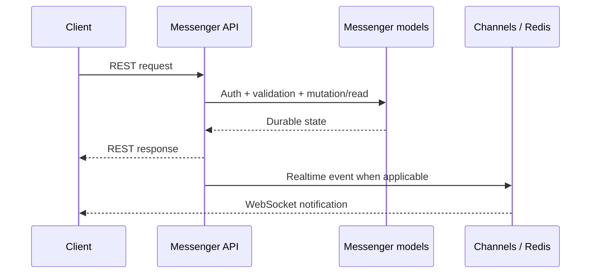
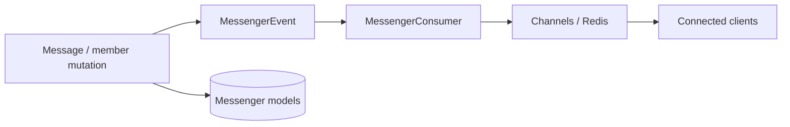

# messenger — detailed API reference

Root REST mount: `/api/messenger/`. This page is derived from the current route declarations and handler request access. Path identifiers are mandatory whenever present in the route.

## Architecture

The REST API owns authentication, object-level conversation/member authorization and durable model mutation. Realtime delivery is a transport layer; it is not the durable source of truth.

## Complete route matrix

| Route | Handler | Request fields observed in implementation |
|---|---|---|
| `/api/messenger/users/search/` | `as_view` | `allowed_user_ids`, `scope`, `text`, `username` |
| `/api/messenger/contacts/` | `as_view` | `nickname`, `page`, `page_size`, `q`, `user_id` |
| `/api/messenger/contacts/<int:user_id>/` | `as_view` | `nickname`, `page`, `page_size`, `q`, `user_id` |
| `/api/messenger/blocks/` | `as_view` | `nickname`, `page`, `page_size`, `q`, `user_id` |
| `/api/messenger/blocks/<int:user_id>/unblock/` | `as_view` | `nickname`, `page`, `page_size`, `q`, `user_id` |
| `/api/messenger/conversations/` | `as_view` | `avatar`, `clear_avatar`, `description`, `history_visibility`, `is_closed`, `is_public`, `member_ids`, `members_can_add`, `only_admins_send`, `page`, `page_size`, `requires_approval`, `title`, `type`, `user_id` |
| `/api/messenger/conversations/<int:pk>/` | `as_view` | `avatar`, `clear_avatar`, `description`, `history_visibility`, `is_closed`, `is_public`, `member_ids`, `members_can_add`, `only_admins_send`, `page`, `page_size`, `requires_approval`, `title`, `type`, `user_id` |
| `/api/messenger/conversations/<int:pk>/messages/` | `as_view` | `body`, `client_message_id`, `conversation_id`, `emoji`, `force_all`, `limit`, `message_ids`, `q`, `reply_to`, `schedule_at`, `scheduled_for`, `up_to_message_id` |
| `/api/messenger/conversations/<int:pk>/events/` | `as_view` | `avatar`, `clear_avatar`, `description`, `history_visibility`, `is_closed`, `is_public`, `member_ids`, `members_can_add`, `only_admins_send`, `page`, `page_size`, `requires_approval`, `title`, `type`, `user_id` |
| `/api/messenger/conversations/<int:pk>/messages/search/` | `as_view` | `body`, `client_message_id`, `conversation_id`, `emoji`, `force_all`, `limit`, `message_ids`, `q`, `reply_to`, `schedule_at`, `scheduled_for`, `up_to_message_id` |
| `/api/messenger/conversations/<int:pk>/scheduled/` | `as_view` | `avatar`, `clear_avatar`, `description`, `history_visibility`, `is_closed`, `is_public`, `member_ids`, `members_can_add`, `only_admins_send`, `page`, `page_size`, `requires_approval`, `title`, `type`, `user_id` |
| `/api/messenger/messages/<int:pk>/cancel-schedule/` | `as_view` | `body`, `client_message_id`, `conversation_id`, `emoji`, `force_all`, `limit`, `message_ids`, `q`, `reply_to`, `schedule_at`, `scheduled_for`, `up_to_message_id` |
| `/api/messenger/conversations/<int:pk>/read/` | `as_view` | `avatar`, `clear_avatar`, `description`, `history_visibility`, `is_closed`, `is_public`, `member_ids`, `members_can_add`, `only_admins_send`, `page`, `page_size`, `requires_approval`, `title`, `type`, `user_id` |
| `/api/messenger/conversations/<int:pk>/pin/` | `as_view` | `avatar`, `clear_avatar`, `description`, `history_visibility`, `is_closed`, `is_public`, `member_ids`, `members_can_add`, `only_admins_send`, `page`, `page_size`, `requires_approval`, `title`, `type`, `user_id` |
| `/api/messenger/conversations/<int:pk>/invite-links/` | `as_view` | `max_uses` |
| `/api/messenger/conversations/<int:pk>/invite-links/<int:link_id>/revoke/` | `as_view` | `max_uses` |
| `/api/messenger/groups/search/` | `as_view` | `action`, `avatar`, `q` |
| `/api/messenger/groups/<int:pk>/join/` | `as_view` | `action`, `avatar`, `q` |
| `/api/messenger/join/<str:code>/` | `as_view` | `max_uses` |
| `/api/messenger/messages/<int:pk>/forward/` | `as_view` | `body`, `client_message_id`, `conversation_id`, `emoji`, `force_all`, `limit`, `message_ids`, `q`, `reply_to`, `schedule_at`, `scheduled_for`, `up_to_message_id` |
| `/api/messenger/messages/<int:pk>/react/` | `as_view` | `body`, `client_message_id`, `conversation_id`, `emoji`, `force_all`, `limit`, `message_ids`, `q`, `reply_to`, `schedule_at`, `scheduled_for`, `up_to_message_id` |
| `/api/messenger/messages/<int:pk>/edit/` | `as_view` | `body`, `client_message_id`, `conversation_id`, `emoji`, `force_all`, `limit`, `message_ids`, `q`, `reply_to`, `schedule_at`, `scheduled_for`, `up_to_message_id` |
| `/api/messenger/messages/<int:pk>/pin/` | `as_view` | `body`, `client_message_id`, `conversation_id`, `emoji`, `force_all`, `limit`, `message_ids`, `q`, `reply_to`, `schedule_at`, `scheduled_for`, `up_to_message_id` |
| `/api/messenger/messages/<int:pk>/readers/` | `as_view` | `body`, `client_message_id`, `conversation_id`, `emoji`, `force_all`, `limit`, `message_ids`, `q`, `reply_to`, `schedule_at`, `scheduled_for`, `up_to_message_id` |
| `/api/messenger/messages/<int:pk>/` | `as_view` | `body`, `client_message_id`, `conversation_id`, `emoji`, `force_all`, `limit`, `message_ids`, `q`, `reply_to`, `schedule_at`, `scheduled_for`, `up_to_message_id` |
| `/api/messenger/conversations/<int:pk>/pinned-messages/` | `as_view` | `body`, `client_message_id`, `conversation_id`, `emoji`, `force_all`, `limit`, `message_ids`, `q`, `reply_to`, `schedule_at`, `scheduled_for`, `up_to_message_id` |
| `/api/messenger/conversations/<int:pk>/leave/` | `as_view` | `avatar`, `clear_avatar`, `description`, `history_visibility`, `is_closed`, `is_public`, `member_ids`, `members_can_add`, `only_admins_send`, `page`, `page_size`, `requires_approval`, `title`, `type`, `user_id` |
| `/api/messenger/conversations/<int:pk>/participants/` | `as_view` | `member_ids`, `page`, `page_size`, `q`, `role`, `user_id`, `user_ids` |
| `/api/messenger/conversations/<int:pk>/members/` | `as_view` | `member_ids`, `page`, `page_size`, `q`, `role`, `user_id`, `user_ids` |
| `/api/messenger/conversations/<int:pk>/members/<int:user_id>/` | `as_view` | `member_ids`, `page`, `page_size`, `q`, `role`, `user_id`, `user_ids` |
| `/api/messenger/conversations/<int:pk>/members/<int:user_id>/role/` | `as_view` | `member_ids`, `page`, `page_size`, `q`, `role`, `user_id`, `user_ids` |
| `/api/messenger/conversations/<int:pk>/transfer-ownership/` | `as_view` | `avatar`, `clear_avatar`, `description`, `history_visibility`, `is_closed`, `is_public`, `member_ids`, `members_can_add`, `only_admins_send`, `page`, `page_size`, `requires_approval`, `title`, `type`, `user_id` |
| `/api/messenger/conversations/<int:pk>/delete/` | `as_view` | `avatar`, `clear_avatar`, `description`, `history_visibility`, `is_closed`, `is_public`, `member_ids`, `members_can_add`, `only_admins_send`, `page`, `page_size`, `requires_approval`, `title`, `type`, `user_id` |
| `/api/messenger/attachments/<int:pk>/download/` | `as_view` | `before_id`, `kind`, `limit`, `once`, `token` |
| `/api/messenger/attachments/<int:pk>/view-once/` | `as_view` | `before_id`, `kind`, `limit`, `once`, `token` |
| `/api/messenger/me/photos/` | `as_view` | `allowed_user_ids`, `scope`, `text`, `username` |
| `/api/messenger/me/photo-privacy/` | `as_view` | None observed |
| `/api/messenger/users/<int:user_id>/profile/` | `as_view` | `allowed_user_ids`, `scope`, `text`, `username` |
| `/api/messenger/users/by-username/` | `as_view` | None observed |
| `/api/messenger/conversations/<int:pk>/cleanup/` | `as_view` | `avatar`, `clear_avatar`, `description`, `history_visibility`, `is_closed`, `is_public`, `member_ids`, `members_can_add`, `only_admins_send`, `page`, `page_size`, `requires_approval`, `title`, `type`, `user_id` |
| `/api/messenger/conversations/<int:pk>/media/` | `as_view` | `before_id`, `kind`, `limit`, `once`, `token` |
| `/api/messenger/me/bio/` | `as_view` | None observed |
| `/api/messenger/conversations/<int:pk>/avatar/` | `as_view` | `before_id`, `kind`, `limit`, `once`, `token` |
| `/api/messenger/conversations/<int:pk>/join-requests/` | `as_view` | `action`, `avatar`, `q` |
| `/api/messenger/conversations/<int:pk>/join-requests/<int:req_id>/action/` | `as_view` | `action`, `avatar`, `q` |
| `/api/messenger/me/join-requests/` | `as_view` | `action`, `avatar`, `q` |
| `/api/messenger/join-requests/<int:req_id>/` | `as_view` | `action`, `avatar`, `q` |
| `/api/messenger/me/profile-broadcast/` | `as_view` | `allowed_user_ids`, `scope`, `text`, `username` |
| `/api/messenger/conversations/<int:pk>/call/` | `as_view` | `audio`, `call`, `call_id`, `reason`, `video` |
| `/api/messenger/conversations/<int:pk>/call/join/` | `as_view` | `audio`, `call`, `call_id`, `reason`, `video` |
| `/api/messenger/conversations/<int:pk>/call/active/` | `as_view` | `audio`, `call`, `call_id`, `reason`, `video` |
| `/api/messenger/conversations/<int:pk>/call/end/` | `as_view` | `audio`, `call`, `call_id`, `reason`, `video` |

## Required vs optional input rules

- Path identifiers are always required when present in the URL: conversation id, message id, user id, invite-link id, join-request id and attachment id.
- Query parameters are optional unless the operation explicitly rejects a missing value. Search/filter endpoints generally treat omission as an unfiltered request.
- Body fields are operation-specific. A field listed as "observed" above is not automatically required; the handler/serializer decides requiredness.
- For exact create/update validation, use the corresponding serializer/domain function as the final contract.

## Main operation groups

### Conversations
Conversation operations validate membership and role before mutation. Conversation creation/update may include title/description/publicity/approval and member-policy fields depending on the handler. Parent conversation ids in detail routes are mandatory.

### Messages
Message creation/edit/reaction/pin/read/forward operations act on a concrete conversation/message id and retain server-side authorization. Scheduling endpoints add scheduled-time/cancellation semantics. A client id, where supported, is correlation metadata and is not the database primary key.

### Groups and join requests
Group search/join and join-request approval are separate flows. The approval endpoint is addressed by both conversation id and request id. A requester can cancel their own pending request through the dedicated route.

### Invite links
Invite links are conversation-scoped. Revoke requires the conversation id and link id. Joining by code uses the code as a path value.

### Media and profile
Attachment delivery is access-controlled before streaming. View-once media has an explicit one-time-open state. Profile operations target the caller's own profile unless an explicit admin boundary is used.

### Calls
Call state is conversation-scoped. Active-call and join operations read current state; ending a call is a mutation guarded by call/session authorization.

## Realtime and durability

A client should be able to recover from a missed WebSocket event by reading the relevant REST resource again.

## Security invariants

1. Authentication does not imply conversation/object access.
2. Membership and role checks are server-side.
3. Attachment access is checked before content delivery.
4. Realtime events do not replace durable DB writes.
5. User-owned profile actions do not become cross-user mutations without an explicit admin boundary.

## Source

`src/messenger/urls.py` and `src/messenger/api/*.py`.
