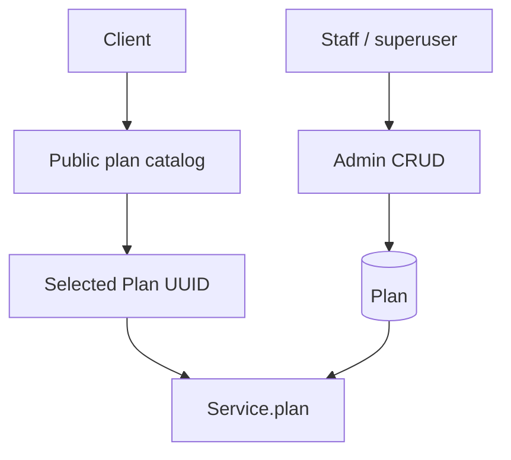
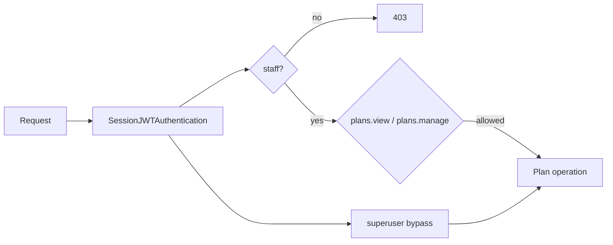

# plans — detailed API reference

The plans app exposes two distinct policies: public customer-facing plan discovery and staff-only administrative CRUD.

## Plan selection flow

## Public endpoints

### GET `/plans/`

No body. Query `id` is optional.

| Parameter | Required | Behavior |
|---|---|---|
| `id` | No | Omitted: paginated list of all plans ordered by platform. Single UUID: returns one plan. Comma-separated UUID v4 list: returns matching plans. |
| `page` | No | DRF pagination page when listing. |
| `page_size` | No | Standard DRF page-size behavior; this endpoint uses the configured default/max rather than the admin paginator. |

Invalid UUID input returns HTTP 400. A syntactically valid but unknown UUID returns HTTP 404 for the single-id form; a missing result set for a multi-id form also returns 404.

### GET `/plans/platforms/`

No body/query. Returns the configured platform choices from `core.global_settings.config.PLATFORM_CHOICES`.

### POST `/plans/platforms/`

| Field | Required | Notes |
|---|---:|---|
| `platform` | Yes | Must match one of the configured platform choice values or labels. |

On success returns all plans for the resolved platform. Invalid platform => 400; a valid platform with no plans => 404.

## Plan apply

### POST `/plans/plans/{planId}/apply/`

Path parameter `planId` is required and must be a UUID.

Request:

| Field | Required | Default | Meaning |
|---|---:|---|---|
| `target_type` | Yes | — | Must currently be `service`. |
| `target_id` | Yes | — | Target Service UUID. |
| `applyImmediately` | No | false | When true, the selected service is queued for a fresh deployment using its current active deploy/revision. |

The target Service must belong to the authenticated caller. With `applyImmediately=false`, the plan assignment is persisted but no deployment is queued. With `true`, the Service must already have an active revision/deploy and must not currently be queued/deploying/stopping.

## Staff admin CRUD

### GET `/plans/admin/plans/`

Authentication: Session JWT. Permission: staff with `plans.view` or `plans.manage`, or superuser.

Query:

| Parameter | Required | Default |
|---|---|---|
| `q` / `q_search` | No | empty |
| `platform` | No | all |
| `plan_type` | No | all |
| `page` | No | 1 |
| `page_size` | No | 20; maximum 100 |

Search matches plan name/platform. Responses are cached through the plan cache boundary.

### POST `/plans/admin/plans/`

Permission: `plans.manage` or superuser.

Request fields are the writable fields of `PlanSerializer`. Validation errors return HTTP 400. A successful create invalidates the plan cache and returns HTTP 201.

### GET `/plans/admin/plans/{pk}/`

Path `pk` required. Permission: plan view/manage.

### PUT/PATCH `/plans/admin/plans/{pk}/`

Path `pk` required. Partial updates are used by the PATCH action. Permission: `plans.manage`.

### DELETE `/plans/admin/plans/{pk}/`

Path `pk` required. Permission: `plans.manage`.

Deletion is rejected with HTTP 409 when one or more Services still reference the Plan. Successful deletion invalidates the plan cache.

## Authorization model

Public endpoints deliberately use `AllowAny`; they do not inherit staff rules.
