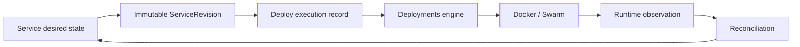

# services

## Purpose

services is the durable workload-domain boundary. It owns user intent, processes, configuration, persistent resources, sharing, shell policy and immutable ServiceRevision snapshots.

## Why this boundary exists

The workload must outlive any single Celery worker, deployment attempt or runtime resource. services provides durable desired state and an immutable executable snapshot; deployments can then safely perform external side effects from that snapshot.

## Responsibilities

Service/process state; source/build/runtime intent; environment/secrets; endpoints/networks; volumes; databases; revisions; sharing; shell sessions/audits; lifecycle API; service-log access.

## Non-responsibilities

Docker/Swarm resource creation is deployments. Deploy history/base-image registry is deploy. Policy definitions are plans. Runtime log storage is logs. Catalog parsing is app_catalog.

## Documents

- [models.md](models.md)
- [api.md](api.md)
- [serializers.md](serializers.md)
- [background.md](background.md)
- [tests.md](tests.md)

## Authority chain

~~~text
Service desired state
 -> ServiceRevision (immutable)
 -> deploy.Deploy (execution/provenance)
 -> deployments
 -> Docker/Swarm observation
~~~

active_revision is current release authority; selected_deploy is compatibility state.

## Security

Owner access and effective ServiceShare rules are rechecked server-side. Secret values are encrypted and versioned; normal APIs expose references/metadata, not plaintext.

## Invariants

1. Service desired state is durable.
2. ServiceRevision is immutable.
3. active_revision identifies the current executable release.
4. selected_deploy is not independent truth.
5. lifecycle_generation fences stale worker intent.
6. volume ownership is exclusive.
7. plan ceilings cannot be exceeded by tenant config.
8. Service API code does not become a second Docker runtime.

## Reading order

models.md -> serializers.md -> api.md -> background.md -> tests.md. Then ../deployments/execution/02-request-to-plan.md and 03-execution-lifecycle.md for execution crossings.

## Wagtail administration

The Wagtail Services surface keeps `Service`, `PrivateNetwork` and `Volume` as the configuration entry points and adds a read-only **Service inspection** view. It consolidates process definitions, endpoint/network/database bindings, volumes, revision/deployment history, sharing metadata, logical storage allocation and redacted security metadata. Secret values, encrypted secret ciphertext, database credential material and shell command/output are not displayed. The inspection view requires staff access plus `services.view_service`.
