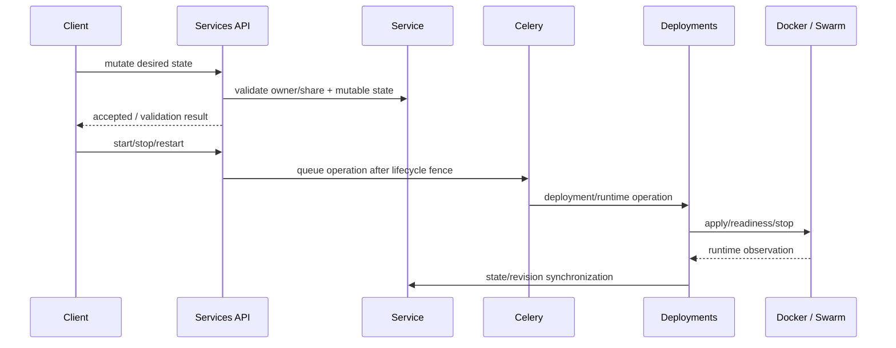
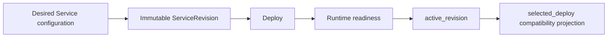

# services — detailed API reference

Root user API mount: `/services/`. User-facing service/network/volume routes are owner-scoped; shared-service access is additionally checked through `ServiceShare` action permissions. Admin routes use explicit staff/rule permissions.

## Service lifecycle



## Endpoint matrix

| Method | Endpoint | Parameters | Required | Behavior |
|---|---|---|---|---|
| GET/POST/PUT/PATCH/DELETE | `/service/` and `/service/{id}/` | Service serializer fields; `id` required on detail routes | method/route dependent | CRUD through `ServiceViewSet`; names are required on create and become read-only on existing records. |
| GET/POST/PUT/PATCH/DELETE | `/networks/` and `/networks/{id}/` | `name` required on create; `id` required on detail | route dependent | User-owned PrivateNetwork CRUD. Existing network name is read-only. |
| GET/POST/PUT/PATCH/DELETE | `/volume/` and `/volume/{id}/` | `name`, `size_mb`, `service`, `default_bind`, `default_mode`; `service` required by tenant create API | create: service required | Volume CRUD with quota, exclusive-service and runtime mutability rules. |
| POST | `/start_service/` | `service_id` required; `force_rebuild` optional | `service_id` | Queues start. With `force_rebuild=true`, uses rebuild permission/path. |
| POST | `/stop_service/` | `service_id` required | `service_id` | Records stopped desired-state intent before worker execution. |
| POST | `/restart_service/` | `service_id` required | `service_id` | Queues ordered runtime restart without creating a new revision. |
| POST | `/force_cancel_deploy/` | `deploy_id` or legacy `service_id`; at least one required | one-of | Immediately terminalizes eligible active deployment state under a lock. |
| POST | `/purge_service_runtime/` | `service_id` required | `service_id` | Purges owned runtime resources through the existing service cleanup boundary. |
| GET | `/service_status/` | `service_id` required | `service_id` | Returns runtime/service status observation. |
| GET/POST | `/service/{id}/configuration/` | GET none; PATCH fields below | `service_id` | Reads/updates declarative desired configuration; effective runtime change needs deployment. |
| GET/POST | `/service/{id}/environment/` | POST: `key`, `value`; `scope` and `is_secret` optional | `key`, `value` for normal set | Creates/updates environment variables; secret values are stored through ServiceSecret. |
| GET/POST/DELETE | `/service/{id}/secrets/` | `key`, `value`, optional `note` on create/update | key/value for writes | Secret CRUD; plaintext is not returned in read responses. |
| GET/POST/DELETE | `/service/{id}/endpoints/` | endpoint fields such as `name`, `target_port`, `published_port`, `protocol`, `exposure`, `hostname`, `path`, `tls`, `enabled` | endpoint-specific | Declarative public/internal endpoint configuration. |
| GET/POST/DELETE | `/service/{id}/networks/` | `network` required on attach | attach: network | Manages explicit Service network attachments. |
| GET/POST/DELETE | `/service/{id}/databases/` | `database` is a DatabaseResource UUID or `service:<database-service-uuid>`; optional `alias`, `env_prefix`, `access_mode` | POST requires a database reference | Explicitly binds a service to an owned managed resource or an existing same-owner DB service; service providers must share a private network; secrets are never returned; binding status is configured/unverified until a runtime connection check exists. |
| GET/POST/DELETE | `/service/{id}/database-resources/` | database resource fields such as name/engine/host/port/database name/provider | create-specific | Lists owner-managed resources and selectable same-owner DB services with `connectable` network metadata; never exposes DB credentials. |
| GET | `/service/{id}/revisions/` | `service_id` required | `service_id` | Lists immutable executable revisions. |
| GET | `/service/{id}/revisions/{revision_id}/` | both UUIDs required | both | Retrieves one immutable revision snapshot. |
| POST | `/service/{id}/revisions/{revision_id}/rollback/` | both UUIDs required | both | Queues rollback through `can_deploy_add`. |
| GET | `/service/{id}/logs/` | `limit`, `before`/`after`, `q`, `level`, `stage`, `event_type`, `from`, `to`, `cursor`, `direction` depending on query path | all optional | Reads persistent runtime logs only. |
| GET | `/service/{id}/logs/export/` | `from`, `to`, `level`, `stream`, `q`, `limit`, `format` | all optional | Exports runtime logs; limit is server bounded. |
| GET | `/service/{id}/volume-capabilities/` | `service_id` required | path | Returns supported volume operations for current service state. |
| GET/POST/... | `/services/{id}/shell/...` | See Shell section | endpoint-specific | Restricted shell lifecycle, file access, audit and history. |
| GET | `/services/mine/` | none | — | Returns services owned by caller. |
| GET | `/services/shared/` | `scope` optional: `received`, `created`, `all` (default `all`) | — | Returns visible shares according to scope. |
| GET | `/services/unified/` | `scope`, search/filter params optional | — | Unified owned/shared service listing. |
| POST | `/services/share/` | share create fields | endpoint-specific | Creates ServiceShare. |
| GET/PATCH/DELETE | `/services/shares/{id}/` | `pk` required; PATCH share fields | route dependent | Detail for recipient; mutation owner-only. DELETE deactivates rather than hard-deleting the share. |
| GET/POST/PUT | `/services/shares/{id}/permissions/` | permission/rule fields | endpoint-specific | Reads or changes effective share rules. |
| GET | `/services/shares/{id}/events/` | `pk` required | path | Reads share audit/events. |
| GET | `/services/groups/{group_id}/shares/` | `group_id` required | path | Lists shares associated with a Messenger group. |
| POST | `/services/shares/{id}/leave/` | `pk` required | path | Direct recipient can leave; group shares use Messenger membership instead. |
| GET/PUT | `/services/shares/{id}/members/` | `pk` required; `members` body for PUT | `pk`, members for PUT | Manages member overrides on a group share. |
| GET | `/services/share-presets/` | none | — | Returns preset rules/labels/defaults. |
| GET | `/services/{service_id}/access/` | `service_id` required | path | Returns ownership and effective Service permissions for UI gating. |

## Service configuration parameters

| Field | Required | Meaning |
|---|---:|---|
| `source_kind` | No | Selects the source family; validated against Service.SourceKind choices. |
| `source_config` | No | Source-specific configuration. Sensitive keys are rejected here; use `/secrets/` or secret-backed environment variables. |
| `build_config` | No | Build-time declarative configuration. Sensitive values are forbidden. |
| `runtime_config` | No | Runtime configuration. Sensitive values are forbidden. |
| `desired_state` | No | Must be `running` or `stopped`; changing it increments `lifecycle_generation` to fence stale workers. |

## Environment variable parameters

| Field | Required | Default | Meaning |
|---|---:|---|---|
| `key` | Yes | — | Must match `[A-Za-z_][A-Za-z0-9_]{0,127}`. |
| `value` | Yes | empty string accepted | Plaintext value when `is_secret=false`; secret value when `is_secret=true`. |
| `scope` | No | runtime | Must be one of the ServiceEnvironmentVariable.Scope choices. |
| `is_secret` | No | false | When true, the value is stored in the encrypted/versioned secret system. |

## Runtime action parameters

`POST /start_service/` requires `service_id`; `force_rebuild` is optional and defaults false. `POST /stop_service/` and `/restart_service/` require `service_id`. These endpoints reject operations while the Service is already queued/deploying/stopping. Stop increments the lifecycle fence before queueing the worker.

`POST /force_cancel_deploy/` accepts either `deploy_id` (preferred) or legacy `service_id`; at least one is required. `POST /purge_service_runtime/` uses the service id and existing purge authorization.

## Volume semantics

Volumes are exclusive to one Service. Tenant creation requires an existing, attached Service so quota can be checked against `Service.plan`. The shared `VolumeSerializer` permits a nullable service field for reuse across API contexts, but the tenant `VolumeViewSet.create` rejects a missing/null `service`; a tenant cannot create an ownerless volume and attach it later.

The Plans service wizard must therefore stage new volume specifications locally until Service creation returns an id. It then creates each new volume with `POST /api/volumes/` and a `service` field containing that id. Example body:

```json
{
  "name": "app-data",
  "size_mb": 1024,
  "default_bind": "/data",
  "default_mode": "rw",
  "service": "<existing-service-uuid>"
}
```

To reuse a previously created unused volume, first create the Service, then attach that volume with `PATCH /api/volumes/{volume_id}/` and `{"service": "<existing-service-uuid>"}`. The backend checks ownership, lifecycle mutability and quota; the browser must not treat client-side quota calculations as authoritative. Service creation does not accept an ownerless or nested tenant volume payload.

Every volume still owned by a Service counts against logical plan storage, including soft-detached volumes. `release=true` on detach performs a hard release and frees logical ownership/quota; ordinary detach keeps ownership. Once the Docker volume exists, name/size/bind/mode metadata is locked.

## Shell API parameters

| Endpoint | Required fields | Optional fields | Notes |
|---|---|---|---|
| `/services/{id}/shell/` | path `service_id` | — | Capability metadata; checks `can_shell`. |
| `/shell/catalog/` | path `service_id` | — | Platform-aware restricted command catalog. |
| `/shell/session/` | path `service_id` | `mode`, `workdir` | Restricted mode is default; developer/advanced mode is permission-gated. |
| `/shell/session/replace/` | path `service_id`; `confirm=true` | `mode`, `workdir` | Explicit confirmation is required for replacement. |
| `/shell/command/` | path `service_id`, shell token, `command` | `confirm`, `dry_run`, `workdir` | Session token is distinct from session JWT; command policy is enforced server-side. |
| `/shell/close/` | path `service_id`, shell token | — | Closes the shell session. |
| `/shell/file/` | path `service_id` | `action`, `path`, `content`, `token`, etc. | File read/write operations are restricted by shell policy. |
| `/shell/download/` | path `service_id` | `path` | Downloads one permitted runtime file/archive. |
| `/shell/tree/` | path `service_id` | `path`, `q`, `page`, `page_size` | Lists runtime tree entries subject to path confinement. |
| `/shell/tree/meta/` | path `service_id` | `path` | Returns metadata for the permitted runtime tree path. |
| `/shell/audit/` | path `service_id` | `limit`, filters | Reads shell audit records. |
| `/shell/audit/export/` | path `service_id` | export filters/format | Exports shell audit metadata. |
| `/shell/history/` | path `service_id` | `limit`, search | Reads command history subject to retention/policy. |
| `/shell/env/` | path `service_id` | filters | Reads safe runtime environment information; secret values remain protected. |
| `/shell/health/` | path `service_id` | — | Returns shell subsystem health/capability information. |

## Revision and deployment semantics



Configuration changes are declarative. They are not runtime mutation by themselves; the next deployment materializes the new immutable revision. `active_revision` is authoritative. `selected_deploy` must not be used as an independent runtime source of truth.

## Authorization invariants

Owner access is allowed when the caller owns the Service. Shared access is action-specific (`can_view`, `can_change_config`, `can_start`, `can_stop`, `can_restart`, `can_rebuild`, `can_shell`, `can_view_logs`, `can_view_db_credentials`, and similar). Staff/superuser privileges do not automatically bypass tenant share semantics in all operations.

## Router-generated endpoints

The top-level Services URL module also registers DRF routers.

### Tenant router

| Method | Endpoint | Required / meaning |
|---|---|---|
| GET | `/services/service/` | Lists caller-owned Services; no body. |
| POST | `/services/service/` | Service create payload. Ownership comes from the authenticated user. |
| GET | `/services/service/{pk}/` | Path `pk` required. |
| PUT/PATCH | `/services/service/{pk}/` | Path `pk` required; PATCH is partial. |
| DELETE | `/services/service/{pk}/` | Path `pk` required; deletion follows Service lifecycle cleanup. |
| GET/POST | `/services/networks/` | Tenant-owned PrivateNetwork list/create. |
| GET/PUT/PATCH/DELETE | `/services/networks/{pk}/` | Tenant-owned network detail; `pk` required. |
| GET/POST | `/services/volume/` | Tenant-owned Volume list/create. |
| GET/PUT/PATCH/DELETE | `/services/volume/{pk}/` | Tenant-owned volume detail; `pk` required. |

### Admin router

| Method | Endpoint | Permission |
|---|---|---|
| GET/POST | `/services/admin/services/` | `services.view` for read, `services.manage` for create. |
| GET/PUT/PATCH/DELETE | `/services/admin/services/{pk}/` | `services.view` for read, `services.manage` for mutation. |
| GET/POST | `/services/admin/networks/` | `services.view` / `services.manage`. |
| GET/PUT/PATCH/DELETE | `/services/admin/networks/{pk}/` | `services.view` / `services.manage`. |
| GET/POST | `/services/admin/volumes/` | `services.view` / `services.manage`. |
| GET/PUT/PATCH/DELETE | `/services/admin/volumes/{pk}/` | `services.view` / `services.manage`. |

### External aliases

`src/config/urls.py` also mounts the network and volume routers at `/api/networks/` and `/api/volumes/`. They expose the corresponding tenant-owned CRUD surfaces.
