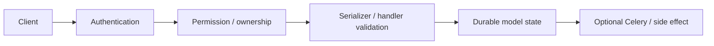

# users — detailed API route reference

This page is a source-derived route inventory. Path parameters are required by the URL shape. Request fields shown as observed are read by the implementation; endpoint-specific validation remains authoritative in the handler/serializer.

## Request flow

## Endpoint matrix

| Route declaration | Handler | Request fields observed in source | Requiredness / notes |
|---|---|---|---|
| `admin/permissions/` | `AdminPermissionCatalogAPIView` | `id`, `email`, `hard`, `image`, `is_active`, `is_staff`, `is_superuser`, `order`, `orders`, `password`, `rules`, `username`, `code`, `phone_number`, `field`, `limit`, `page`, `page_size`, `q` | no path parameter ; handler-module inputs include `id`, `email`, `hard`, `image`, `is_active`, `is_staff`, `is_superuser`, `order`, `orders`, `password`, `rules`, `username`, `code`, `phone_number`, `field`, `limit`, `page`, `page_size`, `q` |
| `admin/me/permissions/` | `MePermissionsAPIView` | `id`, `email`, `hard`, `image`, `is_active`, `is_staff`, `is_superuser`, `order`, `orders`, `password`, `rules`, `username`, `code`, `phone_number`, `field`, `limit`, `page`, `page_size`, `q` | no path parameter ; handler-module inputs include `id`, `email`, `hard`, `image`, `is_active`, `is_staff`, `is_superuser`, `order`, `orders`, `password`, `rules`, `username`, `code`, `phone_number`, `field`, `limit`, `page`, `page_size`, `q` |
| `admin/users/` | `AdminUserListAPIView` | `id`, `email`, `hard`, `image`, `is_active`, `is_staff`, `is_superuser`, `order`, `orders`, `password`, `rules`, `username`, `code`, `phone_number`, `field`, `limit`, `page`, `page_size`, `q` | no path parameter ; handler-module inputs include `id`, `email`, `hard`, `image`, `is_active`, `is_staff`, `is_superuser`, `order`, `orders`, `password`, `rules`, `username`, `code`, `phone_number`, `field`, `limit`, `page`, `page_size`, `q` |
| `admin/users/<int:pk>/` | `AdminUserDetailAPIView` | `id`, `email`, `hard`, `image`, `is_active`, `is_staff`, `is_superuser`, `order`, `orders`, `password`, `rules`, `username`, `code`, `phone_number`, `field`, `limit`, `page`, `page_size`, `q` | path `pk` required ; handler-module inputs include `id`, `email`, `hard`, `image`, `is_active`, `is_staff`, `is_superuser`, `order`, `orders`, `password`, `rules`, `username`, `code`, `phone_number`, `field`, `limit`, `page`, `page_size`, `q` |
| `admin/users/<int:pk>/rules/` | `AdminUserRulesAPIView` | `id`, `email`, `hard`, `image`, `is_active`, `is_staff`, `is_superuser`, `order`, `orders`, `password`, `rules`, `username`, `code`, `phone_number`, `field`, `limit`, `page`, `page_size`, `q` | path `pk` required ; handler-module inputs include `id`, `email`, `hard`, `image`, `is_active`, `is_staff`, `is_superuser`, `order`, `orders`, `password`, `rules`, `username`, `code`, `phone_number`, `field`, `limit`, `page`, `page_size`, `q` |
| `admin/users/<int:pk>/sessions/` | `AdminUserSessionListAPIView` | `id`, `email`, `hard`, `image`, `is_active`, `is_staff`, `is_superuser`, `order`, `orders`, `password`, `rules`, `username`, `code`, `phone_number`, `field`, `limit`, `page`, `page_size`, `q` | path `pk` required ; handler-module inputs include `id`, `email`, `hard`, `image`, `is_active`, `is_staff`, `is_superuser`, `order`, `orders`, `password`, `rules`, `username`, `code`, `phone_number`, `field`, `limit`, `page`, `page_size`, `q` |
| `admin/users/<int:pk>/sessions/logout-all/` | `AdminUserSessionLogoutAllAPIView` | `id`, `email`, `hard`, `image`, `is_active`, `is_staff`, `is_superuser`, `order`, `orders`, `password`, `rules`, `username`, `code`, `phone_number`, `field`, `limit`, `page`, `page_size`, `q` | path `pk` required ; handler-module inputs include `id`, `email`, `hard`, `image`, `is_active`, `is_staff`, `is_superuser`, `order`, `orders`, `password`, `rules`, `username`, `code`, `phone_number`, `field`, `limit`, `page`, `page_size`, `q` |
| `admin/users/<int:pk>/sessions/<str:session_id>/` | `AdminUserSessionRevokeAPIView` | `id`, `email`, `hard`, `image`, `is_active`, `is_staff`, `is_superuser`, `order`, `orders`, `password`, `rules`, `username`, `code`, `phone_number`, `field`, `limit`, `page`, `page_size`, `q` | path `pk` required, path `session_id` required ; handler-module inputs include `id`, `email`, `hard`, `image`, `is_active`, `is_staff`, `is_superuser`, `order`, `orders`, `password`, `rules`, `username`, `code`, `phone_number`, `field`, `limit`, `page`, `page_size`, `q` |
| `user/` | `UserAPIView` | `id`, `email`, `hard`, `image`, `is_active`, `is_staff`, `is_superuser`, `order`, `orders`, `password`, `rules`, `username`, `code`, `phone_number`, `field`, `limit`, `page`, `page_size`, `q` | no path parameter ; handler-module inputs include `id`, `email`, `hard`, `image`, `is_active`, `is_staff`, `is_superuser`, `order`, `orders`, `password`, `rules`, `username`, `code`, `phone_number`, `field`, `limit`, `page`, `page_size`, `q` |
| `profile/list/` | `ProfileViewSet` | `id`, `email`, `hard`, `image`, `is_active`, `is_staff`, `is_superuser`, `order`, `orders`, `password`, `rules`, `username`, `code`, `phone_number`, `field`, `limit`, `page`, `page_size`, `q` | no path parameter ; handler-module inputs include `id`, `email`, `hard`, `image`, `is_active`, `is_staff`, `is_superuser`, `order`, `orders`, `password`, `rules`, `username`, `code`, `phone_number`, `field`, `limit`, `page`, `page_size`, `q` |
| `profile/order/` | `ProfileViewSet` | `id`, `email`, `hard`, `image`, `is_active`, `is_staff`, `is_superuser`, `order`, `orders`, `password`, `rules`, `username`, `code`, `phone_number`, `field`, `limit`, `page`, `page_size`, `q` | no path parameter ; handler-module inputs include `id`, `email`, `hard`, `image`, `is_active`, `is_staff`, `is_superuser`, `order`, `orders`, `password`, `rules`, `username`, `code`, `phone_number`, `field`, `limit`, `page`, `page_size`, `q` |
| `profile/delete/` | `ProfileViewSet` | `id`, `email`, `hard`, `image`, `is_active`, `is_staff`, `is_superuser`, `order`, `orders`, `password`, `rules`, `username`, `code`, `phone_number`, `field`, `limit`, `page`, `page_size`, `q` | no path parameter ; handler-module inputs include `id`, `email`, `hard`, `image`, `is_active`, `is_staff`, `is_superuser`, `order`, `orders`, `password`, `rules`, `username`, `code`, `phone_number`, `field`, `limit`, `page`, `page_size`, `q` |
| `profile/set/` | `ProfileViewSet` | `id`, `email`, `hard`, `image`, `is_active`, `is_staff`, `is_superuser`, `order`, `orders`, `password`, `rules`, `username`, `code`, `phone_number`, `field`, `limit`, `page`, `page_size`, `q` | no path parameter ; handler-module inputs include `id`, `email`, `hard`, `image`, `is_active`, `is_staff`, `is_superuser`, `order`, `orders`, `password`, `rules`, `username`, `code`, `phone_number`, `field`, `limit`, `page`, `page_size`, `q` |
| `password/status/` | `PasswordStatusAPIView` | `id`, `email`, `hard`, `image`, `is_active`, `is_staff`, `is_superuser`, `order`, `orders`, `password`, `rules`, `username`, `code`, `phone_number`, `field`, `limit`, `page`, `page_size`, `q` | no path parameter ; handler-module inputs include `id`, `email`, `hard`, `image`, `is_active`, `is_staff`, `is_superuser`, `order`, `orders`, `password`, `rules`, `username`, `code`, `phone_number`, `field`, `limit`, `page`, `page_size`, `q` |
| `password/set/` | `SetPasswordAPIView` | `id`, `email`, `hard`, `image`, `is_active`, `is_staff`, `is_superuser`, `order`, `orders`, `password`, `rules`, `username`, `code`, `phone_number`, `field`, `limit`, `page`, `page_size`, `q` | no path parameter ; handler-module inputs include `id`, `email`, `hard`, `image`, `is_active`, `is_staff`, `is_superuser`, `order`, `orders`, `password`, `rules`, `username`, `code`, `phone_number`, `field`, `limit`, `page`, `page_size`, `q` |
| `password/change/` | `ChangePasswordAPIView` | `id`, `email`, `hard`, `image`, `is_active`, `is_staff`, `is_superuser`, `order`, `orders`, `password`, `rules`, `username`, `code`, `phone_number`, `field`, `limit`, `page`, `page_size`, `q` | no path parameter ; handler-module inputs include `id`, `email`, `hard`, `image`, `is_active`, `is_staff`, `is_superuser`, `order`, `orders`, `password`, `rules`, `username`, `code`, `phone_number`, `field`, `limit`, `page`, `page_size`, `q` |
| `password/remove/` | `RemovePasswordAPIView` | `id`, `email`, `hard`, `image`, `is_active`, `is_staff`, `is_superuser`, `order`, `orders`, `password`, `rules`, `username`, `code`, `phone_number`, `field`, `limit`, `page`, `page_size`, `q` | no path parameter ; handler-module inputs include `id`, `email`, `hard`, `image`, `is_active`, `is_staff`, `is_superuser`, `order`, `orders`, `password`, `rules`, `username`, `code`, `phone_number`, `field`, `limit`, `page`, `page_size`, `q` |
| `plans/` | `view` | `id`, `email`, `hard`, `image`, `is_active`, `is_staff`, `is_superuser`, `order`, `orders`, `password`, `rules`, `username`, `code`, `phone_number`, `field`, `limit`, `page`, `page_size`, `q` | no path parameter ; handler-module inputs include `id`, `email`, `hard`, `image`, `is_active`, `is_staff`, `is_superuser`, `order`, `orders`, `password`, `rules`, `username`, `code`, `phone_number`, `field`, `limit`, `page`, `page_size`, `q` |
| `plans/` | `view` | `id`, `email`, `hard`, `image`, `is_active`, `is_staff`, `is_superuser`, `order`, `orders`, `password`, `rules`, `username`, `code`, `phone_number`, `field`, `limit`, `page`, `page_size`, `q` | no path parameter ; handler-module inputs include `id`, `email`, `hard`, `image`, `is_active`, `is_staff`, `is_superuser`, `order`, `orders`, `password`, `rules`, `username`, `code`, `phone_number`, `field`, `limit`, `page`, `page_size`, `q` |

## Observed request keys

| Key | Typical role | Optionality |
|---|---|---|
| `code` | Input consumed by at least one handler in this app API layer. | Conditional/operation-specific; use the handler or serializer as the final requiredness contract. |
| `email` | Input consumed by at least one handler in this app API layer. | Conditional/operation-specific; use the handler or serializer as the final requiredness contract. |
| `field` | Input consumed by at least one handler in this app API layer. | Conditional/operation-specific; use the handler or serializer as the final requiredness contract. |
| `hard` | Input consumed by at least one handler in this app API layer. | Conditional/operation-specific; use the handler or serializer as the final requiredness contract. |
| `id` | Input consumed by at least one handler in this app API layer. | Conditional/operation-specific; use the handler or serializer as the final requiredness contract. |
| `image` | Input consumed by at least one handler in this app API layer. | Conditional/operation-specific; use the handler or serializer as the final requiredness contract. |
| `is_active` | Input consumed by at least one handler in this app API layer. | Conditional/operation-specific; use the handler or serializer as the final requiredness contract. |
| `is_staff` | Input consumed by at least one handler in this app API layer. | Conditional/operation-specific; use the handler or serializer as the final requiredness contract. |
| `is_superuser` | Input consumed by at least one handler in this app API layer. | Conditional/operation-specific; use the handler or serializer as the final requiredness contract. |
| `limit` | Input consumed by at least one handler in this app API layer. | Conditional/operation-specific; use the handler or serializer as the final requiredness contract. |
| `order` | Input consumed by at least one handler in this app API layer. | Conditional/operation-specific; use the handler or serializer as the final requiredness contract. |
| `orders` | Input consumed by at least one handler in this app API layer. | Conditional/operation-specific; use the handler or serializer as the final requiredness contract. |
| `page` | Input consumed by at least one handler in this app API layer. | Conditional/operation-specific; use the handler or serializer as the final requiredness contract. |
| `page_size` | Input consumed by at least one handler in this app API layer. | Conditional/operation-specific; use the handler or serializer as the final requiredness contract. |
| `password` | Input consumed by at least one handler in this app API layer. | Conditional/operation-specific; use the handler or serializer as the final requiredness contract. |
| `phone_number` | Input consumed by at least one handler in this app API layer. | Conditional/operation-specific; use the handler or serializer as the final requiredness contract. |
| `q` | Input consumed by at least one handler in this app API layer. | Conditional/operation-specific; use the handler or serializer as the final requiredness contract. |
| `rules` | Input consumed by at least one handler in this app API layer. | Conditional/operation-specific; use the handler or serializer as the final requiredness contract. |
| `username` | Input consumed by at least one handler in this app API layer. | Conditional/operation-specific; use the handler or serializer as the final requiredness contract. |

## Source of truth

The URL declaration, handler implementation and serializer validation are authoritative. This reference deliberately does not invent requiredness when the code makes it conditional on login settings, ownership, resource state or another field.

## Personal account endpoints

### GET `/user/`

No body. Returns the authenticated User representation.

### PUT `/user/`

All request fields are optional individually, but a non-empty request must use the supported fields below. `email` and `phone_number` are deliberately rejected here because contact changes require OTP verification.

| Field | Required | Notes |
|---|---:|---|
| `username` | No | Max 150 characters; updated directly. |
| `birthdate` | No | Date; `null` is accepted by the serializer. |
| `theme` | Yes | Must match `User.ThemeChoices`; the serializer does not set `required=False`. |
| `color` | Yes | Must match configured color choices; the serializer does not set `required=False`. |
| `email` | No | Rejected when supplied; use contact-change flow. |
| `phone_number` | No | Rejected when supplied; use contact-change flow. |

### POST `/user/contact-change/`

Exactly one of `email` or `phone_number` is required.

The existing contact is not changed until the destination OTP is successfully verified. An earlier pending contact change is cancelled before a new one is created.

### POST `/user/contact-change/{change_id}/confirm/`

| Field | Required |
|---|---:|
| `code` | Yes |

`change_id` is a UUID path parameter. Successful confirmation updates the contact, marks it verified and invalidates all sessions.

## Password endpoints

### POST `/password/set/`

| Field | Required | Contract |
|---|---:|---|
| `new_password` | Yes | Minimum 8 characters and Django password validation. |
| `new_confirm_password` | Yes | Must equal `new_password`. |

The operation fails when the account already has a usable password.

### POST `/password/change/`

Requires all three fields:

`current_password`, `new_password`, `new_confirm_password`.

The current password must validate; the new password is checked against Django password validation and confirmation.

### DELETE `/password/remove/`

| Field | Required |
|---|---:|
| `current_password` | Yes |

The operation requires a valid current password and an existing usable password.

## Profile endpoints

### POST `/profile/set/`

Multipart/form-data:

| Field | Required |
|---|---:|
| `image` | Yes |
| `order` | Yes |

The Profile model limits each user to five images and validates image size/dimensions.

### POST `/profile/order/`

JSON body:

`order` is required and must be a non-empty object whose keys are numeric Profile ids and whose values are integers.

### POST `/profile/delete/`

Body:

`id` is required and must identify a Profile belonging to the authenticated user.

## Administrative route aliases declared by `src/users/api_urls.py`

These are additional HTTP mounts that must not be confused with the shorter routes in `users.urls`:

| Method | Route |
|---|---|
| POST | `/api/users/user/contact-change/` |
| POST | `/api/users/user/contact-change/{change_id}/confirm/` |
| GET | `/api/users/password-status/` |
| POST | `/api/users/set-password/` |
| POST | `/api/users/change-password/` |
| DELETE | `/api/users/remove-password/` |
| GET/POST | `/api/users/admin/tables/` |
| GET | `/api/users/admin/tables/{model_key}/` |
| GET | `/api/users/admin/tables/{model_key}/fk-search/` |
| GET/PATCH/DELETE | `/api/users/admin/tables/{model_key}/{pk}/` |
| GET/POST | `/api/users/admin/users/{pk}/profiles/` |
| POST | `/api/users/admin/users/{pk}/profiles/reorder/` |
| PATCH/DELETE | `/api/users/admin/users/{pk}/profiles/{profile_id}/` |

