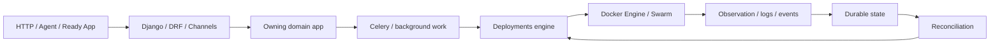

# Architecture

PassDeployer is a service-centric Django PaaS whose customer workload execution uses Docker Swarm in the normal runtime path.

## Cross-app architecture

Start with [apps/README.md](apps/README.md) for the canonical Django application graph. The main ownership split is:

~~~text
users             -> canonical identity
auth_users        -> credential/session/authentication state
plans             -> customer resource/logging policy
services          -> durable Service intent + immutable revisions
deploy            -> Deploy provenance + deployment/base-image/operator records
deployments       -> build/planning/runtime/lifecycle/reconciliation execution
logs              -> runtime/service log persistence and ingestion
app_catalog       -> catalog interpretation + multi-Service installation coordinator
agent              -> machine control-plane authentication/scopes/API/audit
messenger         -> messaging/realtime domain
tickets           -> support workflow
custom_emails     -> email template/delivery domain
docs              -> product documentation content
core              -> shared infrastructure/settings/cache/media
cms               -> Wagtail integration
~~~

## Control-plane path

~~~text
HTTP / WebSocket
 -> Django / DRF / Channels
 -> owning application domain
 -> Celery for asynchronous work
 -> deployments for runtime work
 -> Docker Engine / Swarm
 -> observations/events
 -> durable domain state / realtime notification
~~~

Domain APIs retain authorization and durable state. They do not become alternate runtime engines.

## Service/deployment ownership

~~~text
Service desired state
 -> ServiceRevision (immutable executable snapshot)
 -> Release (immutable promotable unit)
 -> Deploy (execution attempt)
 -> DeploymentLifecycleExecutor
 -> RuntimeContract
 -> SwarmRuntimeAdapter
 -> SwarmRuntime
 -> readiness
 -> canonical activation
~~~

`Service.active_revision` remains the current executable authority. Release is
immutable release/provenance metadata and Deploy records one execution attempt;
neither replaces the Service revision pointer.

The normal Swarm execution path does not construct `DeploymentOrchestrator` and
does not require `DeploymentPlanCompatibilityCompiler` or `DeploymentConfig`
as the semantic RuntimeContract input. Compatibility code remains isolated for
legacy/non-Swarm callers.

## Runtime truth versus desired state

The database stores desired state/provenance. Docker/Swarm observations describe what actually exists. Reconciliation compares the two and fails closed when runtime identity is unknown rather than silently adopting it.

## Storage

Docker local volumes are node-local. Managed local-volume workloads may be pinned to the volume owner node; this does not provide shared-storage HA.

## Logging split

Runtime service logs are owned by logs. Deployment lifecycle events are DeployLog records in the separate deployment-log database.

## Wagtail

Wagtail is an administration/presentation layer. Domain apps retain ownership and permission rules. Runtime-authoritative fields should remain controlled by domain workflows.

## Transitional compatibility

SWARM_ENABLED=0 remains a legacy compatibility runtime mode. Core deployment execution is documented in deployments/.
