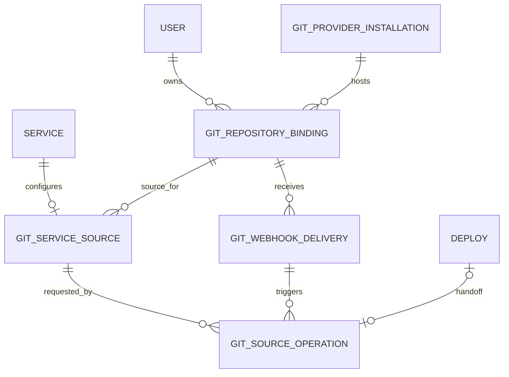

# Git Hosting and PaaS Source Deployment — Feasibility and Design Proposal

**Status:** Architecture proposal; not implemented by this document  
**Reviewed against:** `master` of `django-paas-deployer` and `main` of `react-paas-deployer`, 2026-10-10  
**Working product name:** EchoGit (placeholder only; naming is an open decision)  
**Decision requested:** Approve a small technical spike around a self-hosted Forgejo provider, with Django owning tenant policy and PaaS deployment orchestration.

This document intentionally separates a Git repository hosting product from the ability to deploy source from a Git repository. They are related capabilities, but one can be useful without implementing the other.

**Companion review:** [Implementation Gap Analysis](git-hosting-implementation-gap-analysis.md) tracks confirmed source-code gaps, unresolved provider/operations questions, P0/P1 blockers, acceptance tests and the Phase 0 evidence checklist.

**Important implementation caveat from the latest source review:** the current non-catalog Docker-source path still reads `Deploy.zip_file.path` for source inspection. Although revisioning copies the archive into `ServiceRevision.artifact_file`, the current execution path is not yet proven independent of the legacy Deploy ZIP. The design below states the target contract; it must not be treated as satisfied until GAP-01 is fixed and tested.

## 1. Executive recommendation

**Feasible: yes. Build it as a provider-backed Git subsystem, not as a new Git implementation inside Django.**

Recommended first option:

1. Run a self-hosted [Forgejo](https://forgejo.org/docs/latest/) instance as the Git hosting engine. Forgejo owns the Git wire protocols, repository storage, branches/tags/commits, web UI, SSH/HTTPS transport and its provider-side repository API.
2. Add a small Django **Git control-plane wrapper**. It owns PaaS tenant authorization, service/repository bindings, quotas, credentials, deployment intent, webhook verification, audit events and lifecycle coordination. It calls Forgejo through a narrow provider adapter instead of exposing arbitrary Forgejo API access to the browser.
3. Add React screens for repositories and for connecting a repository/ref/subdirectory to a PaaS Service. Link users to Forgejo for repository operations that the PaaS does not implement (file browser, commit history, branch management, pull requests, issues).
4. Keep the existing PaaS deployment engine as the sole execution path. A Git-triggered deployment must resolve a ref to a full commit SHA, fetch source in a restricted worker, create a reproducible source archive, and feed that immutable artifact into the existing `ServiceRevision → Deploy → BuildArtifact/Release → runtime` flow.
5. Start with **manual deploy from a selected commit/ref**. Add verified push-webhook auto-deploy only after the manual path is tested end to end.

Do **not** begin by implementing Git smart HTTP or SSH protocols, merge requests, a new Git object database, a CI runner, and the existing deploy integration all at once. Those are different projects with substantially different operational and security costs.

### Initial recommendation scorecard

| Option | Product fit | Delivery effort | Operational burden | Recommendation |
|---|---|---:|---:|---|
| Forgejo + Django wrapper + React integration | Self-hosted Git product with PaaS-native deploy UX | Medium | Medium | **Preferred spike** |
| Gitea + the same wrapper | Similar provider-backed design | Medium | Medium | Valid alternative; compare release/support and product requirements |
| GitLab CE as the complete Git platform | Broad built-in collaboration and CI features | High | High | Choose only if GitLab-compatible workflow is a firm product requirement |
| Git CLI / bare repositories / `git-http-backend` with a custom Django service | Maximum product control | Very high | High; all protocol and product edges become ours | Not recommended for MVP |
| External GitHub/GitLab/Forgejo providers only | PaaS source deployment without owned repository hosting | Low–medium | Low–medium | Best fallback if hosting repositories is not a hard requirement |

The first decision is a **spike**, not a commitment to the product name or a promise that Forgejo already integrates with the PaaS.

## 2. What the current repositories tell us

This is based on source inspection, not on an assumption that a model choice implies a complete feature.

### Backend: useful foundations already exist

- src/services/models.py already defines Service.source_kind, including the value git, plus source_config, build_config and runtime_config. The source kind is a discriminator, not evidence that source resolution, provider authorization or a Git deploy path exists.
- ServiceRevision already freezes source_snapshot, build_snapshot, runtime_snapshot and the other executable layers. Its artifact_file owns a revision's deployable source archive. This remains the right execution boundary.
- src/services/revisioning.py currently compiles Service.source_config/build_config/runtime_config, sets the revision source snapshot from the redacted Service.source_config, and copies Deploy.zip_file into ServiceRevision.artifact_file. It does not currently resolve a Git ref or inject a per-attempt resolved commit/archive digest into source_snapshot. Git integration therefore needs an explicit revisioning/provenance bridge; storing a SHA only in mutable Service configuration would be incorrect.
- src/deploy/models.py already has Deploy.source_revision, BuildArtifact.source_digest/build_definition_digest/provenance, Release.provenance and an immutable ServiceRevision reference. Reuse these concepts. Do not invent a second runtime, image, release or deployment state machine.
- src/deploy/apis.py validates Service ownership/share permission and daily deployment allowance when creating a Deploy. The normal execution task enters DeployService, calls ensure_revision_for_deploy, and runs the current lifecycle/health/activation path. A Git worker should hand a prepared archive and trusted source provenance to this normal path, not call Docker or Swarm itself.
- src/deploy/serializers.py models the current uploaded source as a ZIP. The current deployment pipeline extracts ZIP source and invokes the Docker-source security inspection for the relevant Docker platform path. The integration must preserve this validation; fetching from Git must not be treated as trusted source.
- src/deployments/celery/services/deploy_service.py materializes the immutable revision and then drives the normal plan/build/runtime pipeline. It should remain the only deployment execution path.
- Current Celery routing is explicit: application deployment tasks use the deployments queue; stop and maintenance tasks use operations; the base-image worker has a separate base-images queue. In Compose, the generic Celery consumer and deployment worker have access to deployment queues, and the latter mounts the Docker socket. A source-fetch worker must be isolated rather than added to either of those queues.
- The Agent API is not Git-enabled today. src/agent/application.py:create_deployment accepts archive/ZIP and database-native input and explicitly rejects Git and existing-image input. src/agent/apis/deployments.py:DeploymentHelpView and the Agent capabilities response advertise git=false. src/agent/contracts.py, src/agent/scopes.py, src/agent/urls.py and src/agent/skills.py are separate contract surfaces that must be updated together when Git operations are implemented.
- The Agent configuration endpoint currently delegates to the general Service configuration API, whose schema includes source_kind/source_config. Git must not be enabled by merely PATCHing those generic fields: all browser and Agent write paths need to route through the same validated Git-source application service.

### Frontend: source deploy is currently ZIP-oriented

- src/components/service_detail/components/CreateDeployPanel.jsx currently exposes ZIP upload and inspection/config suggestion.
- The Service detail page already has a Deploy workspace, so a Git source selector and source status can live alongside the current ZIP workflow.
- A Forgejo entry in frontend presentation data is not evidence of repository management, authentication, webhook processing or Git deployment being implemented.
- In the inspected create-deploy path, I found no complete provider-authentication → permitted-repository/ref resolution → pinned commit fetch → immutable artifact → normal Deploy flow. Before coding, run a repo-wide trace of every SourceKind.GIT reader/writer and verify the branch under implementation, because the enum and generic configuration fields are already present.

### Feasibility conclusion from these facts

The project has useful domain boundaries, but a few integration details in an initial high-level design were under-specified: the current revisioning method only snapshots Service.source_config; the Agent rejects Git explicitly; and the existing build workers have Docker privileges. The missing slice is not just a provider adapter and UI. It includes a durable source-preparation operation, a safe archive/provenance hand-off into revisioning, a dedicated queue/worker and reconciliation, and Agent contract integration. Those are described below as design requirements, not existing capabilities.

### Feasibility conclusion from these facts

The PaaS already has the durable Service/revision/deploy boundaries needed for integration. The missing product slice is likely the **provider adapter + source-binding API + fetch/snapshot worker + UI**, not a replacement build engine. However, source-kind handling and provider identity/authentication must be traced before writing those components.

## 3. Define which product we are building

“Something like GitLab” can mean several different scopes. These should not be conflated.

### Scope A — Git source deployment only

Users connect a repository from an external or self-hosted provider to a PaaS Service, choose a branch/tag/commit and deploy it. The PaaS owns build/runtime/release behavior. It does not own the repository UI.

### Scope B — Hosted Git repositories integrated with PaaS (recommended first product scope)

Users can create private repositories under their PaaS account, clone/push through normal Git clients, use Forgejo's existing web interface for source-code collaboration, and connect any owned repository to a Service. The PaaS adds an integrated management surface for ownership, quotas, linked services and deploys.

### Scope C — GitLab-like development platform

Build browser-based file editing, diff/commit browsing, branch protection, merge requests, review workflow, issues, package registry, CI runner, artifacts and advanced organization permissions. This is an independent multi-release roadmap, not an MVP requirement.

**Proposed scope:** Scope B, delivered in slices. Scope A remains a valid smaller alternative if hosting repositories is not a must-have. Scope C is explicitly out of initial scope.

## 4. Proposed architecture

```text
Developer's Git client
  | HTTPS / SSH Git protocol
  v
Forgejo (dedicated Git host + repository storage + web UI)
  | signed push webhook
  v
Django Git ingress / control API
  | verify signature, delivery ID, repository binding, branch policy
  | durable event/outbox record
  v
Celery Git-source worker (isolated, bounded workspace)
  | fetch an approved ref
  | resolve and record exact commit SHA
  | validate subdirectory / checkout / archive
  | calculate archive digest and clean up workspace
  v
Immutable source artifact
  | source provenance + SHA-256
  v
Existing ServiceRevision -> Deploy -> BuildArtifact / Release
  -> existing build, rollout, health check, activation and rollback

React PaaS dashboard
  | authenticated API calls
  v
Django Git control API -- narrow provider adapter --> Forgejo REST API
```

### Component ownership

**Forgejo owns:**
- Git object storage and Git over SSH/HTTPS.
- Repository refs, commits, normal Git operations and its repository web UI.
- Provider-native concepts it supports, such as repository collaboration and optional later Actions.
- Provider-side access to Git repositories. The PaaS should not read or mutate Forgejo's internal repository files directly.

**Django wrapper owns:**
- Mapping a PaaS user/workspace to a provider account/repository ID.
- Tenant checks, policy and quota enforcement for PaaS-created repositories.
- Connecting a repository/ref/path to a Service.
- Credential references, webhook registration and verification, replay prevention and audit records.
- Manual deploy requests, automatic-deploy policy and build/deploy status correlation.
- A stable PaaS API independent of the chosen provider. The provider adapter should be replaceable without changing the React contract.

**The existing deployment engine owns:**
- Source policy and validated build inputs.
- Immutable ServiceRevision creation.
- Build resource policy, image/artifact provenance, runtime orchestration, readiness/health, activation, rollback and cleanup.

No Git webhook, Forgejo callback or React request should directly call Docker/Swarm or invent a second deployment state machine.

## 5. Provider choice: Forgejo first, not Gitaly as a standalone engine

### Why Forgejo is the leading candidate

Forgejo is a self-hostable Git collaboration product, rather than just a repository library. Its documentation covers standard Git-client workflows over HTTPS and SSH, a web interface, APIs and repository webhooks. That provides the Git server and much of the user-facing collaboration surface without requiring the PaaS team to implement every Git operation.

Useful starting references:
- [Forgejo documentation](https://forgejo.org/docs/latest/)
- [Forgejo administrator guide](https://forgejo.org/docs/latest/admin/)
- [Forgejo repository and Git-client guide](https://forgejo.org/docs/latest/user/)
- [Forgejo security-related configuration](https://forgejo.org/docs/latest/admin/config-cheat-sheet/)
- [Forgejo deployment recommendations](https://forgejo.org/docs/latest/admin/setup/recommendations/)

Gitea is a valid alternative with similar concepts. Compare the exact version, maintenance policy, API compatibility, backup and migration needs during the spike instead of building a provider-specific API into React.

### Why not use Gitaly directly?

[Gitaly is GitLab's internal repository RPC service](https://docs.gitlab.com/administration/gitaly/), not a complete GitLab-like product API or replacement for a repository hosting UI. GitLab documents it as a service through which GitLab components perform repository operations. GitLab also warns against directly accessing Gitaly-managed repository files because storage layout and correctness depend on the supported interface. A standalone Gitaly integration would leave the PaaS responsible for user-facing hosting, identity, repository lifecycle, protocol ingress and collaboration while adding a GitLab-specific RPC dependency.

If the product requirement is specifically GitLab itself, evaluate GitLab CE as a whole service and its operational footprint. Do not build against its internal storage format or access its repositories directly.

### Why not build the Git protocol ourselves?

Using the Git executable for controlled clone/fetch/archive operations is appropriate. Implementing a custom server for Git's smart HTTP and SSH receive/upload protocol inside Django is different. It introduces protocol correctness, concurrency, authorization on every ref operation, packfile resource limits, large pushes, SSH command restrictions, repository locking and storage-corruption risks. [Git's HTTP protocol documentation](https://git-scm.com/docs/http-protocol) shows that smart HTTP includes specific upload-pack and receive-pack request/response contracts; it is not an ordinary file-upload endpoint.

Only revisit custom Git protocol serving if a future technical spike demonstrates that a provider cannot meet a concrete requirement.


### Forgejo deployment and provider-adapter contract

Run Forgejo as a separately operated product, preferably on a dedicated hostname such as git.<your-domain>, rather than mounting it below the same PaaS browser origin under a path. Forgejo's reverse-proxy guide documents security concerns for hosting it under a subpath on an origin that also serves unrelated user-controlled content. Configure HTTPS, an explicit canonical ROOT_URL, reverse-proxy trust boundaries and a firewall that does not expose its private application/API port directly.

The initial deployment must be deliberately closed:
- Disable public self-registration unless there is an approved abuse-control policy; PaaS users should be provisioned through the chosen identity model.
- Keep custom Git hooks disabled. Repository content is untrusted and custom server-side hooks could execute code on the Forgejo host.
- Restrict Forgejo webhook egress using its webhook allowed-host setting to the exact PaaS webhook ingress host where possible; avoid broad private-network egress allowances.
- Keep provider admin API credentials in the PaaS control-plane secret facility. Do not place the credential in Compose source, public settings, repository metadata or browser storage.
- Use the provider's supported API for repository metadata/management and normal HTTPS/SSH Git protocol for fetch/push. Never manipulate Forgejo's internal repository directories from Django or a worker.
- Back up Forgejo's configured data/repository storage, database and required secret/configuration state together; prove restore and reconcile provider repo IDs against GitRepositoryBinding records before production.

Confirm the precise configuration keys and behavior against the selected Forgejo release during the spike: [Forgejo reverse-proxy guidance](https://forgejo.org/docs/v17.0/admin/setup/reverse-proxy/), [configuration cheat sheet](https://forgejo.org/docs/latest/admin/config-cheat-sheet/) and [recommended settings](https://forgejo.org/docs/latest/admin/setup/recommendations/). Do not copy a configuration recipe across versions without reviewing defaults.

Define a narrow provider adapter before endpoint implementation. Its interface should expose only the operations the PaaS actually needs:
- health/version/capability check;
- create/get/list/rename/archive/delete a repository using stable provider IDs;
- list branches/tags and resolve a ref to a full commit SHA;
- register, rotate, inspect and remove a repository webhook;
- obtain or configure the narrowly scoped credential mechanism used for a source fetch.

The provider adapter must accept a validated installation plus provider object ID, not an arbitrary base URL/clone URL supplied by a tenant. Translate provider errors into stable, sanitized domain errors (not raw API responses or credential-bearing URLs). It must not fetch/build source; actual Git object transfer belongs to the isolated source worker. The Phase 0 spike must prove how a repository owner can push normally while the deploy worker can fetch read-only without possessing the Forgejo administrator token. If the selected Forgejo authentication model cannot meet that trust boundary, stop and revisit the identity/credential design before implementation.


## 6. Recommended MVP boundary

### Include

- One centrally operated Forgejo installation.
- Private repositories by default.
- Repository create/list/detail/rename/archive/delete actions through the PaaS API, subject to explicit ownership rules.
- Clone URL display, branch/ref selection and linked-Service management.
- Manual deploy from a branch, tag or full commit SHA.
- Resolve branches/tags to a full commit SHA before building; store the SHA and source archive digest with deployment provenance.
- A bounded worker that produces an immutable archive and sends it through the current revision/deploy path.
- Owner-scoped audit events, provider errors, rate/size/time limits and safe cleanup.
- Webhook registration and signature verification as groundwork; auto-deploy stays disabled by default until tested.

### Defer

- Browser-based source editor or full code browser.
- Merge requests, advanced review, issue tracker and project boards implemented by the PaaS itself.
- A new CI orchestration/runner subsystem. Optional Forgejo Actions should be assessed separately and must not receive unrestricted Docker-host access.
- Container/package registries, Git LFS, very large monorepo optimization, mirroring/forks and multiple provider types.
- Deployment previews per pull request, promotion workflows and release trains.
- Public repository creation unless an abuse-control and storage policy is approved.
- A custom Git-over-SSH/HTTP server.

## 7. Proposed domain model and invariants

The first draft treated Service.source_config as the sole Git source record. That is easy to implement but leaves repository references without database-level foreign keys and makes safe repository deletion/reassignment harder to enforce. The more robust MVP uses a relational GitServiceSource as the sole authority for Git binding and policy. Service.source_kind remains the existing high-level discriminator; for Git services, Service.source_config is a sanitized, derived compatibility projection for current readers, not an independent write surface.

### Existing Service fields and the new relational authority

For a Git-backed Service:

- Service.source_kind is git.
- GitServiceSource is the single mutable authority for repository binding, requested ref/context and Git automation policy.
- Service.source_config may contain a generated, versioned projection for compatibility with existing code during the transition. Only the Git-source application service may write that projection, atomically with GitServiceSource. Generic Service configuration PATCH, serializers and Agent configuration routes must reject direct edits to Git-managed fields.
- Service.build_config and Service.runtime_config retain their current meanings; Git source settings must not smuggle runtime limits, arbitrary networks, privileged mode or operator-only settings into them.
- The generic configuration PATCH endpoint must reject setting source_kind=git when no valid GitServiceSource exists, and reject changing/deleting the Git projection outside the Git-source application service. The same guard must apply to browser API and Agent API callers.
- Never mutate the requested ref to a resolved commit during a source job. Branch/ref selection is mutable desired state; the resolved SHA and source archive digest belong to that attempt's immutable ServiceRevision provenance.
- Extend ensure_revision_for_deploy to read GitServiceSource under the same transactional/fencing policy and build the authoritative frozen source snapshot from that row. The compatibility JSON projection is not sufficient provenance and must not override a newer or invalid relational binding.

Proposed GitServiceSource fields and constraints:

| Field | Meaning and validation |
|---|---|
| id | UUID primary key |
| service | OneToOne FK to Service, with explicit lifecycle coordination on delete |
| repository_binding | FK to GitRepositoryBinding using PROTECT; prevents physical repository-binding deletion while attached |
| ref_kind / ref_name | branch/tag/full commit SHA; ref names are provider-validated and never shell-interpolated |
| context_path | Relative path such as . or apps/api; reject absolute paths and traversal |
| dockerfile_path | Optional relative path under context_path; allowed only if the current builder supports it |
| auto_deploy_enabled | False by default; requires explicit owner opt-in and later webhook phase |
| auto_deploy_branch | One exact branch name for MVP; no arbitrary pattern language initially |
| generation | Monotonic integer incremented on every source binding/policy change; copied into the source operation as a fencing value |
| status | active, disconnected or invalid; provider/repository removal disables new source operations but does not delete runtime/revisions |
| created_by / created_at / updated_at | Binding provenance and timestamps |

Add database constraints for one Git source per Service, plus indexes for repository_binding/status and auto_deploy_enabled. Validate that GitServiceSource.service owner and repository_binding.owner match unless an explicit delegated-repository model is designed later. Changing repository requires owner authorization, a locked row and a generation increment. Never infer authorization from a JSON ID.

### GitProviderInstallation

One operator-managed provider installation record, not one arbitrary provider URL per user. The first release supports one Forgejo installation. Provider implementations/capabilities should live in a code-level adapter registry; do not add a database row for every adapter type.

Suggested fields:

- UUID primary key; provider_kind; API origin and UI origin.
- Status: pending, healthy, degraded or disabled.
- Encrypted system credential reference for provider administration; never the raw token.
- Version/capability snapshot, last health-check time, created_at and updated_at.
- A configuration version for credential rotation or provider migration.

The record is operator-owned. Customers and Agents cannot edit its host, administrator credential, capability flags or webhook ingress URL. An API token that administers Forgejo belongs to the control-plane provider adapter only and must never be sent to the browser, Agent or deployment container.

### GitRepositoryBinding

A tenant-scoped mapping to a repository that already exists in the selected provider.

Suggested fields:

- UUID primary key; owner_user FK; provider_installation FK.
- provider_repository_id as a string, because provider IDs are provider-specific; provider_owner_id/namespace identity, namespace slug, repository slug, display name and description.
- Visibility, provider-reported archived/deleted state, lifecycle state, provider size and last_synced_at.
- Optional provider webhook ID, webhook secret reference, webhook rotation version and registration status. Keep only a reference to encrypted secret material, never the secret itself.
- created_at, updated_at and deletion/tombstone timestamps.

Constraints and behavior:

- Unique provider installation + provider repository ID. Repository slug is mutable metadata, never the durable identity.
- Enforce normalized namespace/slug uniqueness according to the selected provider's rules.
- Use explicit lifecycle states such as active, archived, deleting, deleted and unavailable; do not encode all of these as a nullable timestamp.
- Create/read/rename/archive/delete must be tenant-scoped. A provider rename updates metadata on the same binding.
- A provider deletion is a lifecycle transition/tombstone, not an implicit deletion of the Service or the last successful Release.
- Physical deletion is permitted only after every GitServiceSource row referencing the binding has been removed and the retention window is satisfied; a merely disconnected/invalid row still holds the PROTECT reference. Prefer a provider-repository tombstone over physical deletion.
- A repository can be linked to several Services in future; webhook delivery is deduplicated once and then evaluated against each authorized source policy.
- Private repositories only in the MVP. Owner-to-provider namespace provisioning and login/SSH-key strategy are Phase 0 decisions, not implied by storing a PaaS owner FK.

### GitSourceOperation

A durable record for the source-preparation phase. It is not a second Deploy state machine: after it hands off to a normal Deploy, that Deploy remains authoritative for build, rollout, readiness, activation, cancellation and rollback.

Suggested fields:

- UUID primary key; Service FK; GitServiceSource FK or captured source-generation value; repository-binding FK; requesting User nullable; trigger_kind (manual or webhook); optional webhook-delivery FK.
- requested_ref_kind/name; immutable source-generation/fingerprint captured at acceptance; resolved_commit_sha; optional provider tree SHA.
- status limited to source preparation/dispatch: queued, running, prepared, dispatched, failed, cancelled or ignored. Use an explicit transition function and reject stale workers.
- stage, attempt_count, worker task ID for correlation only, opaque lease/attempt token, heartbeat and lease-expiry timestamps, created/started/prepared/dispatched/finished timestamps.
- staged archive storage key (prefer a storage abstraction; use FileField only if storage is shared and durable), archive_sha256, archive_bytes, file_count and context_path after successful preparation.
- sanitized error_code/error_detail; request fingerprint and idempotency identity; nullable OneToOne link to the resulting Deploy (or a unique deploy-side source_operation_id if easier to create transactionally).

Constraints and recovery:

- Index by status + lease expiry, Service + creation time, and repository + resolved SHA.
- Unique request idempotency identity within the actor/source scope where an Idempotency-Key is supplied. Keep this distinct from the Celery task ID.
- The one-to-one Deploy relation ensures one operation cannot create two Deploy rows. A transaction and unique constraint, not a check-then-insert pattern alone, must enforce it.
- GitSourceOperation captures the GitServiceSource generation and normalized source fingerprint at acceptance. Before storing a result or handing off to deployment, the worker must revalidate that generation and the repository binding still permit this exact source.
- Never use an unbounded file path supplied by the API as the scratch path. Derive it from the operation UUID below a configured worker-owned root.

Do not copy the full Git history into the build artifact. Keep a temporary checkout only long enough to resolve and archive the requested source. The staged archive is temporary recovery state; after the normal revision artifact is safely persisted and its digest verified, cleanup can reclaim the staged copy under the retention policy.

Idempotency: one accepted manual request with the same Service + Agent/request idempotency identity must return the same operation, not create a second Deploy. A webhook delivery ID deduplicates webhook retries before an operation is created. An operation's Celery task ID is observability metadata, not proof of ownership; DB lease/status/attempt tokens fence stale or duplicate task deliveries.

### GitWebhookDelivery

A durable inbound webhook inbox row, unique by provider installation + provider delivery ID.

Suggested fields:

- UUID primary key; installation FK; provider delivery ID; provider repository ID; event type; ref; before/after SHA; received timestamp and request-body digest.
- signature_verified_at and webhook secret rotation/version identifier, without persisting the secret or raw Authorization/signature headers.
- status: received, ignored, queued, processed or failed; sanitized outcome/reason; optional linked GitSourceOperation and processed_at.

Persist this row before returning a successful HTTP acknowledgement. In the same transaction, create any required dispatch/outbox intent, or make received rows an explicitly pollable durable inbox. If publishing a Celery task fails after the DB transaction commits, a periodic dispatcher/reconciler must redispatch eligible rows. Do not acknowledge success based only on an in-memory Celery send. Do not add a second generic outbox model only for this purpose: a durable inbox plus a tested recovery contract is enough for the MVP.


### Credential storage and trust levels

Do not treat all Git credentials as one token. Keep three separate lifecycles:

- **Provider administration:** operator-only token used by the PaaS adapter for repository provisioning and metadata/webhook configuration. Store encrypted via an operator-managed credential reference; never give this token to source workers, Agents or user code.
- **Developer push/pull:** credentials or SSH keys used by the person pushing code. Prefer Forgejo's own supported user identity/key mechanisms. The PaaS should not receive or persist developer passwords. If SSO is chosen, prove it covers Git-over-HTTPS/SSH and API operations rather than assuming browser SSO transfers automatically.
- **Deployment fetch:** read-only credential capable of fetching only the intended private repository or a narrowly scoped bot account. Resolve the least-privilege mechanism experimentally in Phase 0; do not default to a provider administrator token. Credentials should be injected only into the isolated fetch process and excluded from the remote URL written to logs, Git config that survives the process, environment snapshots and archive.

Webhook secrets are separate random high-entropy values, stored encrypted, versioned and rotated. Persist only a secret reference/version and signature-verification metadata on delivery rows. On rotation, accept the old key only for an explicit short overlap window if provider retry behavior requires it; never keep accepting old signatures indefinitely. Credential values are write-once/rotate-only at APIs and are never returned from list/detail endpoints.


### Proposed Django app boundary and model ownership

Use a dedicated first-party Django app, provisionally named src/git_hosting/; confirm by repository-wide tree/search that no partial Git subsystem already exists before creating it. Do not place Git-provider lifecycle code in deployments, and do not grow src/agent into a second Git domain application.

| Module | Ownership |
|---|---|
| git_hosting/models.py | GitProviderInstallation, GitRepositoryBinding, GitServiceSource, GitSourceOperation and GitWebhookDelivery |
| git_hosting/providers/base.py | Provider adapter protocol and normalized result/error types |
| git_hosting/providers/forgejo.py | Version-tested Forgejo API implementation |
| git_hosting/application/repositories.py | Tenant-fenced repository provisioning, metadata sync, quota and delete lifecycle |
| git_hosting/application/sources.py | GitServiceSource validation, guarded Service projection and owner/share authorization |
| git_hosting/application/operations.py | Idempotent source operation acceptance, state transitions, hand-off and recovery |
| git_hosting/apis/ | Browser/session API views and webhook receiver; route registration belongs to this app |
| git_hosting/tasks.py | Only source-fetch/archive/recovery tasks, routed to git-source |
| git_hosting/tests/ | Provider contracts, tenancy, task routing, revision hand-off, webhook and recovery tests |
| agent/apis/git.py + existing Agent contracts | Thin Agent-facing adapter that calls the same application services; no duplicate repository/deploy logic |
| deploy/models.py + services/revisioning.py | Provider-neutral Deploy source_provenance hand-off and immutable revision snapshot integration |

Model relationship sketch (proposed, not current schema):



Recommended deletion/history semantics:
- GitServiceSource.repository_binding uses PROTECT. Disconnect or tombstone references first; do not cascade-delete source intent silently.
- GitServiceSource.service can cascade with Service deletion only after the delete/lifecycle hook has cancelled or invalidated queued operations. GitSourceOperation's references to the live source/Service should be nullable SET_NULL (or an equivalent deliberate history-preserving relationship), alongside immutable service/repository ID snapshots; this lets operation audit survive without allowing a worker to continue against deleted authority.
- GitWebhookDelivery keeps provider installation/repository IDs and delivery ID as snapshots so audit survives repository deletion. Any live FK to a binding can be nullable SET_NULL after the tombstone process.
- The operation-to-Deploy hand-off must have a uniqueness guarantee. Prefer a nullable OneToOne relation or a unique deploy-side source_operation_id so retry/recovery cannot create multiple Deploy rows.
- Store only encrypted credential references plus metadata/version IDs in model rows. Separate provider administrative credentials, developer push credentials and fetch-only credentials; they are different trust levels. Never reuse ServiceSecret blindly as a global credential vault without validating ownership, rotation and access semantics.

### Migration and release ordering

1. Audit all existing Service rows with source_kind=git and inspect their source_config shape before a schema change. Do not silently treat existing values as valid GitServiceSource rows or overwrite them. Keep a report/management command and decide whether each record is migrated, quarantined or left untouched.
2. Add the new app/models and provider adapter behind a disabled feature flag; create migrations and admin read-only diagnostics.
3. Implement the guarded source application service first; then reject direct generic/API/Agent writes to Git-managed source_config and source_kind paths. Add regression tests for all configuration write routes.
4. Add the source operation, isolated worker and artifact hand-off; verify the SHA+archive digest in a revision before enabling any user-facing feature.
5. Add Agent contracts and React surfaces only after the same application service works for browser and Agent callers. The Agent route is not a second implementation.
6. Turn on manual deploy for internal/test users after all gates pass; only later enable the webhook receiver and owner opt-in auto-deploy.


### Revision and deployment provenance bridge — required schema/code change

The current ServiceRevision artifact_file and source_snapshot are reusable, but the existing revisioning path does not yet record a Git attempt's pinned commit and archive hash. Add a provider-neutral optional source_provenance JSON field to Deploy (read-only in public serializers and populated only by trusted source/deployment application services), or an equivalent internal immutable hand-off contract with the same guarantees. Do not accept this field from tenant JSON.

When ensure_revision_for_deploy creates the revision, it must merge sanitized per-attempt source provenance into the revision's source_snapshot without mutating Service.source_config. Record at least provider kind/installation ID, provider repository ID, requested ref, resolved full commit SHA, context path, archive SHA-256, archive byte count, source operation ID, trigger/delivery ID where applicable and provenance schema version. Set Deploy.source_revision to the full Git commit SHA only if its current semantic contract is confirmed compatible; never rely on that string as the only provenance record.

Reuse ServiceRevision.artifact_file as the frozen source archive. Reuse BuildArtifact.source_digest/build_definition_digest/provenance and Release.provenance in the normal builder where their established contracts permit it. Make the source archive digest an input to revision/build identity; do not invent a parallel runtime or release table.

## 8. Git-to-deploy lifecycle and the exact engine hand-off

The safe flow has two different phases: source preparation and the existing deployment execution. They must not collapse into one long request, and only the deployment engine owns runtime state.

1. **Configure desired source.** The Service owner selects a repository binding, branch/tag/full commit, context directory and any builder-supported options. The Git-source service validates the repository owner, Service owner, current plan/policy and relative paths, then atomically persists GitServiceSource and maintains Service.source_kind/source_config as the guarded compatibility projection. Repository binding and Service binding writes are owner-only in the MVP, even when a Service is shared for runtime work.
2. **Authorize the deploy intent.** The UI or Agent requests a manual Git deploy. Check Git-specific capability/scope, existing Service can_deploy_add authorization, owner/share rules, plan/source policy, idempotency and source quotas. Do not let source fetch imply deploy permission.
3. **Create durable preparation state.** In a short DB transaction create GitSourceOperation with the normalized desired-source fingerprint, request identity and requested ref. Commit first; enqueue through transaction.on_commit. A periodic recovery task must discover committed queued rows if the process dies between commit and broker publish.
4. **Resolve and pin.** For a manual branch request, resolve the branch when the worker starts and persist the full commit SHA. For a webhook, validate after_sha against the expected repository/ref with the provider; do not use an unverified payload URL. Once a SHA has been persisted, later branch movement must not silently change the requested build.
5. **Fetch in an isolated worker.** Fetch only from the configured provider and authorized binding using a read-only repository credential. Use the Git executable with argument arrays, disabled prompts and helpers, controlled Git configuration, bounded time/process/disk use, and no execution of repository scripts. Do not accept arbitrary remote URLs.
6. **Verify the pinned object.** Fetch/check out the exact resolved SHA and verify it equals the recorded SHA. If a force-push or provider retention makes that object unavailable, fail with a specific source error or a deliberate re-resolve policy for a *new* operation. Never silently rebuild whatever the branch points to now.
7. **Prepare context.** Validate context_path and any Dockerfile path against the pinned tree. Reject traversal, unsafe paths, unsupported symlinks, excessive file counts/expanded bytes, unsupported submodules and LFS. Create a bounded archive for the selected context; compute SHA-256 and size and save it to the shared artifact storage used by the deployment process. Do not include Git credentials, remote URLs with credentials, the .git directory or Git history.
8. **Re-check current authority.** Before hand-off, re-read the Service, repository binding and desired-source fingerprint. If the binding was revoked, the Service was deleted, or its source configuration changed while fetch ran, mark the operation ignored/failed instead of dispatching stale code. Check cancellation and policy again.
9. **Create a normal Deploy.** Through an internal domain/application service (not by fabricating an HTTP request to a ViewSet), create the ordinary Deploy with the prepared archive and server-owned source_provenance. Apply the existing deployment quota exactly once; do not count a webhook retry or the same idempotent operation as a second deployment. Use the project's established permission, immutable-revision and deployment admission behavior.
10. **Freeze the source revision.** Extend ensure_revision_for_deploy (or the canonical revision creation boundary) to persist the source provenance and verified archive into ServiceRevision.source_snapshot/artifact_file. Target guarantee, not current behavior: the frozen revision must remain source-reproducible after branch movement, repository rename or deletion of the preparation record. Independence from the legacy Deploy ZIP requires the GAP-01 source-artifact refactor: the current non-catalog Docker inspection path still reads Deploy.zip_file. Do not delete/expire the legacy ZIP until the execution pipeline consumes and verifies the revision-owned artifact, and add an end-to-end test that proves it.
11. **Run only the existing execution path.** Queue deployments.celery.tasks.deploy for the new Deploy. It continues through DeployService, current source/Dockerfile inspection, DeploymentPlan, BuildArtifact/Release, runtime apply, readiness, ownership-fenced activation, cleanup and rollback. The Git worker itself never builds images, talks to Docker/Swarm or marks the Service running.
12. **Report one coherent operation.** Mark the preparation operation dispatched and return its operation ID plus Deploy ID. After that, obtain build/deploy state from the normal Deploy and Service APIs/logs rather than mirroring its full state machine in GitSourceOperation.
13. **Recover and clean up.** Always clean temporary checkout directories on success, failure, timeout, cancellation and process restart. Retain a staged archive only until its digest and revision-owned artifact are verified; safely reconcile orphaned stage files and stale operations. Preserve source artifacts still referenced by retained revisions/releases.
14. **Preserve runtime independence.** Removing a Git binding/repository disables future source operations but does not stop or delete the last successful runtime/release. Deployed runtime lifecycle and source-provider lifecycle are separate.

### Why a pinned commit and archive digest both matter

A ref name identifies a moving pointer, whereas the full commit SHA identifies a Git object. The archive digest identifies the exact bytes handed to the builder. Store both: a commit SHA alone does not prove which context/subdirectory, archive transformation or prepared bytes were supplied to the builder. The archive digest should be verified again at the revision hand-off and included in source/build provenance.

## 9. Proposed PaaS API contract

Routes below are illustrative v1 contracts. They are not implemented endpoints. Prefixes should follow the existing routing conventions after a route review.

| Method and path | Purpose | Important inputs/outputs |
|---|---|---|
| `GET /api/git/v1/providers/` | List enabled provider capabilities for the current user | No credentials in output |
| `GET /api/git/v1/repositories/` | List repositories visible to the current user | `page`, `page_size`, `q`, `visibility` |
| `POST /api/git/v1/repositories/` | Create a repository | `name`, optional `description`, `visibility=private`, `default_branch=main`, optional `initialize_readme` |
| `GET /api/git/v1/repositories/{id}/` | Repository metadata | Provider ID, URLs, default branch, status, size/quota |
| `PATCH /api/git/v1/repositories/{id}/` | Update supported metadata | `name`, `description`, allowed visibility changes |
| `DELETE /api/git/v1/repositories/{id}/` | Delete/unlink a repository | Must require ownership check and explicit confirmation policy |
| `GET /api/git/v1/repositories/{id}/refs/` | List deployable refs | `kind=branch|tag`, pagination, default branch marker |
| `GET /api/git/v1/repositories/{id}/commits/` | List recent commits | `ref`, `limit` with server cap; sanitized commit metadata |
| `GET /api/services/{service_id}/git-source/` | Read source binding | Repo ID, ref policy, subdirectory, auto-deploy state and last deploy SHA |
| `PUT /api/services/{service_id}/git-source/` | Create/update source binding | `repository_id`, `ref_kind`, `ref_name`, `subdirectory`, `build_mode`, optional `dockerfile_path` |
| `DELETE /api/services/{service_id}/git-source/` | Remove Git source binding | Does not delete repository or existing releases |
| `POST /api/services/{service_id}/git-source/deploy/` | Request a manual Git deployment | `ref` or `commit_sha`, optional approved override; returns accepted job/Deploy identity |
| `POST /api/git/v1/webhooks/{binding_token}/` | Provider webhook receiver | Raw body + signature/delivery/event headers; returns quickly after verification and durable enqueue |
| `GET /api/git/v1/deployments/{deploy_id}/source/` | Read source provenance | Resolved SHA, ref, context, archive digest, provider commit URL; never credential data |

### API rules

- Require current session/JWT authentication for user-scoped control APIs and apply the same tenant fencing used by existing service APIs.
- Resolve repository ownership from the database/provider binding. Never trust `owner_user_id` from POST/PATCH payloads.
- Never accept an arbitrary repository URL as permission to clone it. For the MVP, accept a repository binding ID. If external Git URLs are later supported, require an explicit provider/source policy and block SSRF/internal-address/file-protocol abuse.
- Use idempotency keys or unique operation records for manual deploy retries.
- Set explicit request throttles, provider timeouts and pagination caps.
- Do not return access tokens, deploy keys, webhook secrets or credential-bearing clone URLs in ordinary API responses.
- Error responses should use stable machine-readable `code` values plus safe user-facing `detail` strings.


### Agent contract and operating flow (not implemented yet)

The current Agent contract must stay explicit: Git remains unsupported until all of the API, scope, capability, skill, worker and revisioning pieces below exist and pass end-to-end tests. Do not change the current git=false capability flag early just to advertise the design.

Agent authentication is the existing separate Bearer credential. The Agent manifest, capabilities, OpenAPI and scope-filtered skills are generated from distinct but connected source files, so an endpoint added only to urls.py is incomplete. Implement the future API in a dedicated module such as src/agent/apis/git.py and its application/domain service, then register it in URLs and the centralized contract.

Proposed scopes, default-deny:

| Scope | Purpose | Notes |
|---|---|---|
| git.repositories.read | List/read only repositories belonging to the PaaS user | Must not disclose provider-wide repositories |
| git.repositories.create | Create a private repository under the user's provisioned provider namespace | Never accept an owner/namespace override |
| git.repositories.manage | Rename/archive/delete a repository owned by the user | High-risk; deletion is not runtime deletion |
| git.sources.read | Read the Git binding for an authorized Service | Service and repository authorization are both checked |
| git.sources.write | Bind/update/remove a Service's Git source | Service-owner only for MVP; sharing a Service does not grant Git repository administration |
| git.sources.deploy | Queue a manual Git source operation | Also requires the existing Service can_deploy_add policy and deployment quota |
| git.automation.manage | Enable/disable the owner's push-webhook auto-deploy policy | Optional later phase; default off, owner-only |

No new Git scope is implicitly added to existing Agents. Update src/agent/scopes.py (valid scopes, categories, labels, high-risk list), the credential/scope-management UI, contracts, route handlers, capabilities and tests together.

Proposed Agent routes follow the existing versioned facade and are not current routes:

| Method | Route | Scope | Contract |
|---|---|---|---|
| GET | /agent/v1/git/repositories | git.repositories.read | Paginated owner-scoped repository list |
| POST | /agent/v1/git/repositories | git.repositories.create | Creates private repo; idempotent |
| GET | /agent/v1/git/repositories/{repository_id} | git.repositories.read | Stable binding ID, sanitized provider metadata |
| PATCH | /agent/v1/git/repositories/{repository_id} | git.repositories.manage | Only explicitly supported metadata/rename |
| DELETE | /agent/v1/git/repositories/{repository_id} | git.repositories.manage | Explicit delete policy; never deletes running Service/releases |
| GET | /agent/v1/services/{service_id}/git-source | git.sources.read | Read normalized desired source and last operation/deployment provenance |
| PUT | /agent/v1/services/{service_id}/git-source | git.sources.write | Validate repository/ref/context then atomically save Service source config |
| DELETE | /agent/v1/services/{service_id}/git-source | git.sources.write | Disconnect source; keep past revisions/releases/runtime |
| POST | /agent/v1/services/{service_id}/git-source/deploy | git.sources.deploy | Returns 202 with source operation ID; does not synchronously clone |
| GET | /agent/v1/git/source-operations/{operation_id} | git.sources.read | Source-preparation result and linked normal Deploy status |

Do not expose a Git provider administrator token, webhook secret, raw signature header or credential-bearing clone URL in Agent output. Webhook-secret rotation and automation configuration may remain dashboard-only in the first release.

The existing Agent authorization model is an intersection: Agent scope AND the Agent owner's existing PassDeployer user permissions AND ServiceShare action permissions when relevant. Repository-management actions require repository ownership separately. In MVP, a shared-service collaborator can request a Git deploy only if the current Service policy explicitly permits that action and the Git-source binding is already configured; they cannot repoint the Service at their own/another repository. Source-binding writes are owner-only.

### Example Agent usage sequence

1. Call GET /agent/v1/capabilities and GET /agent/v1/openapi.json; confirm git capabilities/scopes exist for this particular Agent. Read GET /agent/v1/skills/git-source once the skill is registered.
2. List or create a repository with /agent/v1/git/repositories. Treat repository IDs returned by the PaaS as opaque; do not call Forgejo's administrative API directly.
3. Read /agent/v1/services/{service_id}/git-source, then PUT the validated binding with repository_id, ref_kind, ref_name and context_path. A generic Service configuration PATCH must not be used to bypass this validation.
4. POST /agent/v1/services/{service_id}/git-source/deploy with an idempotency key. Expect 202 Accepted and an operation ID, not a claim of successful deployment.
5. Poll /agent/v1/git/source-operations/{operation_id}. Once dispatched, inspect the linked normal Deploy using /agent/v1/deployments/{deployment_id} and /logs. Verify the terminal Deploy status, active revision and relevant logs before reporting success.

The source skill should tell an Agent to pin/record the SHA, request confirmation before enabling production auto-deploy or deleting repositories, never use shell to clone onto the runtime container, never expose credentials, and never claim success from HTTP 202 alone.

Implementation must also update src/agent/apis/deployments.py DeploymentHelpView and src/agent/apis/identity.py capabilities so git changes from false only after the supported route is live and the complete end-to-end path passes. src/agent/application.py:create_deployment must continue to reject direct source=git on the generic ZIP API; Git deployments must enter through the purpose-built source-operation endpoint so an unvalidated payload cannot bypass repository binding and provenance checks.

## 10. Webhooks and automatic deploy policy

Forgejo/Gitea-style repository webhooks can deliver push events and support shared-secret signatures. The receiver should verify the raw-body signature before parsing or trusting payload fields. See [Gitea's webhook contract](https://docs.gitea.com/usage/repository/webhooks/) for delivery IDs, event headers, signatures and ref information; confirm the exact header/payload names for the selected Forgejo release during the spike.

### Verification and processing order

1. Enforce HTTPS at the ingress.
2. Match a known binding/installation token and expected provider host.
3. Read the raw request body under a small configured size limit.
4. Validate HMAC-SHA256 using a constant-time compare. Reject missing or invalid signatures.
5. Check provider event type, repository ID, ref and the binding's current branch filter.
6. Deduplicate on provider + delivery ID; store a durable record before returning a successful acknowledgement.
7. Enqueue a worker. The worker re-fetches/validates the repository and resolves the final SHA rather than trusting a payload's URL.
8. Coalesce bursts for the same Service/ref when appropriate. Do not run a second deploy that would race an active operation; use the existing lifecycle/deploy conflict handling.
9. Record ignored reasons as well as successes. Webhook retries must be safe and must not multiply Deploy rows.

### Suggested starting defaults

- Manual deployment: enabled.
- Auto-deploy: disabled until the owner explicitly enables it.
- Auto-deploy ref: one exact branch (default branch shown as a suggestion, not silently assumed).
- Trigger: push event only.
- Deploy latest commit on accepted push after resolving the SHA; ignore tag deletion and unrelated refs.
- A changed source binding or disabled webhook invalidates old queued events for that binding.
- Webhook endpoint secrets are random, rotatable and never shown again after creation.
- No automatic source build for public forks or untrusted pull requests in MVP.

## 11. Security and isolation requirements

Git hosting makes user-controlled repositories executable build inputs. Treat repository content as untrusted.

### Must-have controls

- **Tenant isolation:** every create/read/update/delete, source binding, webhook and repository quota check is scoped to the authenticated owner/workspace. Never trust numeric or UUID IDs without ownership checks.
- **Separate trust boundaries:** Forgejo storage/protocol endpoint, Django control-plane API, and Git/build workers should have separate network and process permissions.
- **No host Docker socket in Git/source workers by default:** source fetching and archive generation should not grant repository code control of the deployment host. The ordinary build runtime can be handled by the existing engine/policy.
- **Credential containment:** use short-lived/revocable tokens where possible; least-privilege provider scopes; redact request headers, credential URLs, environment secrets and raw hook secrets from logs.
- **URL/SSRF defense:** never fetch untrusted remote URLs without allowlisting and resolution checks. Deny `file://`, local socket/file paths, loopback, link-local, private infrastructure addresses and unapproved ports when external providers are eventually permitted. Recheck DNS/IP at connection time to reduce DNS-rebinding risk.
- **Bounded Git processes:** no shell interpolation; pass argument arrays; pinned executable/path; timeout, CPU/memory/process, file-count, checkout-size and disk limits; kill the process group on cancellation.
- **Repository data validation:** enforce safe relative paths, reject path traversal, avoid following symlinks outside the checkout, define a strict submodule allowlist and leave Git LFS disabled until size and credential behavior are specified.
- **No user hooks on the server:** do not execute uploaded Git hooks or accept a config that lets a tenant set arbitrary Git executables/helpers or transport commands.
- **Reproducible source:** pin full commit SHA, record archive digest and relevant build-input/policy version. Never put credentials or secret values into revision snapshots.
- **Webhook security:** HMAC, deduplication, timestamp/replay policy where supported, bounded body, event/ref/repository binding checks, and durable audit.
- **Abuse limits:** repository count, storage, Git push/fetch time, checkout/expanded archive size, manual deployments/day, webhook frequency and build concurrency should be plan- or system-policy-controlled.
- **Backups and deletion:** document repository backups separately from PostgreSQL, restore test cadence, retention for deleted repositories, and orphan recovery between Forgejo metadata and Django bindings.

### Important threat scenarios to test

- An attacker substitutes a repository ID/slug to read another user's private source.
- A webhook is forged, replayed, or delivered twice.
- A branch moves during a queued deployment.
- A submodule points at an internal service or asks to fetch with leaked credentials.
- A crafted tree contains path traversal/symlinks, a huge file, many tiny files or a decompression/checkout bomb.
- A build attempts to exfiltrate a build secret or reach Docker/metadata services.
- A user deletes/revokes the repository while a deploy is queued.
- A push storm or worker crash leaves duplicate Deploys, a stale lock, or temporary source files.
- Forgejo is restored from a backup that is newer/older than the PaaS's repository-binding rows.

## 12. Worker topology, Celery routing and crash recovery

The phrase “dedicated source worker” is not enough for this codebase. Today deployment work is deliberately routed to deployments/operations queues; the deployment worker consumes deployments and operations and mounts /var/run/docker.sock. Git clone/fetch must not be sent to those queues or run in a worker with Docker-host privileges.

### Recommended worker split

| Component | Responsibility | Queue/process | Privilege boundary |
|---|---|---|---|
| Django Git API | User-facing repository/source CRUD, authorization, operation acceptance | HTTP request; no clone/build | No arbitrary process execution |
| Webhook receiver | HTTPS, size limit, raw-body signature verification, durable inbox insert and quick acknowledgement | HTTP request only | No clone/build; no long-running work |
| Git source worker | Resolve refs, fetch pinned objects, validate tree/context, create/archive source, update GitSourceOperation and prepare normal Deploy | New git-source queue; dedicated Compose service | No Docker socket, no host Docker-root mount, no runtime/container shell |
| Existing deployment worker | Create immutable revision from prepared Deploy, build and execute current deployment lifecycle | deployments queue (existing) | Retains current deployment privileges and policy |
| Recovery/cleanup task | Redispatch stale queued inbox/operations, expire leases, clean safe orphan scratch/staged artifacts | git-source queue; periodic Celery Beat task | Same restrictions as Git source worker |
| Forgejo | Git SSH/HTTPS protocol, repository storage and provider-side web UI | Separate service/host | Never share its internal repository filesystem with Django or build workers |

### Required code and deployment changes

- Add explicit Celery routes for Git source tasks in src/config/settings.py, for example prepare/process tasks and a recovery task on queue git-source.
- Add a separate git-source-worker Compose service that consumes only git-source, with its own bounded concurrency setting (start conservatively at 1 and tune from measurement), prefetch multiplier 1 and bounded task/time/resource limits.
- Ensure neither generic Celery nor deployment-worker consumes git-source. Adding a route without a dedicated consumer causes backlog; adding the queue to the generic Docker-privileged consumer defeats isolation.
- The worker needs database/Redis connectivity and access to the configured provider over HTTPS, plus the same durable artifact storage backend needed to hand a staged archive to DeployService. Do not assume that a local worker filesystem path is visible to web/deployment workers; test the actual MEDIA_ROOT/object-storage configuration.
- Use a unique operation-scoped temporary directory and enforce wall-clock, checkout, expanded-size, file-count, process and disk quotas. Restrict outbound traffic to the configured provider and required infrastructure; deny arbitrary redirects/hosts and unapproved Git transports.
- Run Git with an absolute executable path, argument-array invocation, noninteractive mode, controlled HOME and Git configuration, no inherited global/system credential helpers, no arbitrary URL rewrite, and no user-defined external filters/hooks. Never interpolate repo refs/paths into a shell command.
- Use a read-only repository credential scoped as narrowly as the provider permits. Do not hand the Forgejo administrator API token to the worker if a repository-scoped credential/limited robot account can satisfy the design. If Forgejo cannot provide adequate least privilege, record this as a Phase 0 security blocker rather than quietly granting the worker broad cross-tenant read access.
- Do not copy provider credentials into Deploy.config, Service source/build/runtime snapshots, source archives, environment variables for user containers, build arguments, normal logs or Agent responses. A secret broker or short-lived credential injection should expose them only to the source-fetch process and clear them after use.
- Cancellation and worker shutdown must kill the Git process group and remove scratch data. A Celery task ID is not an execution fence: use a DB operation status/lease/attempt token and compare the captured source-config fingerprint before committing results.
- Use bounded retries only for transient provider/network failures. Invalid signature, unsupported Git tree content, disallowed ref/context, quota excess and other deterministic policy failures are terminal. Every retry must reuse the same idempotent operation; after a pinned SHA is recorded, a retry may not silently select a different SHA.
- The source worker writes only source-preparation state. It must not call DeployService, build images, modify Swarm, activate Service.active_revision or reproduce deployment rollback/cleanup code.

### Crash windows and recovery contract

| Crash window | Required recovery |
|---|---|
| Operation row commits but Celery publish fails | Beat/recovery scan discovers queued undispatched rows and republishes safely |
| Worker dies during clone/fetch/archive | Lease expires; next attempt fences the stale worker and recreates a clean workspace |
| Archive saved but operation status not committed | Reconcile by operation ID and digest; reuse only if storage object is complete and verified, otherwise delete and redo |
| Deploy row is created but source operation not marked dispatched | Find the Deploy by the operation's idempotent link; repair the operation projection, never create another Deploy |
| Deploy task starts but revision snapshot fails | Existing deployment failure/lifecycle path remains authoritative; source operation reports hand-off failure and retains enough provenance for diagnosis |
| Revision artifact persisted but staging file remains | Cleanup only after artifact existence and SHA-256 verification; do not remove data needed by retry/rollback |
| Service binding changes or repository is revoked during preparation | Final authority/fingerprint check rejects stale operation; no Deploy is dispatched |
| Webhook row persisted but task publish fails | Reconciliation schedules it again; unique delivery ID prevents duplicate operations |
| Worker returns after its lease/attempt was superseded | It cannot commit the archive, create a Deploy or overwrite operation status |

A source operation has a small preparation state machine only. Once dispatched, the normal Deploy state machine and existing fencing/reconciliation own execution. Never add Git-specific runtime state, image lifecycle or a parallel release activation path.


## 13. Quota and configuration parameters to decide

These are **proposed knobs**, not existing platform settings or final commercial limits. Put them in a central settings/policy model and document which are plan-specific before implementation.

| Parameter | Suggested initial value/policy | Reason |
|---|---|---|
| `git_hosting.enabled` | false until deployed and health-checked | Feature flag and safe rollout |
| `git_hosting.provider_kind` | `forgejo` | Keep provider-specific behavior behind an adapter |
| `git_hosting.private_by_default` | true | Avoid accidental code exposure |
| `git_hosting.max_repositories_per_user` | 10 (provisional) | Bound initial storage/abuse |
| `git_hosting.repository_soft_quota_mb` | Unset / not promised until enforceability is proven | Forgejo quota support is soft and in development; the exact per-repository enforcement contract needs a provider-level spike |
| `git_hosting.user_storage_quota_mb` | 5120 per user (provisional) | User-level budget in addition to per-repo guard |
| `git_source.max_checkout_bytes` | 512 MiB (provisional) | Limit untrusted working tree size; separate from Git's on-disk repo size |
| `git_source.max_archive_bytes` | 256 MiB (provisional) | Keep build input bounded; adjust to observed apps |
| `git_source.fetch_timeout_seconds` | 120 | Bound stuck/slow Git network operations |
| `git_source.archive_timeout_seconds` | 60 | Bound snapshot preparation |
| `git_source.max_files` | 100,000 (provisional) | Protect CPU/inode usage |
| `git_source.max_concurrent_fetches_per_user` | 2 | Avoid noisy-neighbor source fetches |
| `git_source.max_auto_deploys_per_service_per_hour` | 10 (provisional) | Guard accidental push loops/storms |
| `git_source.submodules_enabled` | false | Avoid indirect network/credential access until designed |
| `git_source.lfs_enabled` | false | Requires separate storage, quotas and fetch policy |
| `git_source.auto_deploy_default` | false | Explicit opt-in avoids surprising production deployments |
| `git_source.allow_external_urls` | false for MVP | Avoid SSRF and arbitrary remote cloning |
| `git_source.branch_delete_policy` | Keep the last successful release; mark binding unresolved and require owner action | Do not delete or auto-select a replacement release |
| `git_source.source_retention_days` | 30 days of unreferenced snapshots, subject to release/rollback retention | Prevent unbounded object/artifact storage |
| `git_hosting.deleted_repo_retention_days` | 7-day soft-delete window (provisional) | Accidental deletion recovery |

All numeric values need a small load/security spike and product/plan review. Do not treat provisional numbers as approved billable promises. In particular, the per-repository quota is deliberately unset until tested: Forgejo documents soft quotas as disabled by default, still in development and subject to in-flight operations completing above the limit; its documented `size:repos:all` subject is aggregate, not proof of hard per-repository enforcement. See [Forgejo soft quota and limitations](https://forgejo.org/docs/v17.0/admin/advanced/quota/). Enforce expanded checkout/archive size separately from compressed Git object storage; they are not the same metric.

### Build strategy choice

The source archive must enter a builder already allowed by the Service plan and existing backend policy. MVP should not introduce a new language/framework entitlement or accept tenant-selected unlimited Docker resources. If the current Docker source detector needs a root-level Dockerfile or another required file layout, the worker must prepare the allowed context accordingly and run the existing validation unchanged.

## 14. React dashboard proposal

### Repository workspace

A top-level **Repositories** dashboard route should provide:
- Repository list/search, namespace/name, private badge, default branch, last update, storage/quota and linked Service count.
- Create repository modal with name, optional README/description, and visibility defaulting to private.
- Clone URLs with copy buttons. SSH URL only if SSH ingress/port and public key/account configuration are correctly set.
- “Open in Forgejo” link for code browsing and collaboration; do not rebuild Forgejo's entire UI in React.
- Clear handling for provider outage, permission denied, quota reached, rename/delete pending and credentials not connected.

### Service → Deploy source

In Service Detail, add a source selector or a dedicated Deploy Source section:
- `ZIP upload` (existing behavior).
- `Git repository` (new).
- Repository dropdown limited to repositories the current user can use.
- Ref kind and searchable branch/tag/commit field; show selected/resolved commit SHA and commit link.
- Optional context/subdirectory; validate it against the repository tree.
- Build mode/Dockerfile path only when the backend supports the requested mode.
- Manual “Deploy this revision” button; separate explicit toggle and confirmation for automatic deployments.
- Source status: connected, last fetched SHA, last successful deployed SHA, last webhook, last deploy result and human-readable failure detail.
- Do not show secret/token values. Use separate status for “source connected” vs “deployment running” vs “runtime healthy”.

On a Git deploy attempt, the UI should show a durable task/deploy ID and then navigate into the existing deployment progress/log experience rather than implementing a second progress UI or state model.

## 15. Delivery plan and acceptance criteria

### Phase 0 — architecture spike (small, required before implementation)

- Deploy a disposable Forgejo instance in a non-production environment.
- Verify provider account/provisioning strategy, API authentication, repo create/delete, normal Git push/clone, webhooks/signatures, backup/restore and repository quota observability.
- Create a temporary repository with a small supported Docker source and run the current PaaS pipeline on a frozen source archive.
- Trace all existing SourceKind.GIT readers/writers and inspect persisted Service rows with source_kind=git; decide explicitly how any legacy JSON configuration is handled before migration. Confirm source-binding ownership semantics.
- Decide how PaaS users authenticate to the Git UI and Git over SSH/HTTPS.
- Produce measured resource/security results and refine the proposed defaults.

**Exit gate:** one repository can be created, pushed to, cloned by a restricted worker, pinned to a commit, archived, and deployed through the current engine with no cross-tenant access.

### Phase 1 — manual Git deployment

- Provider adapter and health checks.
- Repository metadata/bindings and owner-scoped API.
- GitServiceSource API.
- Restricted fetch/archive worker.
- Immutable source provenance connected to ServiceRevision/Deploy.
- React repository picker and manual Deploy source UI.
- Contract tests for ownership, credential redaction, SHA pinning, source cleanup and normal deployment outcomes.

**Exit gate:** source input is repeatable from the recorded provider repo ID + full commit SHA + source archive digest after the branch moves. This is not a claim of bit-for-bit deterministic image builds. The gate also requires GAP-01 to pass: the deployment path can consume the revision-owned artifact without requiring the legacy Deploy ZIP.

### Phase 2 — push webhook auto-deploy

- Webhook provisioning/rotation UI/API.
- Signature validation, durable delivery inbox, dedup and replay tests.
- Branch filter, concurrency/conflict handling and push-storm coalescing.
- Event/commit correlation on deployment logs and Service overview.
- Disable/revoke behavior and stale queued event handling.

**Exit gate:** duplicate deliveries create no duplicate deploy; invalid signatures never enqueue work; the worker only builds commits accepted by the binding's current policy.

### Phase 3 — broader Git collaboration and integrations

Only after demand is demonstrated:
- Import from external providers and authenticated private external repositories.
- Team/workspace ownership and shared repo permissions.
- Organization/group management and branch protection.
- Optional Forgejo Actions or other CI integration behind isolated runners.
- Git LFS, mirrors, forks, large monorepo optimization and preview deployments.
- Commit status reporting back to provider, release promotion and environment policies.

Do not couple Phase 1 delivery to Phase 3 features.

## 16. Test and operational checklist

### Provider adapter contract

- Create/get/list/rename/archive/delete repo; duplicate slug; provider timeout/rate limit; invalid credential; provider version/capability mismatch.
- Ref listing and exact SHA resolution for empty repo, deleted branch, annotated tag, force-pushed branch, missing commit and repository rename.
- Provider API errors are sanitized; secret values and Authorization headers never appear in API responses or logs.

### Tenant/authorization

- A user cannot list, bind, deploy, rename or delete another owner's repository by changing UUIDs/provider IDs.
- Shared Service permissions do not automatically grant repository administration. Repo access and Service deploy permission are different authority checks.
- Service owner can bind only a repository they own or are explicitly allowed to use.
- Admin/staff status does not bypass tenant fences accidentally.

### Artifact and deployment pipeline

- Commit A is pinned; branch moves to B while the job is queued; build still uses A.
- Archive digest stored and verified; repeated snapshot for the same source inputs gives expected identity.
- Existing Docker-source security inspection still runs; a failed inspection never activates a release.
- Build failure/readiness failure/rollback/cancel/delete all clean up workspaces and preserve existing lifecycle fences.
- Existing archive-based deployments and Ready Apps remain unaffected.
- Git-source deployments obey existing plan/build/runtime and daily deploy limits.

### Webhook

- Invalid/missing signature rejected.
- Unknown repository, ref mismatch, unknown delivery ID, repeated delivery, wrong event type, malformed JSON and oversized body are safely handled.
- Durable acceptance precedes success acknowledgement.
- Repository deletion/revocation while queued cannot make the worker bypass current binding policy.
- A webhook-triggered deployment cannot create an endless push → build → push loop.


### Agent and worker integration contracts

- Agent credentials without Git scopes cannot call Git endpoints; existing Agents do not silently gain Git scopes; capabilities/OpenAPI/AGENT.md/skills agree on the enabled operations.
- Generic Service configuration PATCH cannot forge source_kind=git or substitute repository_binding_id; the session API and Agent API use the same validation service.
- GitServiceSource generation changes and repository revocation while work is queued prevent the stale worker from dispatching code; a later branch movement does not alter the already pinned SHA.
- Manual Agent request and webhook retry converge to one GitSourceOperation/Deploy under idempotency; daily deployment allowance is not double-counted.
- Celery route tests prove Git preparation goes to git-source and that generic Celery/deployment-worker queues do not consume it. Compose/config tests prove the Git worker has no Docker socket/host Docker-root mount.
- Test task timeout, killed Git process, worker restart, stale lease, lost broker publish, duplicate delivery, partial stage file, digest mismatch, cleanup failure and recovery with the operation/deployment lifecycle fences intact.
- Existing ZIP deployments, Ready Apps, database-native deployment, build policy, Docker-source security inspection, rollout/readiness, activation, rollback and cleanup continue to pass their regression suite.
- Agent operation polling distinguishes accepted/preparing/prepared/dispatched from a successful Deploy; terminal status is read from the real Deploy row.

### Operations

- Forgejo is backed up with a tested restore; PostgreSQL/metadata backups and repository storage backups are coordinated.
- Repository usage, storage, clone/fetch duration, webhook failures, queue age and source-preparation errors are observable.
- Cleanup reconciles stale checkouts and unreferenced source artifacts.
- Forgejo, Git worker and build runtime have separate network/credential permissions.
- Disaster recovery can reconcile orphaned provider repositories and stale Django mappings.

## 17. Questions that should be answered before coding

The following are open product/operations questions. The suggested choices are defaults for the architecture spike, not decisions silently forced on the product.

| Question | Suggested default for the spike | Why the answer matters |
|---|---|---|
| 1. Do we need Git hosting itself, or only deploy-from-Git? | Git hosting + integrated deploy (Scope B) | Determines whether we operate Forgejo or only integrate providers |
| 2. Must the user see a PaaS-native source browser, or is Forgejo's UI acceptable? | Link to Forgejo; build repo management in PaaS only | Avoid duplicating a large application |
| 3. Should PaaS and Forgejo share one login? | Test linking/provisioning first; don't assume seamless SSO | Affects identity provisioning, SSH keys and support |
| 4. Are repositories personal, group-owned, or both? | Personal ownership in Phase 1; design IDs so workspace support can be added | Defines authorization and quotas |
| 5. Are public repositories allowed? | Private only for MVP | Public hosting needs abuse, moderation and bandwidth controls |
| 6. Should GitHub/GitLab/other external providers be allowed at launch? | No arbitrary URL; one self-hosted provider first | Avoids SSRF and credential explosion |
| 7. Should every push automatically deploy? | No; manual by default, explicit branch-filtered opt-in later | Protects production and prevents deploy storms |
| 8. Which branch is production? | Owner explicitly selects one ref; never assume branch name is `main` | Projects vary and production refs may be protected differently |
| 9. Which project types need to build first? | Only what the current Docker-source validation/build path demonstrably supports | Avoids promising language support not implemented by the builder |
| 10. Do we need CI runners now? | No; use the existing PaaS deployment worker | A runner is another untrusted-code execution platform |
| 11. Can builds access private networks/secrets? | Keep current policy; define build secrets separately before enabling them | Repository code can exfiltrate secrets if egress and mounts are uncontrolled |
| 12. What are the repo/storage/checkout limits and retention? | Use the provisional table above for a spike, then tune from measurement | A Git repository's pack size differs from its checked-out source size |
| 13. Should a deleted repo delete deployed apps? | No. Preserve the last successful release and require an explicit Service action | Source lifecycle and runtime lifecycle must remain separate |
| 14. Do we need per-user SSH keys, HTTPS tokens, deploy keys, or all three? | Verify provider support and choose the smallest supported set | Affects user experience and safe credential revocation |
| 15. What recovery SLA/backups are required? | Write and test a basic backup/restore runbook before production | Git data is customer source code and is not recoverable from a Django DB dump alone |

## 18. Go/no-go decision

**Go for a Phase 0 spike, with Forgejo as the first candidate and the existing PaaS deployment engine retained.** The current model/revision architecture makes integration realistic, while the Git hosting server and source-fetch worker remain new operational/security surfaces.

**Do not yet approve** a custom Git protocol server, GitLab-sized feature parity, arbitrary public Git URL cloning, user build runners with unrestricted Docker access, or automatic deployment on every push. Those choices add risk without being prerequisites for a small useful first release.

The implementation should start only after the Phase 0 exit gate, authentication model and tenant/quota policy are agreed. This document is the design baseline to refine from that spike, not an implementation status report.

## References

- [Current PaaS Service model](../../src/services/models.py)
- [Current Deploy API](../../src/deploy/apis.py)
- [Current Deploy serializer](../../src/deploy/serializers.py)
- [Current DeployService build path](../../src/deployments/celery/services/deploy_service.py)
- [Current immutable revision model](../apps/services/models.md)
- [Current deployment system model](../apps/deployments/execution/01-system-model.md)
- [Implementation Gap Analysis — confirmed gaps, decisions and Phase 0 test gates](git-hosting-implementation-gap-analysis.md)
- [Forgejo soft quota and limitations](https://forgejo.org/docs/v17.0/admin/advanced/quota/)
- [Forgejo access-token scope and repository-restricted credentials](https://forgejo.org/docs/v17.0/user/authentication/token-scope/)
- [Forgejo documentation](https://forgejo.org/docs/latest/)
- [Forgejo admin guide](https://forgejo.org/docs/latest/admin/)
- [Forgejo repository guide](https://forgejo.org/docs/latest/user/)
- [Forgejo webhook/config security settings](https://forgejo.org/docs/latest/admin/config-cheat-sheet/)
- [Forgejo reverse-proxy guidance and same-origin/subpath risks](https://forgejo.org/docs/v17.0/admin/setup/reverse-proxy/)
- [Forgejo recommended settings and SSH/Git hosting operations](https://forgejo.org/docs/latest/admin/setup/recommendations/)
- [Gitea webhook delivery/signature reference](https://docs.gitea.com/usage/repository/webhooks/)
- [Git Smart HTTP protocol](https://git-scm.com/docs/http-protocol)
- [GitLab Gitaly architecture and storage caveats](https://docs.gitlab.com/administration/gitaly/)
