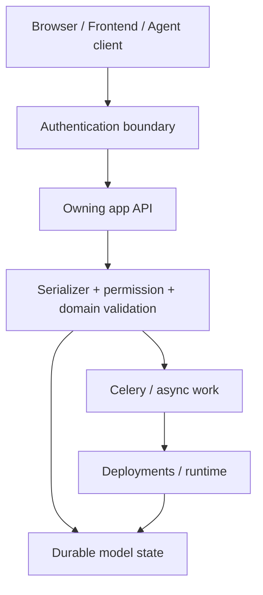
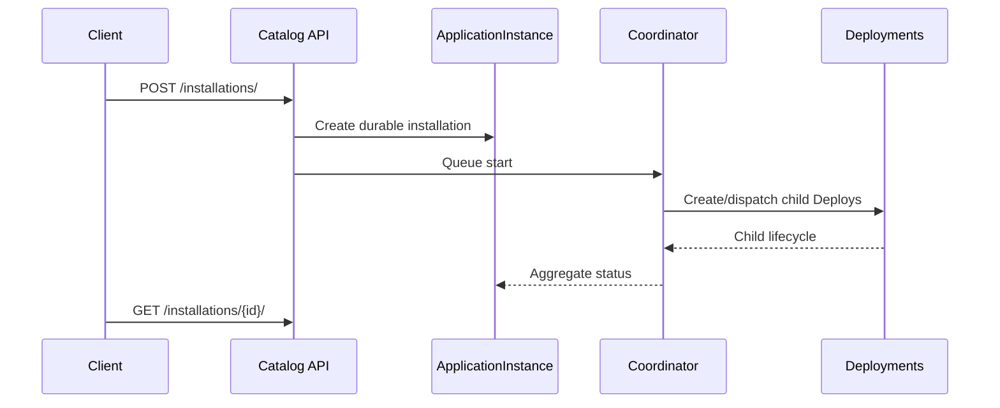
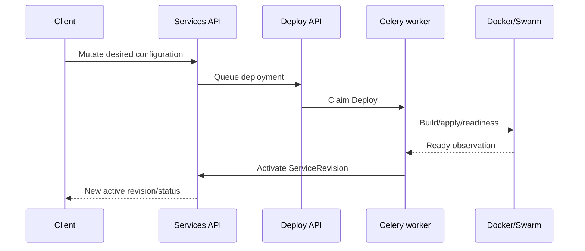

# API contract index

This is the navigation entry point for the backend HTTP API. Individual app pages document endpoint intent and authorization; [agent/api.md](../apps/agent/api.md) contains the complete source-defined Agent contract matrix.

## API layers

The endpoint should be understood as a chain, not just a URL. Authentication does not imply object access; serializers do not imply runtime mutation; a successful HTTP 202/200 does not necessarily mean the asynchronous runtime operation is complete.

## Canonical app API references

| App | Base/surface | Reference |
|---|---|---|
| agent | `/agent/v1/` | [agent API](../apps/agent/api.md) |
| app_catalog | `/api/application-catalog/` | [app_catalog API](../apps/app_catalog/api.md) |
| auth_users | `/auth/` | [auth_users API](../apps/auth_users/api.md) |
| services | `/services/`, plus `/api/networks/` and `/api/volumes/` aliases | [services API](../apps/services/api.md) |
| deploy | deployment/admin API | [deploy API](../apps/deploy/api.md) |
| plans | plan/admin API | [plans API](../apps/plans/api.md) |
| users | user/profile/admin API | [users API](../apps/users/api.md) |
| messenger | messenger REST + realtime API | [messenger API](../apps/messenger/api.md) |
| tickets | ticket/support API | [tickets API](../apps/tickets/api.md) |
| custom_emails | `/api/emails/` | [custom email API](../apps/custom_emails/api.md) |
| docs | `/api/docs/` | [docs API](../apps/docs/api.md) |
| core | `/api/system/` + protected media | [core API](../apps/core/api.md) |

## Parameter semantics

Every endpoint should document three distinct classes of input:

1. **Path parameters** identify an existing resource and are required whenever present in the route.
2. **Query parameters** alter filtering, pagination, export, projection or optional behavior without changing the resource identity.
3. **Request-body parameters** carry create/update/action data. Requiredness is a serializer/domain rule, not a property of HTTP POST alone.

When a parameter is optional, the documentation should state both what happens when it is omitted and any server-side default. For sensitive values, documentation must describe the secret handling without reproducing an actual credential.

## Common REST conventions

| Convention | Current contract |
|---|---|
| Authentication | Each app declares its own authentication/permission boundary; Agent uses Bearer credentials. |
| Pagination | App-specific. Agent defaults to 25 and caps at 100. |
| Validation errors | Resource APIs usually return structured serializer/domain errors; Agent normalizes errors into a stable envelope. |
| Async lifecycle | Mutations that queue runtime work return the durable resource/task state; clients should poll/read the resource rather than assume completion. |
| Idempotency | Agent mutating endpoints marked idempotent support `Idempotency-Key`; other APIs rely on domain-specific lifecycle fences. |
| Authorization | Ownership, staff rules and ServiceShare rules are evaluated server-side. |
| Secrets | Secret material is not returned by normal read serializers. Dedicated high-risk endpoints/actions are explicitly marked. |

## Complex request paths

### Ready App installation

### Service deployment

