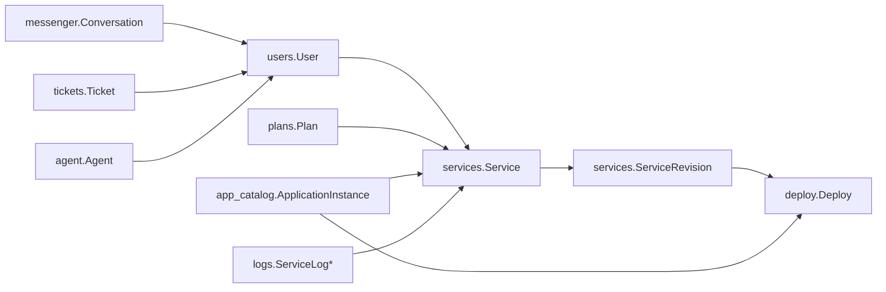

# Model field reference index

The field references in this directory are source-derived snapshots of the Django model declarations. They complement each app's narrative `models.md` and are intended to make schema drift visible.

## Relationship map

## References

| App | Reference |
|---|---|
| agent | [field-reference](../apps/agent/field-reference.md) |
| users | [field-reference](../apps/users/field-reference.md) |
| auth_users | [field-reference](../apps/auth_users/field-reference.md) |
| services | [field-reference](../apps/services/field-reference.md) |
| plans | [field-reference](../apps/plans/field-reference.md) |
| deploy | [field-reference](../apps/deploy/field-reference.md) |
| deployments | Runtime/planning contracts are non-ORM and are documented under [deployments execution](../apps/deployments/execution/README.md). |
| app_catalog | [field-reference](../apps/app_catalog/field-reference.md) |
| logs | [field-reference](../apps/logs/field-reference.md) |
| messenger | [field-reference](../apps/messenger/field-reference.md) |
| tickets | [field-reference](../apps/tickets/field-reference.md) |
| custom_emails | [field-reference](../apps/custom_emails/field-reference.md) |
| docs | [field-reference](../apps/docs/field-reference.md) |
| core | [field-reference](../apps/core/field-reference.md) |
| cms | [field-reference](../apps/cms/field-reference.md) |

## Field interpretation

Every field reference records:

- Django field type.
- Database NULL semantics.
- Django blank/validation semantics.
- Default expression.
- Uniqueness/indexes/relations/choices/validators when visible in the model declaration.
- A concise purpose/contract explanation.
- The original declaration details where useful for maintenance.

The source model declaration remains authoritative. A generated/reference table must never be treated as a substitute for migrations or runtime validation.

For inherited project/framework fields, see [inherited-model-fields.md](inherited-model-fields.md).
